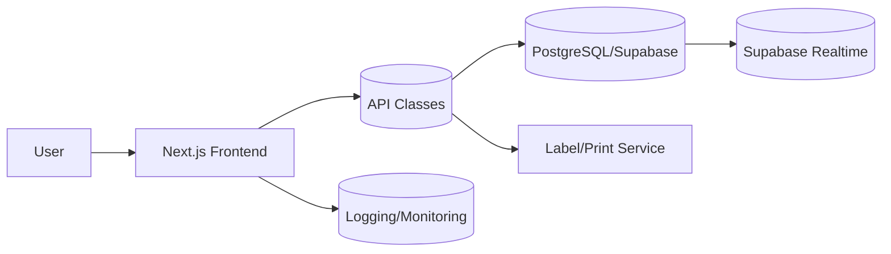
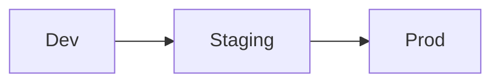

# System Overview

**Last Updated**: 2025-01-11  
**Status**: Active Development (Brownfield MES)  
**Technical Debt Register**: See [Tech-Spec](bmm/artifacts/tech-spec.md#-technical-debt-register)

## 1. Cel dokumentu
Przegląd architektury, modułów i przepływów danych MonoPilot. Dokument pomaga szybko zrozumieć granice domen, zależności i kontrakty między modułami: **Planning**, **Production**, **Technical**, **Warehouse & Scanner**, **Settings & Config**, **App Guide**, **AI Helper**.

**Related Documentation**:
- [Project Structure](11_PROJECT_STRUCTURE.md) - Directory & file organization
- [Database Tables](12_DATABASE_TABLES.md) - Complete schema reference
- [Technical Debt](14_NIESPOJNOSCI_FIX_CHECKLIST.md) - Known issues & fixes
- [BMM Tech-Spec](bmm/artifacts/tech-spec.md) - Comprehensive technical specification

---

## 2. Architektura logiczna

### 2.1 Komponenty
- **Frontend**: Next.js (App Router), UI like Filament in Laravel v12, komponenty tabel/modali, RBAC gating.
- **Warstwa API**: klasy API (PO/TO/WO/GRN/LP/Trace/Settings), walidacja Zod/TS.
- **Baza danych**: PostgreSQL (Supabase), RLS/multi‑tenant, migracje SQL.
- **Integracje**: druk etykiet LP/palet, eksport XLSX/CSV.

### 2.2 Diagram – komponenty i zależności


### 2.3 Granice i odpowiedzialności modułów
- **Technical**: produkty, BOM, routing, linie, QA, packaging/trace (definicje).
- **Planning**: PO/TO/WO, ASN, terminy, „źródło zapotrzebowania”.
- **Production**: realizacja WO, operacje, outputs, yield, trace.
- **Warehouse & Scanner**: receive (GRN), moves, split/merge, palety, operacje WO.
- **Settings**: organizacje, role, słowniki, magazyny/lokalizacje, maszyny ,tax code

---

## 3. Życie danych (lifecycle)
```mermaid
flowchart LR
  Master[Master Data
(Technical/Settings)] --> Plan[Planning (PO/TO/WO)]
  Plan --> Receive[Warehouse Receive
(ASN→GRN→LP)]
  Receive --> Prod[Production
(Ops→Outputs→Yield)]
  Prod --> Trace[Traceability
(Genealogy/LP)]
  Trace --> Reports[Reports/Exports]
```

**Zasady:**
- Snapshot BOM powstaje przy **Create WO** i jest niezmienny.
- LP jest jedynym nośnikiem partii i genealogii.
- Ruchy (Moves) operują na **location**, nie na warehouse.
- Ruchy (TO) operują na **Warehose**, nie na Location.

---

## 4. Bezpieczeństwo i dostęp

### 4.1 Multi‑tenant / RLS
```mermaid
flowchart LR
  Session[User session (org_id)] --> RLS[RLS policy]
  RLS -->|org_id match| Query[(SELECT/INSERT/UPDATE)]
```
- Każda tabela biznesowa ma `org_id` + polityki USING/WITH CHECK.

### 4.2 RBAC
- Role: Admin/Manager/Operator/Viewer.
- Feature gating w UI; akcje bez uprawnień są ukryte.

---

## 5. Niezawodność i transakcyjność
- Operacje skanera (consume/move/split/merge) są transakcyjne.
- Rezerwacje LP + blokady aplikacyjne zapobiegają podwójnemu zużyciu.
- Idempotencja operacji GRN/LP.

---

## 6. Obserwowalność
- **Logi** operacji biznesowych (who/when/what).
- **Sentry**: błędy UI/API, alerty.
- **KPI**: metryki produkcyjne (Made/Progress/Yield), raporty trace.

---

## 7. Środowiska i wdrażanie

- Migracje SQL wersjonowane; dokument „Database Schema” = źródło prawdy.
- Feature flags dla zmian kontraktów.

---

## 8. Wydajność i indeksy
- Indeksy po statusach i datach (WO/PO/TO), po kodach (products, locations).
- Minimalizacja N+1 w API; paginacja i filtry server‑side.

---

## 9. Checklisty (Go‑Live / QA)
- [ ] RLS: `org_id` + test izolacji tenantów
- [ ] RBAC: macierz uprawnień i gating w UI
- [ ] UI↔DB: moves na `from_location_id`/`to_location_id`
- [ ] UI↔DB: moves na `from_Warehouse`/`to_Warehouds`
- [ ] WO: snapshot BOM aktywny; aktualne `line_id`
- [ ] Receive: ASN prefill/auto‑LP, GRN→LP→Stock
- [ ] Trace: pełna genealogia forward/backward
- [ ] Monitoring i logi operacji
```

