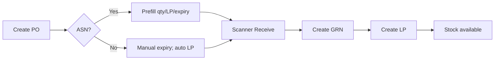
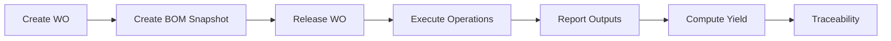
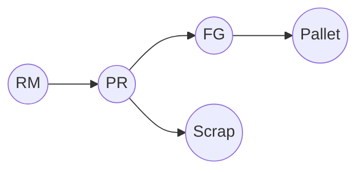
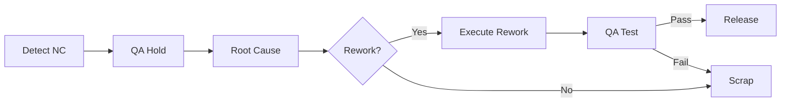

# Business Process Flows (E2E)

## 1. Cel
End‑to‑end przepływy biznesowe w MonoPilot: planowanie, przyjęcia, ruchy, produkcja, traceability. Dokument łączy moduły i definiuje punkty kontrolne QA.

---

## 2. Purchase Order → ASN → GRN → LP

### 2.1 Opis procesu
- Utworzenie PO (prefill waluty/podatku z dostawcy).
- (Opcjonalnie) Import ASN → prefill ilości/LP/expiry.
- Przyjęcie na magazyn (GRN) → generacja LP, alokacja lokalizacji.

### 2.2 Diagram


### 2.3 Checklist (QA)
- [ ] PO: `currency`, `due_date`, `created_by/approved_by`
- [ ] ASN: zgodność SKU/qty z PO; raport różnic
- [ ] GRN: brak over‑receipt; zapis LP (`uom`, batch, expiry)

---

## 3. Transfer Order (TO) – Ship → Transit → Receive

### 3.1 Opis procesu
- Planowanie i wysyłka między magazynami.
- Wykorzystanie **from_Warehouse/to_Warehouse**.

### 3.2 Diagram
```mermaid
flowchart LR
  Draft[Create TO (draft)] --> Plan[Plan dates]
  Plan --> Ship[Mark Shipped]
  Ship --> Transit[In Transit]
  Transit --> Receive[Receive]
  Receive --> Close[Close]
```

### 3.3 Checklist (QA)
- [ ] TO używa `from_Warehouse`/`to_Warehouse`
- [ ] Daty planowane i rzeczywiste zapisane
- [ ] Brak ruchów bez QA = OK

---

## 4. Work Order (WO) – Snapshot → Operations → Outputs → Yield

### 4.1 Opis procesu
- Utworzenie WO i snapshot BOM (niezmienny).
- Egzekwowanie sekwencji operacji.
- Outputs i KPI/yield.

### 4.2 Diagram


### 4.3 Checklist (QA)
- [ ] Snapshot zawiera UoM, 1:1, allergens, product/bom version/ routing operation
- [ ] Kolejność operacji wymuszana (blokada N+1)
- [ ] Outputs zapisane jako LP z QA

---

## 5. Warehouse Moves – Move / Split / Merge / Palletize

### 5.1 Opis procesu
- Przesunięcia między lokalizacjami, dzielenie/łączenie LP, budowa palet, etykiety.

### 5.2 Diagram
```mermaid
flowchart TD
  Start[Scan LP] --> Action{Action}
  Action -->|Move| Move[Move to location]
  Action -->|Split| Split[Create new LP]
  Action -->|Merge| Merge[Merge two LPs]
  Action -->|Palletize| Pallet[Pallet build]
  Move --> Log[Record stock_move]
  Split --> Genealogy[Write genealogy] Log[Record stock_move]
  Merge --> Genealogy[Write genealogy] Log[Record stock_move]
  Pallet --> Label[Print label]
```

### 5.3 Checklist (QA)
- [ ] Walidacja QA/UoM przed ruchem/zużyciem
- [ ] Genealogia zapisana (split/merge)
- [ ] Etykiety LP/palet kompletne (product, qty, batch, expiry, LP id)

---

## 6. Traceability – Forward & Backward

### 6.1 Diagram


### 6.2 Checklist (QA)
- [ ] Pełna ścieżka RM→PR→FG (forward) i FG→PR/RM (backward)
- [ ] Eksport trace do XLSX
- [ ] Zgodność z UoM i 1:1

---

## 7. Non‑conformance / QA Hold / Rework / Scrap

### 7.1 Diagram


### 7.2 Checklist (QA)
- [ ] Status QA blokuje ruchy/zużycia
- [ ] Rework zapisuje genealogię i nowy output
- [ ] Scrap ewidencjonowany (waste)

---

## 8. Punkty kontrolne E2E (Checklists)
- [ ] **UI↔DB**: `location_id` w TO/moves; `currency/due_date` w PO; `actual_*` w WO.
- [ ] **RLS/RBAC**: izolacja tenantów i gating akcji.
- [ ] **ASN/GRN/LP**: prefill, auto‑LP, zakaz over‑receipt.
- [ ] **Trace**: pełna genealogia i eksport XLSX.
- [ ] **Observability**: logi + alerty dla błędów krytycznych.

