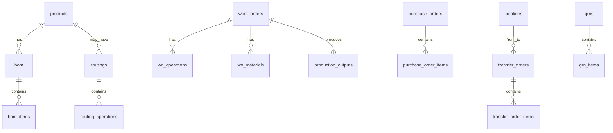
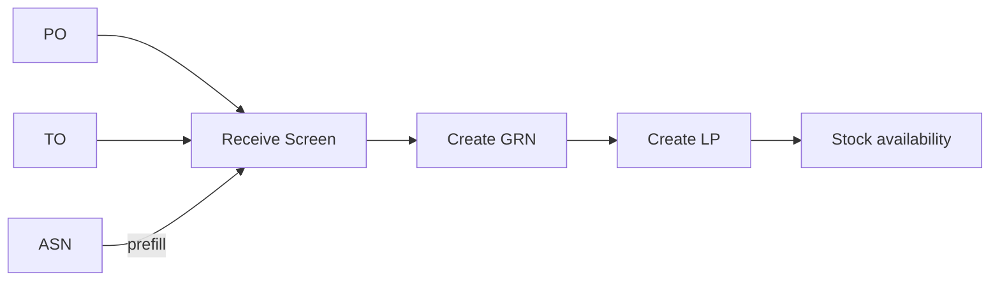
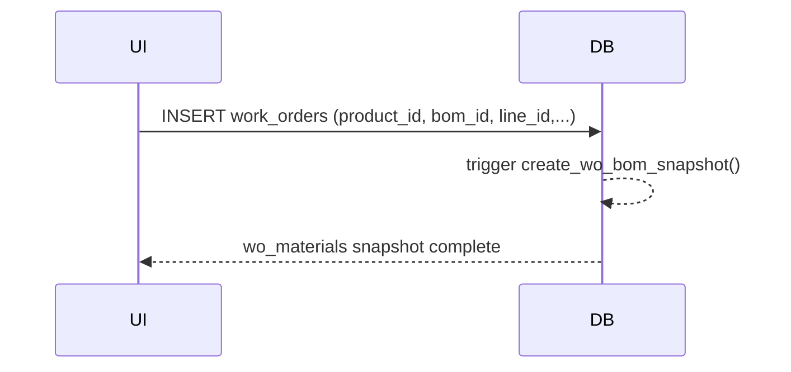
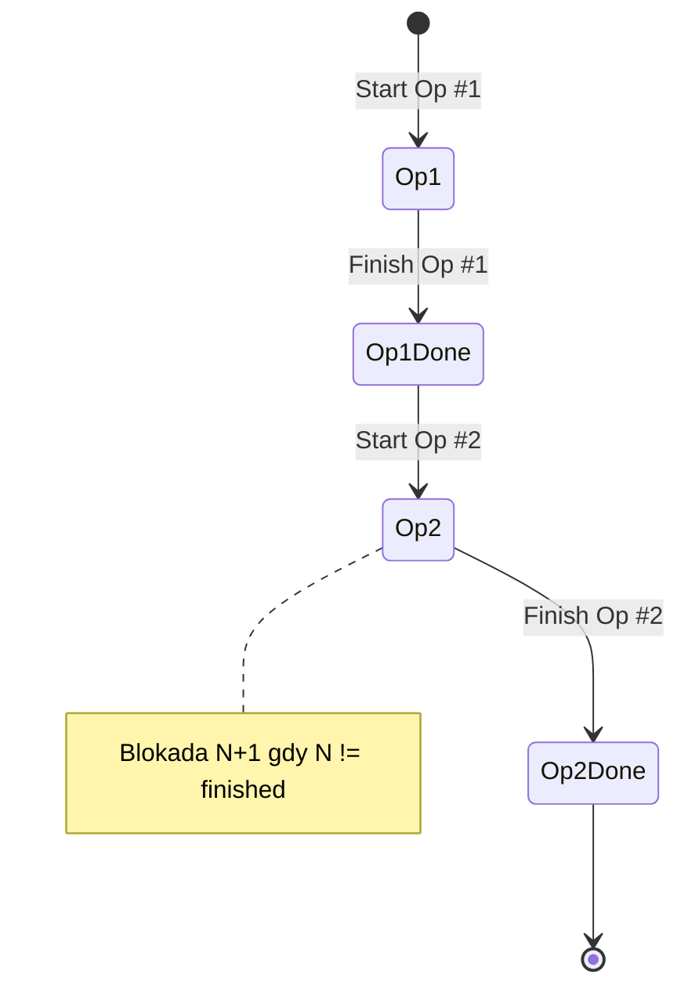
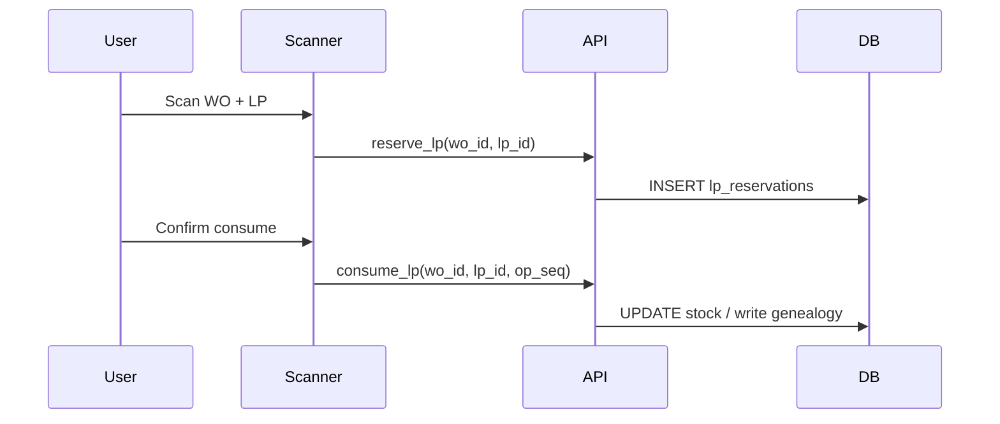
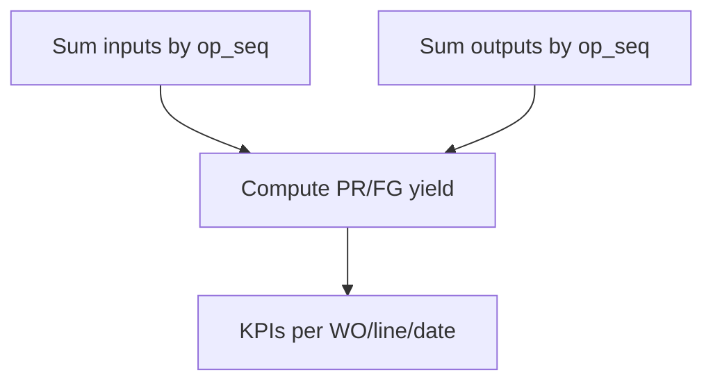
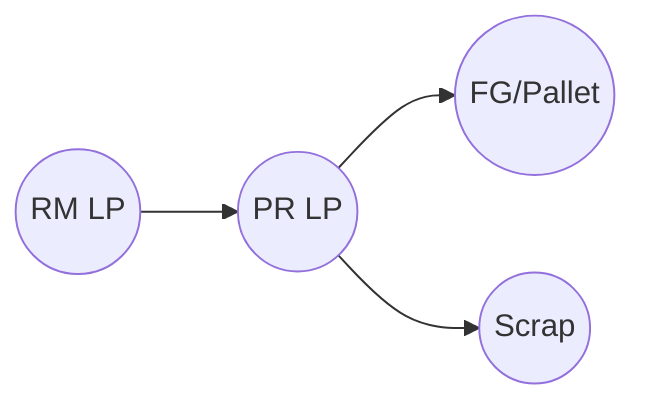

# Database Schema Documentation

## 1. Zakres i zasady
Kompletny opis schematu bazy MonoPilot (PostgreSQL / Supabase): tabele, kolumny, klucze, relacje, indeksy, RLS i multi‑tenant. Dokument wyznacza **źródło prawdy** dla nazewnictwa oraz kontraktów danych używanych przez moduły Planning, Production, Technical i Warehouse & Scanner.

### 1.1 Konwencje nazewnicze (must‑have)
- **Nazwy tabel**: `snake_case`, liczba **pojedyncza** dla bytów logicznych rdzenia (np. `bom`, `routing_operations` wyjątki dla tablic zależnych), bez prefiksów.
- **Klucze główne**: `id SERIAL/BIGSERIAL` lub `UUID` (wymagane dla `users`).
- **FK**: sufiks `_id`, naturalne nazwy: `from_location_id`, `to_location_id` (nie: `from_warehouse`).
- **Znaczniki czasu**: `created_at`, `updated_at` (`TIMESTAMPTZ`).
- **Tenant**: `org_id UUID NOT NULL` w tabelach biznesowych; wszystkie RLS filtrują po `org_id`.
- **Statusy** jako `TEXT` z ograniczeniami CHECK (lub enum typy domenowe) – lista w sekcji 6.

---

## 2. Moduły i tabele

### 2.1 Technical
- **products**: katalog produktów, `product_version`, `preferred_supplier_id`, (FG) `packs_per_box`, `boxes_per_pallet`.
- **bom** ↔ **bom_items**: struktura receptur; `bom.status` (draft/active/archived), `bom.version` (X.Y), `bom.line_id` (INT[]/NULL), `bom_items.uom` (`KG|EACH|METER|LITER`), `one_to_one_flag`, `scrap_pct`.
- **routings** ↔ **routing_operations**: sekwencje operacji; `routing_operations.machine_id` (FK), `sequence_number` unikalne per routing.
- **product_allergens**, **allergens**, **settings_tax_codes**.

### 2.2 Planning
- **purchase_orders** ↔ **purchase_order_items**: `supplier_id`, `warehouse_id`, `currency`, `due_date`, `created_by`, `approved_by`.
- **transfer_orders** ↔ **transfer_order_items**: *korzystają z* `from_location_id`/`to_location_id` + planowane/rzeczywiste daty.
- **work_orders** ↔ **wo_operations** ↔ **wo_materials**: planowanie WO, snapshot BOM; `line_id`, `source_demand_type/id`, `actual_start/end`.
- **asns**, **asn_items** (opcjonalnie `po_id`), **grns**, **grn_items`**.

### 2.3 Production & Traceability
- **production_outputs**: wyniki produkcji (KPI/yield), `operation_seq`, `qa_status`.
- **license_plates** (LP) + **lp_reservations** + **lp_compositions** + **lp_genealogy**: nośnik partii i genealogia.

### 2.4 Settings & Master Data
- **warehouses**, **locations** (hierarchia magazyn → strefa → miejsce), **machines**.
- **users** (Supabase), **organizations** (multi‑tenant), **routings dictionary** (słownik nazw operacji).

---

## 3. Relacje kluczowe (ER – skrót)
- products 1—* bom, bom 1—* bom_items
- products 1—* routings, routings 1—* routing_operations
- work_orders 1—* wo_operations; work_orders 1—* wo_materials; work_orders 1—* production_outputs
- purchase_orders 1—* purchase_order_items; transfer_orders 1—* transfer_order_items
- grns 1—* grn_items; asns 1—* asn_items (ASN→GRN powiązanie po `po_id`/dostawie)
- locations 1—* transfer_orders (from/to)
- license_plates powiązane z outputs/consumption (genealogia)

---

## 4. Klucze, indeksy, ograniczenia
- **PK**: `id` na wszystkich tabelach biznesowych.
- **FK**: kompletne i z ON DELETE RESTRICT/SET NULL wg potrzeb (brak cascade dla danych transakcyjnych).
- **Indeksy**:
  - status/time: `idx_work_orders_status_date`, `idx_po_status_date`, `idx_to_ship_recv_dates`
  - wyszukiwalne: `idx_products_part_number`, `idx_suppliers_name`, `idx_locations_code`
  - relacyjne: `idx_wo_materials_wo_id`, `idx_routing_ops_routing_id`
- **CHECK**: uom w (`KG`,`EACH`,`METER`,`LITER`); `packs_per_box >= 1`, `boxes_per_pallet >= 1`.
- **Unique**: pojedynczy **Active BOM** per produkt; `locations.code` unikalne w obrębie `warehouse_id`.

---

## 5. RLS & Multi‑tenant
- **org_id** wymagane w: products, bom, bom_items, work_orders, wo_materials, wo_operations, purchase_orders, transfer_orders, asns, grns, license_plates, routings, routing_operations, warehouses, locations, machines.
- Zasady RLS: `using ( org_id = auth.org_id() )` i `with check ( org_id = auth.org_id() )`.
- Testy izolacji: scenariusz 2×org, 2×user – SELECT/INSERT/UPDATE **niedostępne cross‑tenant**.

---

## 6. Słowniki statusów (normatywne)
- **work_orders.status**: `draft|planned|released|in_progress|completed|cancelled`
- **purchase_orders.status**: `draft|submitted|confirmed|received|closed|cancelled`
- **transfer_orders.status**: `draft|submitted|in_transit|received|closed|cancelled`
- **asns.status**: `submitted|confirmed|received|closed`
- **production_outputs.qa_status**: `ok|blocked|hold`

---

## 7. Diagramy (Mermaid)

### 7.1 ER (skrót – moduły core)


### 7.2 Receive Flow (PO/TO → GRN → LP)


### 7.3 Snapshot WO


---

## 8. Niespójności / Do poprawy (⚠️)
- ⚠️ **`bom` vs `boms`**: dokumentacja/kod odwołuje się do `boms`; źródło prawdy: **`bom`**.
- ⚠️ **Kolumny linii**: UI wysyła `production_lines`; w DB kolumny to `line_id` (w `bom`) / `production_line_restrictions` (historycznie). Ujednolicić do `line_id` (INT[]/NULL) i zaktualizować API/validację.
- ⚠️ **TO – lokalizacje**: UI pokazuje warehousy zamiast `from_location_id`/`to_location_id`.
- ⚠️ **PO – finanse**: `currency`, `due_date`, `created_by/approved_by` muszą istnieć w UI/API zgodnie ze schematem.
- ⚠️ **Typy i nazwy pól**: `price` vs `std_price`, `PR` vs `WIP` – unifikacja w TS/schema.
- ⚠️ **ASN powiązanie z PO**: rozważyć `asns.po_id` + aktualizację GRN.

---

## 9. Backlog migracji (P0)
- M1: `alter table bom add column line_id int[] null;` (jeśli brak) + FK walidacja
- M2: `alter table work_orders add column line_id int not null;`
- M3: `alter table bom_items add column uom text not null check (uom in ('KG','EACH','METER','LITER'));`
- M4: `alter table routing_operations add column machine_id int null references machines(id);`
- M5: `alter table products add column product_version text;`
- M6: `alter table asns add column po_id int references purchase_orders(id);`
- M7: Dodanie `org_id uuid not null` + RLS w tabelach brakujących

---

## 10. Checklisty zgodności (QA & Akceptacja)

### 10.1 Kontrakt UI ↔ DB
- [ ] **TO** używa `from_location_id`/`to_location_id` (nie warehouses)
- [ ] **PO** eksponuje `due_date`, `currency`, `notes`, `created_by`
- [ ] **WO** eksponuje `actual_start/end`, `bom_id`, `line_id`, `created_by`
- [ ] **ASN/GRN/LP**: przepływ z prefill/auto‑LP działający i spójny z tabelami

### 10.2 RLS / Multi‑tenant
- [ ] `org_id` w każdej tabeli biznesowej
- [ ] Polityki `USING/WITH CHECK` filtrujące po `org_id`
- [ ] Test izolacji: brak widoczności danych między organizacjami

### 10.3 Integralność i wydajność
- [ ] FK kompletne, brak osieroconych rekordów
- [ ] Indeksy na kolumnach filtrów i relacjach
- [ ] CHECK na UoM i polach pakowania (FG)
- [ ] Unikalność Active BOM per produkt

---

## 11. Załączniki i notatki
- Słowniki, listy enum i wartości dopuszczalne muszą być zcentralizowane (TS + SQL)
- Dokument jest nadrzędny względem opisów w modułach – zmiany w DB = aktualizacja tego pliku + migracje


---

## 10. Diagramy (Mermaid)

### 10.1 High‑level: WO → Operations → Outputs → Trace
```mermaid
flowchart LR
  Plan[Plan WO] --> WO[Work Order]
  WO --> Ops[Operations (routing seq)]
  Ops --> Consume[Consume LP / Materials]
  Consume --> Outputs[Production Outputs]
  Outputs --> Yield[Yield KPIs]
  Outputs --> Trace[LP Genealogy]
```

### 10.2 Wymuszanie sekwencji operacji


### 10.3 Rezerwacja i zużycie LP (Scanner)


### 10.4 Obliczanie Yield (PR/FG)


### 10.5 Trace forward/backward (skrót)


---

## 11. Checklisty (QA & Akceptacja)

### 11.1 Routing & Operacje
- [ ] Blokada startu operacji N+1 dopóki N != finished
- [ ] `routing_operations.sequence_number` unikalny i rosnący
- [ ] `machine_id` ustawiane tam, gdzie wymagane

### 11.2 Snapshot & Materiały
- [ ] Snapshot BOM utworzony przy create WO (wo_materials)
- [ ] `uom` z BOM (bez konwersji po starcie)
- [ ] `one_to_one_flag` egzekwowane w Scanner/Production

### 11.3 Outputs & KPI
- [ ] Made/Progress liczone z `production_outputs`
- [ ] Yield per op i per WO dostępny (API/raport)
- [ ] Trendy i dashboard (do wdrożenia)

### 11.4 Traceability
- [ ] Genealogia `lp_compositions`/`lp_genealogy` kompletna
- [ ] Backward: FG→PR/RM; Forward: RM→PR→FG
- [ ] Eksport trace do XLSX

### 11.5 Bezpieczeństwo transakcji
- [ ] Rezerwacje LP (advisory lock/tx) zapobiegają podwójnemu zużyciu
- [ ] Anulowanie WO weryfikuje brak outputs (lub rollback)
- [ ] Audyt operacji (who/when/what)

