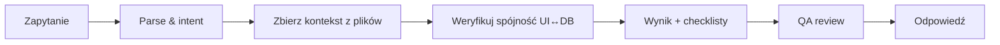
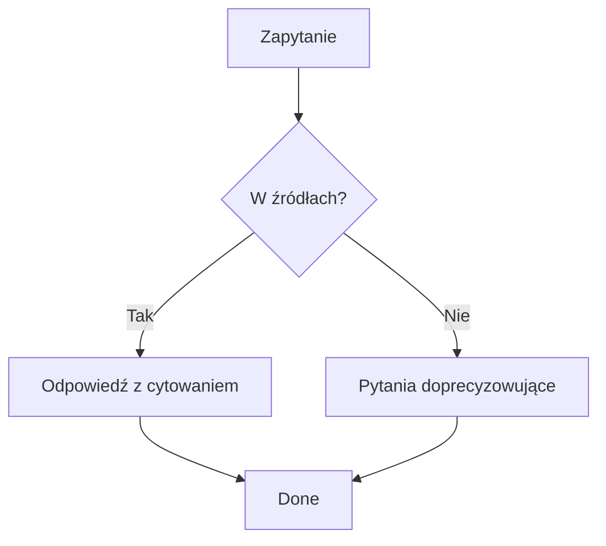

# AI Helper Guide

## 1. Cel
Standard działania **AI Helpera** w projekcie MonoPilot: jak korzystać z kontekstu, jakie są reguły bezpieczeństwa, jak tworzyć skuteczne prompty, jakie są szablony i checklisty jakości. Dokument jest referencją dla deweloperów, analityków i QA.

---

## 2. Zasady ogólne
- **Źródła prawdy**: `Database Schema`, `Technical Module`, `Planning Module`, `Production Module`, `Warehouse & Scanner`, `Settings & Config`.
- **Zakaz halucynacji**: AI nie tworzy nieistniejących tabel/pól/endpointów; zawsze odwołuje się do dokumentu źródłowego.
- **Terminologia normatywna**: `bom` (nie `boms`), `from_location_id`/`to_location_id` (nie *warehouse* w ruchach), UoM z BOM.
- **Priorytety**: wykrywanie niespójności > generowanie kodu; zgodność UI↔DB > wygoda.
- **Bezpieczeństwo**: nie eksporuje poufnych danych; pamięta o multi‑tenant/RLS.

---

## 3. Kontekst i indeks
AI ma dostęp do poniższych pakietów kontekstu (wskazać konkretny plik przy odwołaniu):
- `04_PLANNING_MODULE.md`, `05_PRODUCTION_MODULE.md`, `06_TECHNICAL_MODULE.md`
- `07_WAREHOUSE_AND_SCANNER.md`, `08_SETTINGS_AND_CONFIG.md`, `09_DATABASE_SCHEMA.md`
- `03_APP_GUIDE.md`, `11_DOCUMENTATION_AUDIT.md`

> **Reguła**: jeśli informacja nie jest potwierdzona w tych plikach – AI **pyta** lub oznacza jako hipotezę.

---

## 4. Szablony promptów (templatey)

### 4.1 Analiza niespójności UI ↔ DB
```
Cel: wykryj niespójności między {Strona/Komponent} a Database Schema.
Wejście: nazwy pól w UI, mapping do API.
Wyjście: lista rozbieżności (konkretne pola), rekomendacje naprawy, wpływ na inne moduły.
Źródła: App Guide, Database Schema, {moduł szczegółowy}.
```

### 4.2 Specyfikacja migracji SQL
```
Cel: przygotuj migrację P0 do wdrożenia {zmiana}.
Wejście: opis zmiany + tabela/kolumna.
Wyjście: ALTER/CREATE + indeksy, FK, CHECK, notatki rollback, wpływ na API/UI.
Źródła: Database Schema.
```

### 4.3 Definicja kontraktu API
```
Cel: zdefiniuj kontrakt API dla {endpointu}.
Wejście: operacje (list/get/create/update/cancel), pola wej./wyj., statusy.
Wyjście: spec (typy, walidacje, kody błędów), checklisty testów.
Źródła: {odpowiedni moduł}, Database Schema.
```

### 4.4 Checklisty QA
```
Cel: wygeneruj checklistę akceptacyjną dla {procesu}.
Wejście: opis procesu.
Wyjście: lista kontrolna (UI↔DB, uprawnienia, edge cases, testy E2E).
Źródła: {moduł}, Settings & Config.
```

---

## 5. Wzorce stylu odpowiedzi
- **Struktura**: Kontekst → Założenia → Wynik → Ryzyka/Edge cases → Następne kroki
- **Cytowanie**: sekcje/rozdziały z plików źródłowych (tytuł + sekcja), bez długich cytatów.
- **Flagowanie niepewności**: `⚠️` i opis brakującej informacji.

---

## 6. Diagramy (Mermaid)

### 6.1 Przepływ pracy AI Helpera


### 6.2 Decyzja: dopuszczalność odpowiedzi


---

## 7. Checklisty jakości (QA)
- [ ] Źródła prawdy zacytowane (sekcja/plik)
- [ ] Brak sprzeczności z Database Schema
- [ ] Terminologia normatywna (bom/line/uom/location)
- [ ] Oznaczone niepewności (`⚠️`) i brakujące dane
- [ ] Rekomendacje z priorytetami (P0/P1/P2)

---

## 8. Best practices
- Porównuj nazwy pól 1:1; unikaj „synonimów” (np. warehouse vs location).
- Używaj list kontrolnych i diagramów, nie długich esejów.
- Pisz z myślą o wdrożeniu (migracje, testy, wpływ na moduły).

