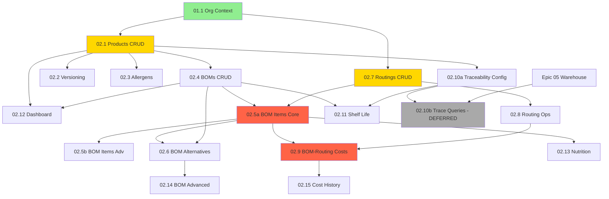

# Epic 02 - Technical Module - Implementation Plan

**Date:** 2025-12-23
**Epic:** 02-technical (Products, BOMs, Routings)
**Status:** Ready for Implementation
**Total Stories:** 16 (15 ready + 1 deferred)
**Estimated Effort:** 12-15 days (1 developer)

---

## Prerequisites

### ✅ Required Before Starting Epic 02

| Dependency | Status | Provides |
|------------|--------|----------|
| **01.1 - Org Context + Base RLS** | **REQUIRED** | organizations, users, roles tables, RLS pattern, org-context-service.ts, permission-service.ts |

**Verification:**
```sql
-- Check tables exist
SELECT EXISTS (SELECT FROM pg_tables WHERE tablename = 'organizations');
SELECT EXISTS (SELECT FROM pg_tables WHERE tablename = 'users');
SELECT EXISTS (SELECT FROM pg_tables WHERE tablename = 'roles');
```

---

## Stories Dependency Analysis

### Dependency Levels (Critical Path)

```
LEVEL 0: Prerequisites
└── 01.1 - Org Context + Base RLS [EXTERNAL]

LEVEL 1: Foundation (Parallel)
├── 02.1 - Products CRUD + Types [M - 3 days]
└── 02.7 - Routings CRUD [M - 3 days]

LEVEL 2: Products Extensions (Parallel)
├── 02.2 - Product Versioning + History [S - 1 day] ← 02.1
├── 02.3 - Product Allergens [M - 3 days] ← 02.1, 01.1
├── 02.4 - BOMs CRUD + Date Validity [M - 3 days] ← 02.1, 01.1
├── 02.8 - Routing Operations [L - 4 days] ← 02.7, 01.1
├── 02.10a - Traceability Config [M - 2 days] ← 02.1, 01.1
└── 02.12 - Technical Dashboard [M - 2 days] ← 02.1, 02.4

LEVEL 3: BOM Items + Dependencies
├── 02.5a - BOM Items Core [M - 3 days] ← 02.4, 02.7 (BOTH!)
└── 02.11 - Shelf Life Calculation [M - 2 days] ← 02.1, 02.4, 02.10a

LEVEL 4: Advanced BOM Features
├── 02.5b - BOM Items Advanced [M - 2 days] ← 02.5a
├── 02.6 - BOM Alternatives + Clone [M - 2 days] ← 02.4, 02.5a
├── 02.9 - BOM-Routing Costs [M - 3 days] ← 02.5a, 02.8 (BOTH!)
└── 02.13 - Nutrition Calculation [L - 4 days] ← 02.5a

LEVEL 5: Final Features
├── 02.14 - BOM Advanced Features [M - 2 days] ← 02.6
└── 02.15 - Cost History + Variance [S - 1 day] ← 02.9

DEFERRED:
└── 02.10b - Traceability Queries [L] ← 02.10a + Epic 05 (Warehouse LP)
```

---

## Detailed Dependency Graph



---

## Critical Blockers & Key Dependencies

### 🚨 Critical Blocking Dependencies

| Story | Blocks | Why Critical |
|-------|--------|--------------|
| **02.1 Products CRUD** | 02.2, 02.3, 02.4, 02.10a, 02.12 | Foundation for entire module - products table required everywhere |
| **02.4 BOMs CRUD** | 02.5a, 02.6, 02.11, 02.12 | BOM header required before items can be added |
| **02.7 Routings CRUD** | 02.5a, 02.8 | Routing header required for operation assignment in BOM items |
| **02.5a BOM Items** | 02.5b, 02.6, 02.9, 02.13 | BOM items required for costing, nutrition, alternatives |
| **02.8 Routing Ops** | 02.9 | Operations with labor cost required for total cost calculation |

### ⚠️ Cross-Story Dependencies (Must Complete BOTH)

| Story | Requires BOTH | Reason |
|-------|---------------|---------|
| **02.5a BOM Items** | 02.4 BOMs + 02.7 Routings | Items need bom_id FK AND operation_seq FK |
| **02.9 BOM Costs** | 02.5a Items + 02.8 Ops | Costs = Material + Operation Labor + Routing Costs |
| **02.11 Shelf Life** | 02.4 BOMs + 02.10a Config | Calculation needs BOM ingredients + traceability settings |

---

## Recommended Implementation Order

### Sprint 1: Products Foundation (5 days)
**Goal:** Establish product master data foundation

| Order | Story | Days | Dependencies | Deliverables |
|-------|-------|------|--------------|--------------|
| 1 | **02.1 - Products CRUD + Types** | 3 | 01.1 | products table, product_types, CRUD API, list page, modal |
| 2 | **02.2 - Product Versioning** | 1 | 02.1 | version history table, audit log, version timeline UI |
| 3 | **02.3 - Product Allergens** | 3 | 02.1, 01.1 | allergens table (EU 14 seed), product_allergens, allergen UI |

**Milestone:** ✅ Products with types, versioning, allergen tracking

---

### Sprint 2: BOMs + Routings Foundation (6 days)
**Goal:** Establish BOM and routing headers (parallel work possible)

| Order | Story | Days | Dependencies | Deliverables |
|-------|-------|------|--------------|--------------|
| 4 | **02.7 - Routings CRUD** | 3 | 01.1 | routings table, CRUD API, list page, cost config UI |
| 5 | **02.4 - BOMs CRUD + Validity** | 3 | 02.1, 01.1 | boms table, date validity trigger, BOM list, BOM modal |

**Parallel:** Stories 02.4 and 02.7 can run in parallel (different dev or same dev switching)

**Milestone:** ✅ BOM headers with date validity, Routing headers with cost config

---

### Sprint 3: Operations + Traceability (8 days)
**Goal:** Complete routing operations and traceability configuration

| Order | Story | Days | Dependencies | Deliverables |
|-------|-------|------|--------------|--------------|
| 6 | **02.8 - Routing Operations** | 4 | 02.7, 01.1 | routing_operations table, operations CRUD, machine assignment |
| 7 | **02.10a - Traceability Config** | 2 | 02.1, 01.1 | product_traceability_config table, GS1 service, lot format UI |
| 8 | **02.12 - Technical Dashboard** | 2 | 02.1, 02.4 | Dashboard page, stats cards, allergen matrix, BOM timeline |

**Parallel:** Stories 02.10a and 02.12 can run in parallel after 02.4 completes

**Milestone:** ✅ Routing operations with labor cost, Traceability configuration, Dashboard overview

---

### Sprint 4: BOM Items + Advanced (7 days)
**Goal:** BOM items management (core + advanced)

| Order | Story | Days | Dependencies | Deliverables |
|-------|-------|------|--------------|--------------|
| 9 | **02.5a - BOM Items Core** | 3 | 02.4, 02.7 | bom_items table, items CRUD API, items table UI, operation assignment |
| 10 | **02.5b - BOM Items Advanced** | 2 | 02.5a | Conditional items, byproducts, line-specific items |
| 11 | **02.6 - BOM Alternatives + Clone** | 2 | 02.4, 02.5a | bom_alternatives table, alternatives UI, BOM clone functionality |

**Critical:** 02.5a BLOCKS costing, nutrition, and alternatives - highest priority

**Milestone:** ✅ BOM items with alternatives, conditional items, byproducts

---

### Sprint 5: Costing + Nutrition (8 days)
**Goal:** Cost calculation and nutrition features

| Order | Story | Days | Dependencies | Deliverables |
|-------|-------|------|--------------|--------------|
| 12 | **02.9 - BOM-Routing Costs** | 3 | 02.5a, 02.8 | product_costs table, costing-service.ts, cost rollup API, cost page |
| 13 | **02.11 - Shelf Life Calculation** | 2 | 02.1, 02.4, 02.10a | product_shelf_life table, shelf life calculation service, shelf life UI |
| 14 | **02.13 - Nutrition Calculation** | 4 | 02.5a | product_nutrition, ingredient_nutrition tables, nutrition service, FDA label |

**Parallel:** Stories 02.11 and 02.13 can run in parallel

**Milestone:** ✅ Full cost calculation (material + labor + routing), Shelf life management, Nutrition labels

---

### Sprint 6: Advanced Features + Finalization (3 days)
**Goal:** Complete BOM advanced features and cost history

| Order | Story | Days | Dependencies | Deliverables |
|-------|-------|------|--------------|--------------|
| 15 | **02.14 - BOM Advanced Features** | 2 | 02.6 | BOM comparison, multi-level explosion, BOM yield, BOM scaling |
| 16 | **02.15 - Cost History + Variance** | 1 | 02.9 | Cost history tracking, variance analysis, cost trend charts |

**Milestone:** ✅ Epic 02 Complete - Full Technical Module delivered

---

## Deferred to Later Phase

| Story | Deferred Until | Reason |
|-------|----------------|---------|
| **02.10b - Traceability Queries** | Epic 05 (Warehouse) Complete | Requires `license_plates` and `lp_genealogy` tables from Warehouse module |

---

## Parallel Execution Opportunities

### Sprint 1 (Limited Parallelization)
- 02.1 must complete first
- 02.2 and 02.3 can run in parallel after 02.1

### Sprint 2 (Full Parallelization)
- **02.4 BOMs CRUD** and **02.7 Routings CRUD** can run in parallel (independent)

### Sprint 3 (Partial Parallelization)
- 02.8 must wait for 02.7
- 02.10a and 02.12 can run in parallel after 02.1, 02.4 complete

### Sprint 4 (Sequential - Critical Path)
- 02.5a blocks everything → highest priority
- 02.5b must wait for 02.5a
- 02.6 can run in parallel with 02.5b

### Sprint 5 (Partial Parallelization)
- 02.9 requires BOTH 02.5a AND 02.8
- 02.11 and 02.13 can run in parallel

### Sprint 6 (Sequential)
- 02.14 depends on 02.6
- 02.15 depends on 02.9

---

## Risk Assessment & Mitigation

| Risk | Impact | Likelihood | Mitigation |
|------|--------|------------|------------|
| **BOM date overlap bugs** | High | Medium | Database trigger + integration tests + manual QA |
| **02.5a delays critical path** | Critical | Medium | Prioritize 02.5a, allocate best dev, add buffer time |
| **Cost calculation errors** | High | Medium | Comprehensive unit tests for costing-service.ts, sample data validation |
| **RLS policy gaps** | High | Low | Follow ADR-013 pattern strictly, security review after each story |
| **Routing-BOM-Items triple dependency** | Medium | Low | Complete 02.4 and 02.7 BEFORE starting 02.5a |
| **Missing products table** | Critical | Low | Verify 02.1 completion before ANY Level 2+ story |

---

## Definition of Done (Per Story)

### Backend
- [ ] Database migration created (if needed)
- [ ] RLS policies applied (org_id isolation)
- [ ] API endpoints implemented with error handling
- [ ] Service layer with business logic
- [ ] Zod validation schemas
- [ ] Unit tests (>80% coverage)
- [ ] Integration tests (API + database)

### Frontend
- [ ] Pages created with routing
- [ ] Components with TypeScript types
- [ ] Form validation (Zod + react-hook-form)
- [ ] Empty states, loading states, error states
- [ ] Mobile responsive
- [ ] E2E smoke test (critical flow)

### Documentation
- [ ] API endpoints documented
- [ ] Service methods documented
- [ ] Complex business logic explained
- [ ] Known limitations noted

---

## Epic 02 Success Metrics

- [ ] **Demo Flow:** Create product → Create BOM → Add items → Create routing → Add operations → Calculate cost
- [ ] **BOM Date Validity:** No overlapping BOMs allowed (enforced by trigger)
- [ ] **Allergen Inheritance:** Allergens auto-inherited from BOM items
- [ ] **Traceability Config:** GS1 settings saved per product
- [ ] **Cost Calculation:** < 500ms for 5-level BOM
- [ ] **RLS Enforcement:** 100% cross-tenant isolation (no data leaks)
- [ ] **Test Coverage:** >80% unit tests, 100% critical path integration tests
- [ ] **Performance:** Product list <1s, BOM explosion <2s

---

## Handoff Checklist

### Before Starting Epic 02
- [ ] Verify 01.1 (Org Context) is deployed to database
- [ ] Verify organizations, users, roles tables exist
- [ ] Verify RLS policies work (test cross-tenant isolation)
- [ ] Verify org-context-service.ts and permission-service.ts exist
- [ ] Supabase local instance running
- [ ] Migrations 001-026 applied successfully

### During Implementation
- [ ] Follow story order (respect dependencies)
- [ ] Run tests after each story
- [ ] Update PROJECT-STATE.md after each story
- [ ] Commit after each story completion
- [ ] Verify no cross-tenant data leaks (RLS tests)

### After Epic 02 Completion
- [ ] All 15 stories marked as complete (02.1-02.15 except 02.10b)
- [ ] Database migrations 027-042 applied
- [ ] All tables have RLS policies
- [ ] Integration tests pass
- [ ] E2E smoke tests pass
- [ ] Demo flow validated end-to-end
- [ ] PROJECT-STATE.md updated with Epic 02 status

---

## Next Steps

1. **Verify Prerequisites:** Confirm 01.1 is complete and deployed
2. **Start Sprint 1:** Begin with 02.1 (Products CRUD)
3. **Follow Dependency Order:** Use this plan to avoid blockers
4. **Track Progress:** Update PROJECT-STATE.md after each story

---

**Generated:** 2025-12-23
**Author:** Claude Code (AI Agent)
**Epic Owner:** Technical Module
