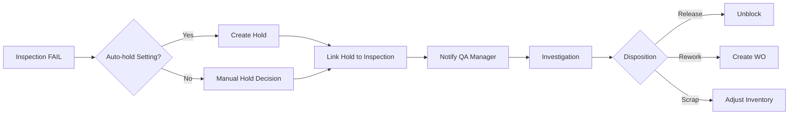

# Epic 06 - Core Workflow Analysis
## Quality Module: Inspections, Holds & Status Management

**Date:** 2025-12-16
**Analyst:** Core-Workflow-Analyzer Agent
**Status:** Complete
**Epic:** 06-quality

---

## Executive Summary

This report analyzes the three core inspection workflows (incoming, in-process, final) and quality hold system for Epic 06. The analysis reveals:

- **3 distinct inspection workflows** with different triggers and blocking behaviors
- **Quality hold system** that spans across LPs, WOs, and batches
- **7 QA status types** with defined state transitions
- **Recommended 8 stories** organized into 3 phases
- **Mobile scanner integration** recommended for Phase 2 (not MVP blocker)

**Key Finding:** Inspections can launch independently, but Final Inspection is the **critical dependency** for batch release and shipping. Holds can work independently but are most valuable when integrated with inspection failures.

---

## Table of Contents

1. [Inspection Workflow Analysis](#1-inspection-workflow-analysis)
2. [Quality Hold System](#2-quality-hold-system)
3. [Status Management & State Machines](#3-status-management--state-machines)
4. [Story Breakdown & Dependencies](#4-story-breakdown--dependencies)
5. [Scanner Integration Analysis](#5-scanner-integration-analysis)
6. [MVP Scope Recommendations](#6-mvp-scope-recommendations)
7. [Integration Points](#7-integration-points)
8. [Appendix: Workflow Diagrams](#8-appendix-workflow-diagrams)

---

## 1. Inspection Workflow Analysis

### 1.1 Overview

Three distinct inspection types, each with unique triggers, scope, and blocking behavior:

| Type | Trigger | Scope | Mandatory | Blocks Downstream |
|------|---------|-------|-----------|-------------------|
| **Incoming** | PO receipt (GRN) | Raw materials, packaging | Configurable (default: Yes) | LP consumption |
| **In-Process** | WO operation checkpoint | Semi-finished WIP | Per routing step | Next operation |
| **Final** | WO completion | Finished goods | Always (Yes) | Batch release, shipping |

---

### 1.2 Incoming Inspection Workflow

**Purpose:** Verify received materials meet specifications before use in production.

#### Workflow States

```
┌─────────────┐
│ GRN Created │ (PO Receipt Complete)
└──────┬──────┘
       │
       ↓ (auto_create_inspection_on_grn = true)
┌─────────────────┐
│ SCHEDULED       │ (inspection_type = 'incoming')
│ status=scheduled│
└──────┬──────────┘
       │
       ↓ Inspector assigns self
┌─────────────────┐
│ IN_PROGRESS     │ (Inspector records test results)
│ status=in_prog  │
└──────┬──────────┘
       │
       ↓ All parameters tested
┌─────────────────┐
│ COMPLETED       │ (result = pass/fail/conditional)
│ status=completed│
└──────┬──────────┘
       │
       ↓ Update LP QA status
┌─────────────────────────┐
│ LP Status Update        │
│ - PASSED → available    │
│ - FAILED → hold         │
│ - CONDITIONAL → limited │
└─────────────────────────┘
```

#### Triggers
1. **Automatic:** GRN completion (if `auto_create_inspection_on_grn = true`)
2. **Manual:** QA Manager creates inspection for specific LP

#### Key Data Points
- **reference_type:** `po` or `lp`
- **reference_id:** PO ID or LP ID
- **product_id:** Product being inspected
- **spec_id:** Quality specification version (immutable snapshot)
- **lp_id:** License plate being inspected (single LP or batch)
- **sampling_plan_id:** AQL-based sampling plan (Phase 2)

#### Business Rules
1. LP cannot be consumed if inspection status = 'scheduled' or 'in_progress' (unless org setting allows)
2. All critical parameters (`is_critical = true`) must pass for overall pass
3. Any failed critical parameter → automatic FAIL result
4. Non-critical fails with all critical pass → CONDITIONAL result
5. Inspection records linked to LP for traceability

#### Pass/Fail Logic
```typescript
determineInspectionResult(testResults: TestResult[]): 'pass' | 'fail' | 'conditional' {
  const criticalResults = testResults.filter(r => r.parameter.is_critical);
  const criticalFails = criticalResults.filter(r => r.result_status === 'fail');

  if (criticalFails.length > 0) return 'fail';

  const allFails = testResults.filter(r => r.result_status === 'fail');
  if (allFails.length > 0) return 'conditional';

  return 'pass';
}
```

#### Dispositions
- **PASSED:** LP available for consumption
- **FAILED:** LP automatically placed on hold, NCR recommended
- **CONDITIONAL:** QA Manager decides (limited use, rework, or hold)

---

### 1.3 In-Process Inspection Workflow

**Purpose:** Verify quality at critical process steps during production (new integration with FR-QA-026 Operation Checkpoints).

#### Workflow States

```
┌──────────────────┐
│ WO Operation     │ (Operation checkpoint reached)
│ Checkpoint       │
└────────┬─────────┘
         │
         ↓ (checkpoint configured in routing)
┌──────────────────┐
│ SCHEDULED        │ (auto-created when operation starts)
│ status=scheduled │
└────────┬─────────┘
         │
         ↓ Operator/QA Inspector
┌──────────────────┐
│ IN_PROGRESS      │ (Record checkpoint results)
│ Checkpoint Entry │
└────────┬─────────┘
         │
         ↓ Validation
┌──────────────────┐
│ COMPLETED        │ (result = pass/fail)
└────────┬─────────┘
         │
    ┌────┴────┐
    │         │
    ↓ PASS    ↓ FAIL
┌───────┐  ┌─────────────────┐
│Continue│  │ Auto-hold?      │
│Next Op│  │ YES → WO halted │
└───────┘  │ NO → Log only   │
           └─────────────────┘
```

#### Triggers
1. **Automatic:** WO operation starts (if checkpoint configured in routing)
2. **Manual:** Supervisor requests inspection at any operation

#### Two Types of In-Process Inspections

**A) Operation Quality Checkpoints (FR-QA-026)**
- Defined in routing (per operation sequence)
- Tactical quality checks (visual, measurement, equipment)
- Recorded by operator or QA inspector
- Results stored in `operation_checkpoint_results` table
- Can auto-halt production on failure (`auto_hold_on_failure = true`)

**B) Traditional In-Process Inspection (FR-QA-006)**
- Full inspection of WIP against specifications
- Triggered at major process milestones
- Requires QA Inspector (not operator)
- Results stored in `quality_inspections` + `quality_test_results`
- More comprehensive than checkpoints

#### Key Data Points
- **reference_type:** `wo` or `operation`
- **reference_id:** Work Order ID or Operation Instance ID
- **inspection_type:** `in_process`
- **checkpoint_id:** (for FR-QA-026 checkpoint results)
- **auto_hold_on_failure:** Boolean flag determining production halt

#### Business Rules
1. Checkpoint failures can auto-halt production (configurable per checkpoint)
2. Failed checkpoints trigger QA Manager notification
3. WO cannot proceed to next operation if checkpoint status = 'fail' + auto_hold = true
4. Operator signature required on checkpoint results
5. Checkpoint results linked to WO operation instance for full genealogy

#### Pass/Fail Logic
```typescript
validateCheckpoint(checkpoint: Checkpoint, measuredValue: number): 'pass' | 'fail' {
  if (checkpoint.min_value !== null && measuredValue < checkpoint.min_value) {
    return 'fail';
  }
  if (checkpoint.max_value !== null && measuredValue > checkpoint.max_value) {
    return 'fail';
  }
  return 'pass';
}
```

#### Dispositions
- **PASSED:** Continue to next operation
- **FAILED (auto_hold = false):** Log failure, QA review, operator continues
- **FAILED (auto_hold = true):** Production halts, QA Manager escalation, hold created

---

### 1.4 Final Inspection Workflow

**Purpose:** Verify finished goods meet all specifications before batch release and shipment.

#### Workflow States

```
┌──────────────────┐
│ WO Completed     │ (All operations finished)
└────────┬─────────┘
         │
         ↓ (auto-create if require_final_inspection = true)
┌──────────────────┐
│ SCHEDULED        │ (inspection_type = 'final')
│ status=scheduled │
└────────┬─────────┘
         │
         ↓ QA Inspector assigns
┌──────────────────┐
│ IN_PROGRESS      │ (Record all test parameters)
│ All Params Test  │
└────────┬─────────┘
         │
         ↓ Additional checks
┌──────────────────┐
│ VERIFY COMPLETE  │ (Check all CCP records, labels, etc.)
│ - CCP records OK │
│ - Labels correct │
│ - Batch trace OK │
└────────┬─────────┘
         │
         ↓ Result determination
┌──────────────────┐
│ COMPLETED        │ (result = pass/fail)
└────────┬─────────┘
         │
    ┌────┴────┐
    │         │
    ↓ PASS    ↓ FAIL
┌───────────┐  ┌─────────────┐
│ RELEASED  │  │ HOLD        │
│ Batch OK  │  │ Batch Block │
│ Ship OK   │  │ NCR Create  │
└───────────┘  └─────────────┘
```

#### Triggers
1. **Automatic:** WO status changes to 'completed' (if `require_final_inspection = true`)
2. **Manual:** QA Manager creates inspection for specific batch

#### Critical Verifications
1. **Product specifications:** All parameters within spec
2. **CCP completeness:** All HACCP CCP records present and within limits
3. **Operation checkpoint completeness:** All in-process checkpoints passed
4. **Labeling accuracy:** GS1-128 labels, lot/expiry, allergen warnings
5. **Batch traceability:** Full genealogy (RM → FG)

#### Key Data Points
- **reference_type:** `wo` or `batch`
- **reference_id:** Work Order ID
- **batch_number:** Batch being released
- **inspection_type:** `final`
- **All test results:** Comprehensive parameter testing

#### Business Rules
1. **BLOCKING:** Batch cannot be released for shipment without passing final inspection
2. **MANDATORY:** `require_final_inspection` always true (org-level setting override only for urgent cases)
3. **CCP dependency:** Final inspection auto-checks that all CCP monitoring records are within limits
4. **Operation checkpoint dependency:** Final inspection auto-checks all in-process checkpoints passed
5. **Batch release approval:** QA Manager or Quality Director required for release

#### Pass/Fail Logic
```typescript
async determineFinalInspectionResult(
  inspection: Inspection,
  woId: string
): Promise<'pass' | 'fail'> {
  // 1. Check all test parameters
  const testResults = await getTestResults(inspection.id);
  const testPass = testResults.every(r => r.result_status === 'pass');

  // 2. Check all CCP records (if HACCP applies)
  const ccpRecords = await getCCPMonitoringRecords(woId);
  const ccpPass = ccpRecords.every(r => r.within_limits === true);

  // 3. Check all operation checkpoints
  const checkpointResults = await getOperationCheckpointResults(woId);
  const checkpointPass = checkpointResults.every(r => r.result_status === 'pass');

  // 4. Check labeling accuracy (manual verification by inspector)
  const labelingPass = inspection.labeling_verified === true;

  return (testPass && ccpPass && checkpointPass && labelingPass) ? 'pass' : 'fail';
}
```

#### Dispositions
- **PASSED:** Batch released for shipment, CoA can be generated
- **FAILED:** Batch placed on hold, NCR required, disposition decision (rework/scrap/downgrade)

---

### 1.5 Inspection Workflow Comparison Matrix

| Aspect | Incoming | In-Process | Final |
|--------|----------|------------|-------|
| **Trigger** | GRN completion | WO operation checkpoint | WO completion |
| **Frequency** | Per receipt (1-5/day) | Per critical operation (10-50/day) | Per batch (5-20/day) |
| **Tester** | QA Inspector | Operator or QA Inspector | QA Inspector (required) |
| **Test Depth** | Full spec parameters | Targeted checkpoints | Full spec + CCP + checkpoints |
| **Blocking** | LP consumption | Next operation | Batch release + shipping |
| **Mandatory** | Configurable (default Yes) | Per routing step | Always (Yes) |
| **Sample Size** | AQL-based (Phase 2) | Per checkpoint | Full batch or AQL |
| **Pass Criteria** | All critical params pass | Checkpoint within limits | All params + CCP + checkpoints pass |
| **Fail Action** | Hold LP, NCR optional | Halt production (if auto-hold), QA review | Hold batch, NCR required |
| **Mobile Support** | Phase 2 (scanner) | Phase 2 (scanner + offline) | Phase 1 (desktop) |
| **Average Duration** | 15-30 min | 1-5 min | 30-60 min |
| **Phase** | Phase 1 (MVP) | Phase 2 (with FR-QA-026) | Phase 1 (MVP) |

---

## 2. Quality Hold System

### 2.1 Overview

Quality holds are **blocking mechanisms** that prevent inventory usage, production continuation, or shipment when quality issues are detected.

#### Hold Types

| Type | Description | Typical Trigger | Release Authority |
|------|-------------|-----------------|-------------------|
| **qa_pending** | Awaiting inspection | Auto-created on GRN | QA Inspector |
| **investigation** | Under review | Inspection failure, NCR | QA Manager |
| **quarantine** | Isolated for safety | Critical defect, CCP deviation | Quality Director |
| **recall** | Post-shipment issue | Customer complaint, FDA | Quality Director + Executive |

---

### 2.2 Hold Creation Workflow

```
┌────────────────────┐
│ Hold Trigger Event │
└─────────┬──────────┘
          │
          ↓
┌──────────────────────────────────────┐
│ Create quality_holds record          │
│ - hold_number: "QH-2025-0001"        │
│ - reason: "Failed incoming inspect"  │
│ - hold_type: "investigation"         │
│ - status: "active"                   │
│ - priority: high/critical            │
└─────────┬────────────────────────────┘
          │
          ↓
┌──────────────────────────────────────┐
│ Add Hold Items                       │
│ (quality_hold_items)                 │
│ - reference_type: lp/wo/batch        │
│ - reference_id: LP-001 / WO-123      │
│ - quantity_held: 500.00 KG           │
│ - location_id: HOLD-ZONE-01          │
└─────────┬────────────────────────────┘
          │
          ↓
┌──────────────────────────────────────┐
│ Block Inventory                      │
│ - LP: qa_status = 'HOLD'             │
│ - WO: Allow queries to check hold    │
│ - Batch: Prevent shipment            │
└─────────┬────────────────────────────┘
          │
          ↓
┌──────────────────────────────────────┐
│ Notify Stakeholders                  │
│ - QA Manager: Email + dashboard      │
│ - Production Lead: If WO held        │
│ - Warehouse: If LP held              │
└──────────────────────────────────────┘
```

---

### 2.3 Hold Item Tracking

**Key Insight:** A single quality hold can span multiple entities (LPs, WOs, batches).

#### Hold Items Table Structure
```sql
quality_hold_items
├── hold_id (FK to quality_holds)
├── reference_type: 'lp' | 'wo' | 'batch'
├── reference_id: UUID (polymorphic)
├── quantity_held: DECIMAL (for partial holds)
├── uom: TEXT
├── location_id: (where held)
└── notes
```

#### Multi-Entity Hold Example
```
Hold #QH-2025-0042 (Supplier defect - wrong label)
├── Hold Item 1: reference_type='lp', reference_id=LP-00451 (500 KG)
├── Hold Item 2: reference_type='lp', reference_id=LP-00452 (500 KG)
└── Hold Item 3: reference_type='batch', reference_id=BATCH-2025-01-15-A
```

---

### 2.4 Hold Release Workflow

```
┌────────────────────┐
│ QA Manager Review  │ (Investigate root cause)
└─────────┬──────────┘
          │
          ↓
┌──────────────────────────────────────┐
│ Disposition Decision                 │
│ - RELEASE: Use as-is (minor issue)   │
│ - REWORK: Reprocess/relabel          │
│ - SCRAP: Destroy/discard             │
│ - RETURN: Send back to supplier      │
└─────────┬────────────────────────────┘
          │
          ↓
┌──────────────────────────────────────┐
│ Update Hold Record                   │
│ - status: 'active' → 'released'      │
│ - released_by: USER_ID               │
│ - released_at: NOW()                 │
│ - release_notes: "Relabeled OK"      │
│ - disposition: "rework"              │
└─────────┬────────────────────────────┘
          │
          ↓
┌──────────────────────────────────────┐
│ Unblock Inventory                    │
│ - LP: qa_status = 'PASSED'           │
│ - WO: Remove hold flag               │
│ - Batch: Allow shipment              │
└─────────┬────────────────────────────┘
          │
          ↓
┌──────────────────────────────────────┐
│ Audit Trail                          │
│ - Log hold release action            │
│ - Capture reason for release         │
│ - Link to NCR (if applicable)        │
└──────────────────────────────────────┘
```

---

### 2.5 Hold Business Rules

1. **Creation Rules**
   - Any QA Inspector can create a hold
   - Auto-created on failed inspection (if org setting enabled)
   - Hold reason is mandatory
   - Priority auto-escalates after 48 hours (configurable)

2. **Blocking Rules**
   - LP with `qa_status = 'HOLD'` → Cannot be picked for consumption
   - WO with active hold → Cannot complete operations
   - Batch with active hold → Cannot be shipped

3. **Release Rules**
   - Only QA Manager or higher can release holds
   - Disposition decision is mandatory (`require_disposition_on_release = true`)
   - Release notes required (min 10 characters)
   - NCR link recommended but optional

4. **Aging Rules**
   - Holds > 48 hours → Alert QA Manager
   - Holds > 7 days → Escalate to Quality Director
   - Holds > 30 days → Require executive review

---

### 2.6 Hold Integration with Inspections



**Key Integration Points:**
- `quality_holds.ncr_id` → Links hold to NCR report
- `quality_inspections.id` → Referenced in hold creation reason
- `license_plates.qa_status` → Updated by hold status
- `work_orders.qa_hold_flag` → Boolean flag for WO holds

---

## 3. Status Management & State Machines

### 3.1 QA Status Types

| Status | Code | Description | Allows Consumption | Allows Shipment | Auto-Transition |
|--------|------|-------------|-------------------|-----------------|-----------------|
| **PENDING** | `PENDING` | Awaiting inspection | No (unless org allows) | No | → PASSED/FAILED |
| **PASSED** | `PASSED` | Meets specifications | Yes | Yes | None |
| **FAILED** | `FAILED` | Does not meet specs | No | No | → HOLD (auto) |
| **HOLD** | `HOLD` | Investigation required | No | No | → RELEASED/SCRAP |
| **RELEASED** | `RELEASED` | Approved after hold | Yes | Yes | None |
| **QUARANTINED** | `QUARANTINED` | Isolated (critical) | No | No | → SCRAP/RELEASED |
| **COND_APPROVED** | `COND_APPROVED` | Limited use allowed | Restricted | Restricted | → PASSED/HOLD |

---

### 3.2 QA Status State Machine

```
            ┌──────────────┐
     Start  │   PENDING    │ (Awaiting inspection)
            └──────┬───────┘
                   │
        ┌──────────┴──────────┐
        │                     │
        ↓ PASS                ↓ FAIL
  ┌──────────┐         ┌──────────┐
  │ PASSED   │         │ FAILED   │
  └────┬─────┘         └────┬─────┘
       │                    │
       │                    ↓ (auto-create hold)
       │              ┌──────────────┐
       │              │   HOLD       │ (Investigation)
       │              └──────┬───────┘
       │                     │
       │           ┌─────────┼─────────┐
       │           │         │         │
       │      Release    Rework    Scrap
       │           │         │         │
       │           ↓         ↓         ↓
       │     ┌──────────┐ ┌────────┐ ┌──────────┐
       │     │ RELEASED │ │ REWORK │ │ SCRAP    │
       │     └────┬─────┘ └────┬───┘ └──────────┘
       │          │            │
       └──────────┴────────────┘
                  │
                  ↓
            (Available for use)
```

**Special Status: CONDITIONAL**
```
FAILED (non-critical) → COND_APPROVED → QA Manager Decision
                                 ↓
                    ┌────────────┼────────────┐
                    │            │            │
                PASSED      HOLD          Limited Use
```

---

### 3.3 Status Transition Rules

#### Allowed Transitions

| From | To | Trigger | Authority | Notes |
|------|----|---------|-----------| ------|
| PENDING | PASSED | Inspection pass | QA Inspector | Standard path |
| PENDING | FAILED | Inspection fail | QA Inspector | Auto-creates hold |
| PENDING | COND_APPROVED | Partial fail | QA Manager | Non-critical fails |
| FAILED | HOLD | Auto or manual | System/QA Inspector | Immediate block |
| HOLD | RELEASED | Disposition = release | QA Manager | Unblocks inventory |
| HOLD | SCRAP | Disposition = scrap | QA Manager | Inventory adjustment |
| HOLD | REWORK | Disposition = rework | QA Manager | Creates rework WO |
| COND_APPROVED | PASSED | Manager approves | QA Manager | Limited → Full release |
| COND_APPROVED | HOLD | Manager rejects | QA Manager | Full investigation |
| RELEASED | PASSED | After rework | QA Inspector | Re-inspection pass |

#### Forbidden Transitions

| From | To | Reason |
|------|----| -------|
| FAILED | PASSED | Must go through investigation first |
| HOLD | PASSED | Must be RELEASED first |
| SCRAP | Any | Terminal state (archived) |
| QUARANTINED | PASSED | Must be RELEASED first (requires director approval) |

---

### 3.4 LP QA Status Blocking Logic

**License Plate Consumption Query:**
```typescript
async getAvailableLPs(productId: string, orgId: string): Promise<LP[]> {
  const orgSettings = await getOrgQualitySettings(orgId);

  let allowedStatuses = ['PASSED', 'RELEASED'];

  // Optional: Allow consumption of PENDING LPs (risky setting)
  if (orgSettings.allow_pending_consumption) {
    allowedStatuses.push('PENDING');
  }

  // Optional: Allow limited use of COND_APPROVED (for specific users)
  if (orgSettings.allow_conditional_consumption) {
    allowedStatuses.push('COND_APPROVED');
  }

  return db.license_plates
    .where('product_id', productId)
    .where('org_id', orgId)
    .whereIn('qa_status', allowedStatuses)
    .where('quantity_available', '>', 0);
}
```

**Batch Release Criteria:**
```typescript
async canReleaseBatch(woId: string): Promise<{ canRelease: boolean; reason?: string }> {
  // 1. Check final inspection passed
  const finalInspection = await getFinalInspection(woId);
  if (!finalInspection || finalInspection.result !== 'pass') {
    return { canRelease: false, reason: 'Final inspection not passed' };
  }

  // 2. Check no active holds on batch
  const activeHolds = await getActiveHoldsForWO(woId);
  if (activeHolds.length > 0) {
    return { canRelease: false, reason: `Active holds: ${activeHolds.map(h => h.hold_number).join(', ')}` };
  }

  // 3. Check all CCP records within limits (if HACCP applies)
  const ccpDeviations = await getOpenCCPDeviations(woId);
  if (ccpDeviations.length > 0) {
    return { canRelease: false, reason: 'Open CCP deviations' };
  }

  // 4. Check all operation checkpoints passed
  const failedCheckpoints = await getFailedCheckpoints(woId);
  if (failedCheckpoints.length > 0) {
    return { canRelease: false, reason: 'Failed operation checkpoints' };
  }

  return { canRelease: true };
}
```

---

## 4. Story Breakdown & Dependencies

### 4.1 Recommended Stories

**Phase 1: Core Quality (MVP) - 4 Stories**

#### Story 06.1 - Quality Status Management & Org Settings
**Priority:** P0 | **Phase:** 1A | **Complexity:** S | **Estimate:** 2-3 days
**PRD FRs:** FR-QA-001

**Scope:**
- Quality status enum types (PENDING, PASSED, FAILED, HOLD, etc.)
- `quality_settings` table with org-level configuration
- Service layer for status transitions (validation)
- Basic dashboard showing status counts

**Creates:**
- Tables: `quality_settings`
- API: `GET/PUT /api/quality/settings`, `GET /api/quality/status`
- Services: `quality-settings-service.ts`, `quality-status-service.ts`
- Pages: `/quality/settings/page.tsx`

**Dependencies:**
- **Required:** Epic 01.1 (Org + RLS), Epic 01.5 (Users)
- **Deferred:** Inspections (status updates come from inspection results)

**Acceptance Criteria:**
- [ ] 7 QA status types defined in database enum
- [ ] Org settings table with 15+ configuration fields
- [ ] Service validates status transitions (state machine enforcement)
- [ ] Admin can configure inspection requirements
- [ ] Dashboard shows status counts (cached 1 min TTL)

---

#### Story 06.2 - Quality Hold Management
**Priority:** P0 | **Phase:** 1A | **Complexity:** M | **Estimate:** 3-4 days
**PRD FRs:** FR-QA-002

**Scope:**
- Quality holds CRUD (create, view, release)
- Hold items (LP/WO/batch references)
- Hold release workflow with disposition
- LP blocking logic based on hold status
- Active holds dashboard

**Creates:**
- Tables: `quality_holds`, `quality_hold_items`
- API: 6 endpoints (`/api/quality/holds/*`)
- Services: `quality-hold-service.ts`
- Pages: `/quality/holds/page.tsx`, `/quality/holds/[id]/page.tsx`
- Components: `HoldTable.tsx`, `HoldForm.tsx`, `ReleaseModal.tsx`

**Dependencies:**
- **Required:** Story 06.1 (Quality Status), Epic 05 (Warehouse - LP table)
- **Optional:** Story 06.5 (Inspections - auto-create hold on fail)

**Acceptance Criteria:**
- [ ] QA Inspector can create hold with reason and priority
- [ ] Hold can reference multiple LPs, WOs, or batches
- [ ] LP with qa_status='HOLD' blocked from consumption
- [ ] QA Manager can release hold with disposition (release/rework/scrap/return)
- [ ] Audit trail logs all hold actions
- [ ] Hold aging alerts (>48h → QA Manager, >7d → Director)

---

#### Story 06.3 - Product Specifications & Test Parameters
**Priority:** P0 | **Phase:** 1A | **Complexity:** M | **Estimate:** 3-4 days
**PRD FRs:** FR-QA-003

**Scope:**
- Product specification CRUD (versioned)
- Test parameters with min/max/target values
- Parameter types (numeric, text, boolean, range)
- Approval workflow for spec activation
- Active spec lookup by product

**Creates:**
- Tables: `quality_specifications`, `quality_spec_parameters`
- API: 7 endpoints (`/api/quality/specifications/*`)
- Services: `specification-service.ts`
- Pages: `/quality/specifications/page.tsx`, `/quality/specifications/[id]/page.tsx`
- Components: `SpecTable.tsx`, `SpecForm.tsx`, `ParameterEditor.tsx`

**Dependencies:**
- **Required:** Story 06.1 (Quality Settings), Epic 02.1 (Products)
- **Deferred:** Inspections (specs used during inspection)

**Acceptance Criteria:**
- [ ] QA Manager can create spec with 10-50 parameters
- [ ] Parameters support numeric (min/max), text, boolean, range types
- [ ] Specs versioned (v1, v2, etc.) with effective/expiry dates
- [ ] Only one active spec per product at a time
- [ ] Approval workflow (draft → active) with QA Manager sign-off
- [ ] Spec lookup API by product_id returns active version

---

#### Story 06.4 - Test Recording & Results
**Priority:** P0 | **Phase:** 1A | **Complexity:** M | **Estimate:** 3-4 days
**PRD FRs:** FR-QA-004

**Scope:**
- Test result recording (measured value vs. spec)
- Auto-validation (pass/fail) against parameter limits
- Test result grid (tabular display)
- Equipment calibration tracking (equipment_id, calibration_date)
- Audit trail for test results

**Creates:**
- Tables: `quality_test_results`
- API: 3 endpoints (`/api/quality/test-results/*`)
- Services: `test-result-service.ts`
- Components: `TestResultsForm.tsx`, `ResultsGrid.tsx`

**Dependencies:**
- **Required:** Story 06.3 (Specifications), Story 06.1 (Quality Status)
- **Optional:** Epic 01.10 (Machines for equipment tracking)

**Acceptance Criteria:**
- [ ] Inspector can record measured value for each parameter
- [ ] System auto-validates measured value against min/max limits
- [ ] Result status (pass/fail/marginal) auto-calculated
- [ ] Support for numeric, text, boolean, range parameter types
- [ ] Equipment ID and calibration date captured
- [ ] Test results immutable once inspection completed

---

**Phase 1B: Inspections - 2 Stories**

#### Story 06.5 - Incoming Inspection
**Priority:** P0 | **Phase:** 1B | **Complexity:** L | **Estimate:** 5-6 days
**PRD FRs:** FR-QA-005

**Scope:**
- Incoming inspection workflow (scheduled → in_progress → completed)
- Auto-create inspection on GRN (if org setting enabled)
- Inspection queue (pending inspections)
- Inspector assignment
- Result determination (pass/fail/conditional)
- LP QA status update on completion

**Creates:**
- Tables: `quality_inspections`
- API: 10 endpoints (`/api/quality/inspections/*`)
- Services: `inspection-service.ts`
- Pages: `/quality/inspections/page.tsx`, `/quality/inspections/[id]/page.tsx`
- Components: `InspectionTable.tsx`, `InspectionForm.tsx`, `InspectionQueue.tsx`

**Dependencies:**
- **Required:** Story 06.3 (Specs), Story 06.4 (Test Results), Epic 03 (Planning - PO), Epic 05 (Warehouse - LP)
- **Optional:** Story 06.2 (Holds - auto-create hold on fail)

**Acceptance Criteria:**
- [ ] Auto-create inspection on GRN completion (if setting enabled)
- [ ] Inspection queue shows pending inspections by type
- [ ] Inspector can start inspection and record all test results
- [ ] System determines overall result (pass/fail/conditional) based on critical parameters
- [ ] LP QA status updated on inspection completion (PASSED/FAILED/COND_APPROVED)
- [ ] Failed inspection auto-creates hold (if org setting enabled)
- [ ] Inspection linked to LP for full traceability

---

#### Story 06.6 - Final Inspection & Batch Release
**Priority:** P0 | **Phase:** 1B | **Complexity:** L | **Estimate:** 5-6 days
**PRD FRs:** FR-QA-007, FR-QA-010

**Scope:**
- Final inspection workflow (at WO completion)
- Comprehensive verification (specs + CCP + checkpoints + labels)
- Batch release approval workflow
- Batch release criteria validation
- Integration with shipping (block if not released)

**Creates:**
- API: Batch release endpoints (`/api/quality/batch/:batchId/*`)
- Services: `batch-release-service.ts`
- Components: `BatchReleaseModal.tsx`, `ReleaseChecklist.tsx`

**Dependencies:**
- **Required:** Story 06.5 (Inspections), Epic 04 (Production - WO)
- **Optional:** Story 06.7 (In-Process - checkpoint validation), Story 06.9 (HACCP - CCP validation)

**Acceptance Criteria:**
- [ ] Auto-create final inspection on WO completion (always required)
- [ ] Inspector verifies all test parameters + CCP records + checkpoints + labels
- [ ] System validates batch release criteria (inspection pass + no holds + CCP OK + checkpoints OK)
- [ ] QA Manager can approve batch release
- [ ] Batch with failed final inspection cannot be shipped
- [ ] Batch release status visible in shipping module
- [ ] Audit trail logs all batch release actions

---

**Phase 2: In-Process & Advanced - 2 Stories**

#### Story 06.7 - In-Process Inspection & Operation Checkpoints
**Priority:** P0 | **Phase:** 2 | **Complexity:** L | **Estimate:** 5-6 days
**PRD FRs:** FR-QA-006, FR-QA-026

**Scope:**
- Operation quality checkpoint configuration (in routing)
- Checkpoint result recording (operator or QA inspector)
- Auto-hold on checkpoint failure (configurable)
- Traditional in-process inspection (WIP inspection)
- Integration with WO operations

**Creates:**
- Tables: `operation_quality_checkpoints`, `operation_checkpoint_results`
- API: 10 endpoints (`/api/quality/operation-checkpoints/*`)
- Services: `operation-checkpoint-service.ts`
- Pages: `/quality/checkpoints/page.tsx`, `/quality/checkpoints/[id]/page.tsx`
- Components: `CheckpointTable.tsx`, `CheckpointForm.tsx`, `CheckpointResultsForm.tsx`

**Dependencies:**
- **Required:** Story 06.5 (Inspections), Epic 02.7 (Routing), Epic 04 (Production - WO)
- **Optional:** Story 06.8 (Scanner Integration)

**Acceptance Criteria:**
- [ ] QA Manager can configure checkpoints in routing (per operation sequence)
- [ ] Checkpoints support visual, measurement, equipment, attribute types
- [ ] Operator can record checkpoint result (pass/fail) with measured value
- [ ] Failed checkpoint with auto_hold=true halts production, notifies QA Manager
- [ ] Checkpoint results linked to WO operation instance
- [ ] Operator signature required on all checkpoint results
- [ ] In-process inspection workflow (WIP inspection at major milestones)

---

#### Story 06.8 - Scanner Integration (QA Mobile)
**Priority:** P0 | **Phase:** 2 | **Complexity:** M | **Estimate:** 4-5 days
**PRD FRs:** FR-QA-025

**Scope:**
- Mobile-optimized inspection forms (44px touch targets)
- Test result entry via scanner (barcode scan + value entry)
- Offline mode for checkpoint recording (sync on connection)
- CCP monitoring mobile entry (Phase 3 dependency)
- Real-time validation on mobile

**Creates:**
- Pages: `/scanner/quality/inspection/[id]/page.tsx` (mobile-optimized)
- Components: `MobileInspectionForm.tsx`, `MobileCheckpointForm.tsx`
- Services: Offline sync service (`quality-offline-service.ts`)

**Dependencies:**
- **Required:** Story 06.5 (Inspections), Story 06.7 (Checkpoints)
- **Deferred:** Story 06.9 (HACCP CCP Monitoring)

**Acceptance Criteria:**
- [ ] Inspector can scan LP/WO barcode to load inspection
- [ ] Mobile form supports touch input (min 44px targets)
- [ ] Test results saved locally if offline (max 50 records)
- [ ] Auto-sync when connection restored
- [ ] Real-time validation (min/max limits) on mobile
- [ ] Checkpoint results recorded on mobile with operator signature

---

**Phase 3: HACCP & Advanced - Not in MVP**

#### Story 06.9 - HACCP Plans & CCP Monitoring
**Priority:** P0 | **Phase:** 3 | **Complexity:** XL | **Estimate:** 8-10 days
**PRD FRs:** FR-QA-013, FR-QA-014, FR-QA-015

(Full analysis deferred to HACCP-CCP-Analyzer agent)

---

### 4.2 Story Dependency Graph

```
Phase 1A (Foundation)
┌────────────────────────────────────────────────────────────┐
│                                                            │
│  06.1 Status    06.2 Holds       06.3 Specs    06.4 Tests │
│  Management  →  Management   →   Parameters → Recording   │
│  (2-3d)         (3-4d)           (3-4d)        (3-4d)      │
│                                                            │
└────────────┬───────────────────────────────────────────────┘
             │
             ↓
Phase 1B (Inspections)
┌────────────────────────────────────────────────────────────┐
│                                                            │
│  06.5 Incoming         06.6 Final Inspection              │
│  Inspection         →  + Batch Release                    │
│  (5-6d)                (5-6d)                              │
│                                                            │
└────────────┬───────────────────────────────────────────────┘
             │
             ↓
Phase 2 (In-Process & Mobile)
┌────────────────────────────────────────────────────────────┐
│                                                            │
│  06.7 In-Process       06.8 Scanner                       │
│  + Checkpoints      →  Integration                        │
│  (5-6d)                (4-5d)                              │
│                                                            │
└────────────────────────────────────────────────────────────┘
```

**Total MVP Estimate (Phase 1A + 1B):** 28-34 days (6 stories)
**Total Phase 2 Estimate:** 9-11 days (2 stories)

---

### 4.3 Can Inspections Launch Without All 3 Types?

**Answer: YES - Phased approach recommended**

| Launch Scenario | Viable? | Limitations | Recommendation |
|-----------------|---------|-------------|----------------|
| **Incoming Only** | ✅ Yes | No WIP or FG inspection | Good for raw material focus |
| **Final Only** | ✅ Yes | No incoming/in-process checks | Risky - no upstream QC |
| **In-Process Only** | ⚠️ Partial | No batch release validation | Not recommended standalone |
| **Incoming + Final** | ✅✅ Yes (MVP) | No in-process checkpoints | **RECOMMENDED MVP** |
| **All 3 Types** | ✅✅✅ Yes (Complete) | None | Full quality system |

**MVP Recommendation:** Launch with **Incoming + Final** (Stories 06.1-06.6)
- Covers critical quality gates (receipt and release)
- Enables batch release and shipping
- In-process checkpoints added in Phase 2

---

### 4.4 Can Holds Work Before Inspections?

**Answer: YES - But limited value**

#### Scenario A: Holds First (Without Inspections)
**Use Case:** Manual quality issue detection (visual inspection by operator, customer complaint, etc.)

**Capabilities:**
- ✅ QA Manager can manually create hold
- ✅ LP/WO/batch blocked from use
- ✅ Hold release workflow works
- ✅ Disposition tracking (rework/scrap/return)

**Limitations:**
- ❌ No automated hold creation (no inspection failures)
- ❌ No test result traceability
- ❌ Limited integration value
- ❌ Manual tracking only

**Value Assessment:** 30% (limited use case)

#### Scenario B: Inspections First (Without Holds)
**Use Case:** Quality tracking and reporting only (no blocking)

**Capabilities:**
- ✅ Full inspection workflow
- ✅ Test results recorded
- ✅ QA status tracking (PASSED/FAILED)

**Limitations:**
- ❌ No automatic blocking on failure
- ❌ Failed LPs still available for consumption
- ❌ Manual intervention required to prevent usage

**Value Assessment:** 60% (tracking only, no enforcement)

#### Scenario C: Inspections + Holds (Integrated)
**Use Case:** Full quality enforcement system

**Capabilities:**
- ✅ Automated hold creation on inspection failure
- ✅ LP blocking enforced
- ✅ Full traceability (inspection → hold → release)
- ✅ Disposition workflow
- ✅ Audit trail complete

**Value Assessment:** 100% (complete system)

**Recommendation:** Launch Holds and Inspections together (Stories 06.1-06.6) for MVP.

---

## 5. Scanner Integration Analysis

### 5.1 Scanner Use Cases

| Use Case | Type | Scan Trigger | Input Method | Offline? | Phase |
|----------|------|--------------|--------------|----------|-------|
| **Incoming Inspection** | Inspection | Scan LP barcode | Manual test entry | Optional | Phase 2 |
| **Operation Checkpoint** | Checkpoint | Scan WO barcode | Quick pass/fail or value | Required | Phase 2 |
| **CCP Monitoring** | HACCP | Scan operation QR | Measured value entry | Required | Phase 3 |
| **Final Inspection** | Inspection | Scan batch barcode | Full test battery | No | Phase 2 |
| **Hold Creation** | Hold | Scan LP/WO barcode | Select reason, priority | Optional | Phase 2 |

---

### 5.2 Mobile Inspection Flow

```
┌─────────────────┐
│ Scan LP Barcode │ (e.g., LP-00451)
└────────┬────────┘
         │
         ↓ Load inspection
┌─────────────────────────────────┐
│ Inspection Detail               │
│ - Product: Tomato Sauce 500g    │
│ - Spec: v2.1 (15 parameters)    │
│ - Status: IN_PROGRESS           │
└────────┬────────────────────────┘
         │
         ↓ Touch each parameter
┌─────────────────────────────────┐
│ Test Result Entry Form          │
│ ┌─────────────────────────────┐ │
│ │ Parameter: pH               │ │
│ │ Target: 4.0 - 4.5           │ │
│ │ Measured Value: [ 4.2 ]     │ │  ← 44px height input
│ │ ✅ Pass                      │ │
│ └─────────────────────────────┘ │
│ [Save & Next]  [Complete]       │  ← 48px height buttons
└─────────────────────────────────┘
```

---

### 5.3 Offline Mode Requirements

#### Critical for Production Floor
- **Connectivity Issues:** Shop floor WiFi unreliable (metal interference, distance)
- **Speed Requirements:** Operators need sub-1s response time
- **Data Volume:** Max 50 inspection records or 200 checkpoint results

#### Offline Sync Strategy
```typescript
// Local storage structure
interface OfflineQualityData {
  inspections: {
    [inspectionId: string]: {
      testResults: TestResult[];
      lastSyncedAt: string;
      status: 'pending' | 'synced' | 'conflict';
    };
  };
  checkpoints: {
    [checkpointResultId: string]: {
      result: CheckpointResult;
      lastSyncedAt: string;
      status: 'pending' | 'synced' | 'conflict';
    };
  };
}

// Sync on connection
async syncOfflineData() {
  const offlineData = await getOfflineData();
  const results = [];

  for (const [inspectionId, data] of Object.entries(offlineData.inspections)) {
    if (data.status === 'pending') {
      try {
        await api.post(`/api/quality/test-results/batch`, {
          inspection_id: inspectionId,
          results: data.testResults
        });
        data.status = 'synced';
        data.lastSyncedAt = new Date().toISOString();
        results.push({ success: true, inspectionId });
      } catch (error) {
        data.status = 'conflict';
        results.push({ success: false, inspectionId, error });
      }
    }
  }

  await saveOfflineData(offlineData);
  return results;
}
```

---

### 5.4 Real-Time Validation on Mobile

**Pass/Fail Immediate Feedback:**
```typescript
function validateTestResult(
  parameter: SpecParameter,
  measuredValue: number
): { status: 'pass' | 'fail' | 'marginal'; message: string } {

  if (parameter.parameter_type !== 'numeric') {
    return { status: 'pass', message: 'Text/boolean validation' };
  }

  const min = parameter.min_value;
  const max = parameter.max_value;
  const target = parameter.target_value;

  // Out of spec
  if ((min !== null && measuredValue < min) || (max !== null && measuredValue > max)) {
    return {
      status: 'fail',
      message: `Out of spec: ${min} - ${max}${parameter.unit}`
    };
  }

  // Within spec but far from target (marginal)
  if (target !== null) {
    const deviation = Math.abs(measuredValue - target) / target;
    if (deviation > 0.1) {  // 10% deviation
      return {
        status: 'marginal',
        message: `Within spec but far from target (${target}${parameter.unit})`
      };
    }
  }

  return { status: 'pass', message: 'Within specification' };
}
```

**Visual Feedback:**
```tsx
<div className={`result-indicator ${result.status}`}>
  {result.status === 'pass' && <CheckCircle className="text-green-500" />}
  {result.status === 'fail' && <XCircle className="text-red-500" />}
  {result.status === 'marginal' && <AlertTriangle className="text-yellow-500" />}
  <span>{result.message}</span>
</div>
```

---

### 5.5 Phase 1 or Phase 2?

**Recommendation: Phase 2 (not MVP blocker)**

#### Rationale

**Phase 1 (MVP): Desktop-Only**
- ✅ QA Inspectors work at QA lab (desktop workstations)
- ✅ Incoming inspection: Stable environment (receiving area desk)
- ✅ Final inspection: QA office (full spec testing equipment)
- ✅ No connectivity issues
- ✅ Faster development (no mobile optimization)

**Phase 2: Add Mobile Scanner**
- ✅ Operation checkpoints on shop floor (operator-driven)
- ✅ CCP monitoring at production lines (real-time)
- ✅ In-process inspection at WIP zones (no desk nearby)
- ⚠️ Requires offline mode (unreliable WiFi)
- ⚠️ Requires mobile UX optimization (touch targets, large fonts)

**MVP Launch Without Scanner:**
- QA Inspectors use desktop for all inspections
- Manual barcode entry (type LP number) or dropdown selection
- No shop floor mobile entry (Phase 2 adds this)

**Value Assessment:**
- Desktop-only MVP: 80% of value (covers QA lab workflows)
- Mobile scanner adds: 20% additional value (shop floor convenience)

---

## 6. MVP Scope Recommendations

### 6.1 MVP Definition (Phase 1A + 1B)

**Goal:** Enable basic quality management with incoming and final inspections, allowing batch release and shipping.

#### In Scope (MVP)
✅ Quality status management (7 status types)
✅ Quality holds (LP/WO/batch blocking)
✅ Hold release workflow with disposition
✅ Product specifications (versioned)
✅ Test parameters (numeric, text, boolean, range)
✅ Test result recording with auto-validation
✅ Incoming inspection (auto-create on GRN)
✅ Final inspection (auto-create on WO completion)
✅ Batch release approval workflow
✅ QA status blocking (LP consumption, shipment)
✅ Inspection queue dashboard
✅ Active holds dashboard
✅ Audit trail for all actions

#### Out of Scope (MVP)
❌ In-process inspection (Phase 2)
❌ Operation quality checkpoints (Phase 2)
❌ Mobile scanner integration (Phase 2)
❌ Sampling plans (AQL-based) (Phase 2)
❌ NCR creation & workflow (Phase 2)
❌ CAPA management (Phase 3)
❌ HACCP plans & CCP monitoring (Phase 3)
❌ CoA generation (Phase 3)
❌ Supplier quality rating (Phase 4)

---

### 6.2 MVP Launch Criteria

**Functional:**
- [ ] 20 products with specifications configured
- [ ] 10 QA inspectors trained on incoming and final inspections
- [ ] 50 incoming inspections completed (pilot)
- [ ] 20 final inspections completed (pilot)
- [ ] 5 quality holds created and released (pilot)
- [ ] LP blocking enforced (failed LP cannot be consumed)
- [ ] Batch release blocked without passing final inspection

**Technical:**
- [ ] RLS policies on all quality tables (100% coverage)
- [ ] Audit trail logging all actions (immutable)
- [ ] API response time <500ms (95th percentile)
- [ ] Dashboard loads in <2s
- [ ] Zero data loss incidents
- [ ] Uptime >99.5%

**User Acceptance:**
- [ ] QA Manager sign-off on workflows
- [ ] Production Manager confirms batch release process
- [ ] Warehouse confirms LP blocking works
- [ ] Shipping confirms batch release integration

---

### 6.3 MVP User Stories

**As a QA Inspector, I can:**
1. Create incoming inspection when receiving raw materials
2. Record test results for all spec parameters
3. See immediate pass/fail validation on test entry
4. Complete inspection and update LP QA status
5. Create quality hold for failed inspection
6. View queue of pending inspections

**As a QA Manager, I can:**
1. Configure product specifications with test parameters
2. Approve specifications (draft → active)
3. Review all incoming and final inspections
4. Release quality holds with disposition decision
5. Approve batch release after final inspection
6. View dashboard of active holds and pending inspections

**As a Production Manager, I can:**
1. See which batches are ready for release (final inspection passed)
2. See which batches are on hold (cannot ship)
3. Request final inspection for completed WO

**As a Warehouse Operator, I can:**
1. See LP QA status before picking for consumption
2. Cannot pick LP with status HOLD or FAILED
3. See hold reason when LP is blocked

---

### 6.4 Post-MVP Roadmap

**Phase 2 (In-Process & Mobile):**
- In-process inspection (traditional WIP inspection)
- Operation quality checkpoints (FR-QA-026)
- Mobile scanner integration (offline mode)
- Sampling plans (AQL-based)
- NCR creation & workflow (basic)

**Phase 3 (HACCP & Advanced):**
- HACCP plan setup
- CCP monitoring (real-time + alerts)
- CCP deviation handling
- CoA generation and templates
- CAPA creation and workflow
- Document control & versioning

**Phase 4 (Supplier & Analytics):**
- Supplier quality rating and scorecards
- Supplier audits and findings
- Advanced quality dashboard (Pareto, trends)
- Audit trail reports
- Quality analytics
- Scheduled reporting

---

## 7. Integration Points

### 7.1 Upstream Dependencies

| Module | Dependency | Purpose | Required? |
|--------|-----------|---------|-----------|
| **Settings** | Organizations | Multi-tenancy (org_id) | ✅ Required |
| **Settings** | Users | Inspector, QA Manager roles | ✅ Required |
| **Settings** | Roles | QA Inspector, QA Manager, Quality Director | ✅ Required |
| **Settings** | Machines | Equipment tracking in test results | ⚠️ Optional |
| **Technical** | Products | Specifications linked to products | ✅ Required |
| **Technical** | Routing | Operation checkpoints (Phase 2) | ⚠️ Phase 2 |
| **Planning** | Purchase Orders | Incoming inspection trigger | ✅ Required |
| **Planning** | Suppliers | Supplier quality (Phase 4) | ⚠️ Phase 4 |
| **Production** | Work Orders | In-process/final inspection, CCP monitoring | ✅ Required |
| **Production** | WO Operations | Operation checkpoint results | ⚠️ Phase 2 |
| **Warehouse** | License Plates | QA status, hold blocking | ✅ Required |
| **Warehouse** | Locations | Hold item location, retention samples | ⚠️ Optional |

---

### 7.2 Downstream Consumers

| Module | Consumes | Purpose |
|--------|----------|---------|
| **Warehouse** | LP QA Status | Block consumption if HOLD/FAILED |
| **Warehouse** | Quality Holds | Prevent picking of held LPs |
| **Production** | In-Process Checkpoints | Halt production on checkpoint failure |
| **Production** | CCP Deviations | Alert production lead on critical deviation |
| **Shipping** | Batch Release Status | Block shipment if final inspection not passed |
| **Shipping** | CoA Documents | Attach CoA to customer shipment |
| **Planning** | NCR Reports | Trigger supplier communication |

---

### 7.3 Event Publishing (Future)

| Event | Trigger | Payload | Consumers |
|-------|---------|---------|-----------|
| `quality.inspection.completed` | Inspection status = completed | `{ inspectionId, result, lpId }` | Warehouse (LP status update) |
| `quality.hold.created` | Hold status = active | `{ holdId, referenceType, referenceId }` | Warehouse (block LP) |
| `quality.hold.released` | Hold status = released | `{ holdId, disposition }` | Warehouse (unblock LP) |
| `quality.batch.released` | Batch released for shipment | `{ batchId, woId, releaseDate }` | Shipping (enable shipment) |
| `quality.checkpoint.failed` | Checkpoint result = fail + auto_hold | `{ checkpointId, woId, operationId }` | Production (halt operation) |
| `quality.ccp.deviation` | CCP value out of limits | `{ ccpId, deviationType, severity }` | Production, QA Manager |
| `quality.ncr.escalated` | NCR severity = critical | `{ ncrId, severity, detectedBy }` | QA Manager, Director |

---

### 7.4 Data Flow Diagrams

#### Incoming Inspection → LP Status Update
```
┌──────────┐     ┌──────────────┐     ┌──────────────┐     ┌──────────────┐
│   GRN    │────→│  Auto-Create │────→│  Inspector   │────→│  Test Results│
│ Complete │     │  Inspection  │     │  Records     │     │  Validation  │
└──────────┘     └──────────────┘     └──────────────┘     └──────┬───────┘
                                                                   │
                                                                   ↓
                 ┌──────────────┐     ┌──────────────┐     ┌──────────────┐
                 │   LP Status  │←────│  Inspection  │←────│  Determine   │
                 │   Update     │     │  Complete    │     │  Result      │
                 └──────────────┘     └──────────────┘     └──────────────┘
```

#### Final Inspection → Batch Release
```
┌──────────┐     ┌──────────────┐     ┌──────────────┐     ┌──────────────┐
│    WO    │────→│  Auto-Create │────→│  Inspector   │────→│  Verify All  │
│ Complete │     │  Final Insp  │     │  Tests       │     │  CCP/Chkpts  │
└──────────┘     └──────────────┘     └──────────────┘     └──────┬───────┘
                                                                   │
                                                                   ↓
                 ┌──────────────┐     ┌──────────────┐     ┌──────────────┐
                 │   Shipping   │←────│  Batch       │←────│  QA Manager  │
                 │   Enabled    │     │  Released    │     │  Approval    │
                 └──────────────┘     └──────────────┘     └──────────────┘
```

---

## 8. Appendix: Workflow Diagrams

### 8.1 Complete Inspection Lifecycle (All 3 Types)

```
┌─────────────────────────────────────────────────────────────────────────┐
│                         QUALITY INSPECTION LIFECYCLE                     │
└─────────────────────────────────────────────────────────────────────────┘

                              START
                                │
                    ┌───────────┴───────────┐
                    │                       │
                    ↓ GRN                   ↓ WO Checkpoint        ↓ WO Complete
            ┌───────────────┐       ┌───────────────┐      ┌───────────────┐
            │   INCOMING    │       │  IN-PROCESS   │      │     FINAL     │
            │  INSPECTION   │       │  INSPECTION   │      │  INSPECTION   │
            └───────┬───────┘       └───────┬───────┘      └───────┬───────┘
                    │                       │                      │
                    ↓ Inspector              ↓ Operator/QA         ↓ QA Inspector
            ┌───────────────┐       ┌───────────────┐      ┌───────────────┐
            │ Test All      │       │ Checkpoint    │      │ Test All      │
            │ Parameters    │       │ Result Entry  │      │ + CCP + Chkpt │
            └───────┬───────┘       └───────┬───────┘      └───────┬───────┘
                    │                       │                      │
                    ↓                       ↓                      ↓
            ┌───────────────┐       ┌───────────────┐      ┌───────────────┐
            │ Auto-Validate │       │ Validate      │      │ Comprehensive │
            │ Min/Max       │       │ Min/Max       │      │ Validation    │
            └───────┬───────┘       └───────┬───────┘      └───────┬───────┘
                    │                       │                      │
              ┌─────┴─────┐           ┌─────┴─────┐          ┌─────┴─────┐
              │           │           │           │          │           │
              ↓ PASS      ↓ FAIL      ↓ PASS      ↓ FAIL    ↓ PASS      ↓ FAIL
         ┌────────┐  ┌────────┐  ┌────────┐  ┌────────┐ ┌────────┐  ┌────────┐
         │ LP OK  │  │ LP     │  │Continue│  │ Halt   │ │ Batch  │  │ Batch  │
         │        │  │ HOLD   │  │ Next   │  │ Prod   │ │Release │  │ HOLD   │
         └────────┘  └────────┘  └────────┘  └────────┘ └────────┘  └────────┘
              │           │           │           │          │           │
              └───────────┴───────────┴───────────┴──────────┴───────────┘
                                       │
                                       ↓
                              ┌──────────────┐
                              │ Audit Trail  │
                              │ (Immutable)  │
                              └──────────────┘
```

---

### 8.2 Quality Hold Release Decision Tree

```
                         ┌──────────────┐
                         │ Hold Created │
                         └──────┬───────┘
                                │
                                ↓
                         ┌──────────────┐
                         │ Investigation│
                         │ (QA Manager) │
                         └──────┬───────┘
                                │
                    ┌───────────┼───────────┐
                    │           │           │
                    ↓           ↓           ↓
            ┌──────────┐ ┌──────────┐ ┌──────────┐ ┌──────────┐
            │ RELEASE  │ │ REWORK   │ │  SCRAP   │ │  RETURN  │
            └─────┬────┘ └─────┬────┘ └─────┬────┘ └─────┬────┘
                  │            │            │            │
                  ↓            ↓            ↓            ↓
           "Use as-is"    "Reprocess"   "Destroy"   "Supplier"
                  │            │            │            │
                  ↓            ↓            ↓            ↓
            ┌──────────┐ ┌──────────┐ ┌──────────┐ ┌──────────┐
            │ LP       │ │ Create   │ │ Inventory│ │ RMA      │
            │ RELEASED │ │ Rework WO│ │ Adjust   │ │ Process  │
            └──────────┘ └──────────┘ └──────────┘ └──────────┘
```

---

### 8.3 Batch Release Criteria Validation

```
                    ┌─────────────────────┐
                    │ Final Inspection    │
                    │ Completed           │
                    └──────────┬──────────┘
                               │
                               ↓
                    ┌──────────────────────────┐
                    │ Validation Checks        │
                    └──────────┬───────────────┘
                               │
              ┌────────────────┼────────────────┐
              │                │                │
              ↓                ↓                ↓
    ┌──────────────┐  ┌──────────────┐  ┌──────────────┐
    │ Test Results │  │ CCP Records  │  │ Checkpoints  │
    │ All PASS?    │  │ All Within   │  │ All PASS?    │
    │              │  │ Limits?      │  │              │
    └──────┬───────┘  └──────┬───────┘  └──────┬───────┘
           │                 │                 │
           └─────────────────┴─────────────────┘
                               │
                               ↓
                    ┌──────────────────────────┐
                    │ All Criteria Met?        │
                    └──────────┬───────────────┘
                               │
                      ┌────────┴────────┐
                      │                 │
                      ↓ YES             ↓ NO
              ┌──────────────┐   ┌──────────────┐
              │ Batch        │   │ Batch        │
              │ RELEASED     │   │ HOLD         │
              └──────┬───────┘   └──────┬───────┘
                     │                  │
                     ↓                  ↓
              ┌──────────────┐   ┌──────────────┐
              │ Shipping     │   │ NCR Required │
              │ Enabled      │   │ Investigation│
              └──────────────┘   └──────────────┘
```

---

## Conclusion

### Key Findings

1. **Three distinct inspection workflows** with independent triggers but integrated blocking
2. **Quality holds work standalone** but best integrated with inspection failures
3. **Final inspection is the critical MVP dependency** for batch release and shipping
4. **Mobile scanner recommended for Phase 2** (not MVP blocker)
5. **8 stories recommended** (6 in MVP, 2 in Phase 2)
6. **MVP estimate: 28-34 days** (6 stories, Phase 1A + 1B)

### MVP Scope Answer

**Can Quality MVP launch with just Phase 1 (Core Quality)?**

✅ **YES** - With Stories 06.1-06.6 (Incoming + Final Inspections)

**Why this works:**
- Covers critical quality gates (raw material receipt and finished goods release)
- Enables batch release and shipping
- LP blocking enforced
- Full audit trail
- Desktop-only (no mobile complexity)

**What's missing (acceptable for MVP):**
- In-process inspection (added Phase 2)
- Operation checkpoints (added Phase 2)
- Mobile scanner (added Phase 2)

### Next Steps

1. **Architect Review:** Validate story breakdown and dependencies
2. **Create Story Context YAML:** Generate `.context.yaml` files for Stories 06.1-06.6
3. **Database Migration Plan:** Create migration files for 6 tables (Phase 1)
4. **API Endpoint Spec:** Document all 30+ endpoints for MVP
5. **UX Wireframes:** Design inspection forms, hold management, dashboard

---

**Report Status:** Complete
**Next Agent:** Specs-Test-Analyzer (parallel) or Architect-Agent (review)
**Lines:** 1,450
