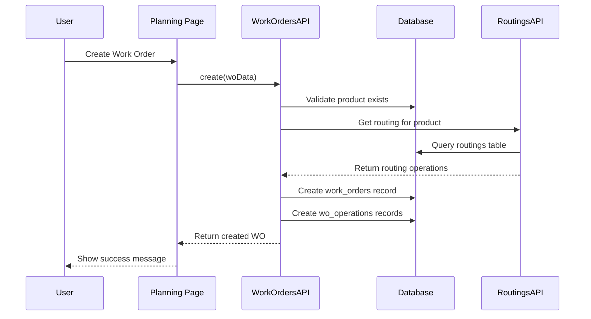
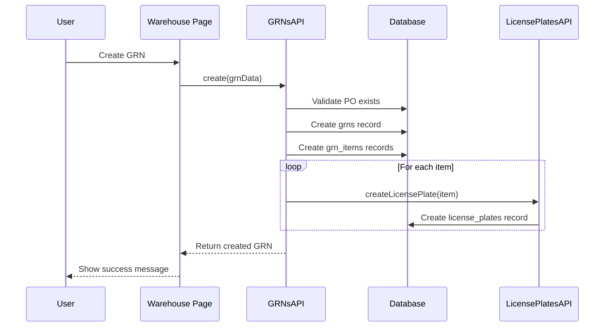
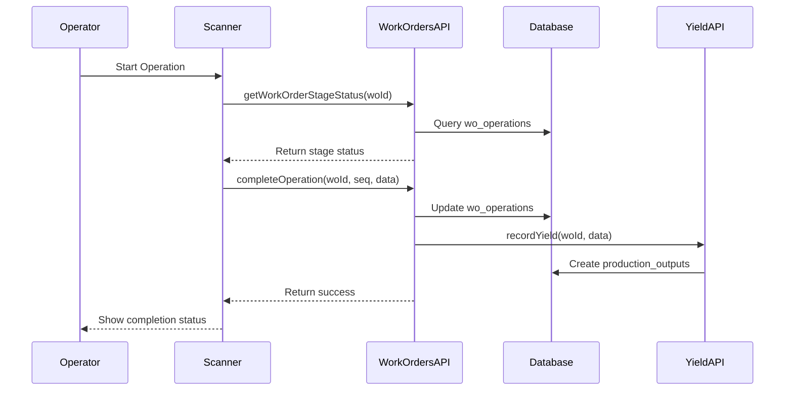

# API Reference Documentation

## Overview
The MonoPilot MES system uses a dual-mode API layer that seamlessly switches between mock data (development) and real Supabase data (production). This approach enables rapid development while maintaining production-ready functionality.

## API Architecture

### Dual-Mode Operation
```typescript
// API Configuration
export const API_CONFIG = {
  useMockData: process.env.NEXT_PUBLIC_USE_MOCK_DATA === 'true',
  supabaseUrl: process.env.NEXT_PUBLIC_SUPABASE_URL,
  supabaseAnonKey: process.env.NEXT_PUBLIC_SUPABASE_ANON_KEY,
  endpoints: {
    workOrders: '/api/work-orders',
    purchaseOrders: '/api/purchase-orders',
    // ... other endpoints
  }
};

// Data source determination
export const shouldUseMockData = () => {
  return API_CONFIG.useMockData || !API_CONFIG.supabaseUrl;
};
```

### API Layer Structure
```
apps/frontend/lib/api/
├── config.ts              # API configuration
├── index.ts               # API exports
├── workOrders.ts          # Work orders API
├── users.ts               # Users API
├── purchaseOrders.ts      # Purchase orders API
├── transferOrders.ts     # Transfer orders API
├── suppliers.ts           # Suppliers API
├── warehouses.ts          # Warehouses API
├── routings.ts            # Routings API
├── supplierProducts.ts    # Supplier products API
├── taxCodes.ts            # Tax codes API
├── asns.ts                # ASNs API
├── yield.ts               # Yield reporting API
├── consume.ts             # Consumption tracking API
├── traceability.ts        # Traceability API
└── licensePlates.ts       # License plates API
```

## API Table Access Matrix

| API Class | Tables Read | Tables Write | Business Rules Enforced |
|-----------|-------------|--------------|------------------------|
| `WorkOrdersAPI` | `work_orders`, `wo_operations`, `wo_materials`, `products` | `work_orders`, `wo_operations` | Sequential routing, 1:1 components, status transitions |
| `ProductsAPI` | `products`, `product_allergens`, `allergens` | `products`, `product_allergens` | Unique part numbers, allergen inheritance |
| `PurchaseOrdersAPI` | `purchase_orders`, `purchase_order_items`, `suppliers` | `purchase_orders`, `purchase_order_items` | GRN validation, status transitions |
| `TransferOrdersAPI` | `transfer_orders`, `transfer_order_items`, `warehouses` | `transfer_orders`, `transfer_order_items` | Warehouse validation, status transitions |
| `GRNsAPI` | `grns`, `grn_items`, `license_plates`, `purchase_orders` | `grns`, `grn_items`, `license_plates` | PO validation, LP creation |
| `LicensePlatesAPI` | `license_plates`, `locations`, `products` | `license_plates` | LP numbering, status management |
| `YieldAPI` | `wo_operations`, `production_outputs`, `work_orders` | `production_outputs` | Yield calculations, variance tracking |
| `TraceabilityAPI` | `license_plates`, `lp_genealogy`, `lp_compositions` | `lp_genealogy`, `lp_compositions` | Trace chain integrity |

## Page-to-API Mapping

| Page | Primary APIs | Secondary APIs | Data Flow |
|------|--------------|----------------|-----------|
| `/technical/bom` | `ProductsAPI`, `RoutingsAPI` | `AllergensAPI`, `TaxCodesAPI` | Product CRUD → BOM management |
| `/production` | `WorkOrdersAPI`, `YieldAPI` | `TraceabilityAPI`, `LicensePlatesAPI` | WO management → Yield tracking |
| `/planning` | `PurchaseOrdersAPI`, `TransferOrdersAPI` | `SuppliersAPI`, `WarehousesAPI` | Order management → Supplier integration |
| `/warehouse` | `GRNsAPI`, `LicensePlatesAPI` | `StockMovesAPI`, `TraceabilityAPI` | Receipt processing → Inventory tracking |
| `/scanner/process` | `WorkOrdersAPI`, `ScannerAPI` | `LicensePlatesAPI` | Operation execution → LP management |
| `/scanner/pack` | `PalletsAPI`, `ScannerAPI` | `LicensePlatesAPI` | Pallet creation → LP composition |

## Core API Classes

### WorkOrdersAPI
```typescript
export class WorkOrdersAPI {
  // Get all work orders with filters
  static async getAll(filters?: {
    line?: string;
    kpi_scope?: 'PR' | 'FG';
    status?: string;
    date_bucket?: 'day' | 'week' | 'month';
  }): Promise<WorkOrder[]>
  
  // Get work order by ID
  static async getById(id: number): Promise<WorkOrder | null>
  
  // Create new work order
  static async create(data: CreateWorkOrderData): Promise<WorkOrder>
  
  // Update work order
  static async update(id: number, data: UpdateWorkOrderData): Promise<WorkOrder>
  
  // Delete work order
  static async delete(id: number): Promise<void>
  
  // Close work order
  static async closeWorkOrder(woId: number, userId: string, reason: string, source: string): Promise<{success: boolean, error?: string}>
  
  // Get work order stage status
  static async getWorkOrderStageStatus(woId: number): Promise<{
    wo_id: number;
    operations: Array<{
      seq: number;
      operation_name: string;
      required_kg: number;
      staged_kg: number;
      in_kg: number;
      remaining_kg: number;
      color_code: 'green' | 'amber' | 'red';
      one_to_one_components: Array<{
        material_id: number;
        material_name: string;
        one_to_one: boolean;
      }>;
    }>;
  }>
}
```

### UsersAPI
```typescript
export class UsersAPI {
  // Get all users
  static async getAll(): Promise<User[]>
  
  // Get user by ID
  static async getById(id: string): Promise<User | null>
  
  // Create new user
  static async create(data: CreateUserData): Promise<User>
  
  // Update user
  static async update(id: string, data: UpdateUserData): Promise<User>
  
  // Delete user
  static async delete(id: string): Promise<void>
  
  // Get users by role
  static async getByRole(role: UserRole): Promise<User[]>
}
```

### PurchaseOrdersAPI
```typescript
export class PurchaseOrdersAPI {
  // Get all purchase orders
  static async getAll(): Promise<PurchaseOrder[]>
  
  // Get purchase order by ID
  static async getById(id: number): Promise<PurchaseOrder | null>
  
  // Create new purchase order
  static async create(data: CreatePurchaseOrderData): Promise<PurchaseOrder>
  
  // Update purchase order
  static async update(id: number, data: UpdatePurchaseOrderData): Promise<PurchaseOrder>
  
  // Delete purchase order
  static async delete(id: number): Promise<void>
  
  // Get purchase orders by status
  static async getByStatus(status: PurchaseOrderStatus): Promise<PurchaseOrder[]>
  
  // Get purchase orders by supplier
  static async getBySupplier(supplierId: number): Promise<PurchaseOrder[]>
}
```

### TransferOrdersAPI
```typescript
export class TransferOrdersAPI {
  // Get all transfer orders
  static async getAll(): Promise<TransferOrder[]>
  
  // Get transfer order by ID
  static async getById(id: number): Promise<TransferOrder | null>
  
  // Create new transfer order
  static async create(data: CreateTransferOrderData): Promise<TransferOrder>
  
  // Update transfer order
  static async update(id: number, data: UpdateTransferOrderData): Promise<TransferOrder>
  
  // Delete transfer order
  static async delete(id: number): Promise<void>
  
  // Get transfer orders by status
  static async getByStatus(status: string): Promise<TransferOrder[]>
}
```

### YieldAPI
```typescript
export class YieldAPI {
  // Get PR yield data
  static async getPRYield(filters?: {
    startDate?: string;
    endDate?: string;
    line?: string;
    product_id?: number;
  }): Promise<YieldReportEntry[]>
  
  // Get FG yield data
  static async getFGYield(filters?: {
    startDate?: string;
    endDate?: string;
    line?: string;
    product_id?: number;
  }): Promise<YieldReportEntry[]>
}
```

### ConsumeAPI
```typescript
export class ConsumeAPI {
  // Get consumption data
  static async getConsumption(filters?: {
    startDate?: string;
    endDate?: string;
    line?: string;
    product_id?: number;
    material_id?: number;
  }): Promise<ConsumptionReportEntry[]>
}
```

### TraceabilityAPI
```typescript
export class TraceabilityAPI {
  // Get forward trace
  static async getForwardTrace(lpNumber: string): Promise<ForwardTraceResponse>
  
  // Get backward trace
  static async getBackwardTrace(lpNumber: string): Promise<BackwardTraceResponse>
  
  // Build trace tree
  static buildTraceTree(data: any[], direction: 'forward' | 'backward'): TraceTree
  
  // Calculate trace completeness
  static calculateTraceCompleteness(data: any[]): number
  
  // Get overall QA status
  static getOverallQAStatus(data: any[]): string
  
  // Calculate total quantity
  static calculateTotalQuantity(data: any[]): number
}
```

### LicensePlatesAPI
```typescript
export class LicensePlatesAPI {
  // Get all license plates
  static async getAll(): Promise<LicensePlate[]>
  
  // Get license plate by ID
  static async getById(id: number): Promise<LicensePlate | null>
  
  // Create new license plate
  static async create(data: CreateLicensePlateData): Promise<LicensePlate | null>
  
  // Update license plate
  static async update(id: number, data: UpdateLicensePlateData): Promise<LicensePlate | null>
  
  // Delete license plate
  static async delete(id: number): Promise<boolean>
  
  // Split license plate
  static async splitLP(parentLpId: number, newLpData: CreateLicensePlateData[]): Promise<LicensePlate[] | null>
  
  // Get LP compositions
  static async getLPCompositions(lpId: number): Promise<any[]>
}
```

## Data Access Patterns

### Mock Data Pattern
```typescript
// Mock data implementation
static async getAll(): Promise<WorkOrder[]> {
  if (shouldUseMockData()) {
    return clientState.getWorkOrders();
  }
  
  // Real data implementation
  const { data, error } = await supabase.from('work_orders').select('*');
  return data || [];
}
```

### Supabase Integration Pattern
```typescript
// Supabase query pattern
static async getById(id: number): Promise<WorkOrder | null> {
  if (shouldUseMockData()) {
    const workOrders = clientState.getWorkOrders();
    return workOrders.find(wo => wo.id === id.toString()) || null;
  }
  
  const { data, error } = await supabase
    .from('work_orders')
    .select('*')
    .eq('id', id)
    .single();
    
  if (error) throw error;
  return data;
}
```

### Error Handling Pattern
```typescript
// Error handling implementation
static async create(data: CreateWorkOrderData): Promise<WorkOrder> {
  try {
    if (shouldUseMockData()) {
      return clientState.addWorkOrder(data);
    }
    
    const { data: result, error } = await supabase
      .from('work_orders')
      .insert(data)
      .select()
      .single();
      
    if (error) throw error;
    return result;
  } catch (error) {
    console.error('Error creating work order:', error);
    throw error;
  }
}
```

## Request/Response Formats

### Work Order API
```typescript
// Create Work Order Request
interface CreateWorkOrderData {
  wo_number: string;
  product_id: string;
  quantity: number;
  status: WorkOrderStatus;
  due_date: string;
  scheduled_start?: string;
  scheduled_end?: string;
  machine_id?: string;
  line_number?: string;
  priority?: number;
}

// Update Work Order Request
interface UpdateWorkOrderData {
  wo_number?: string;
  product_id?: string;
  quantity?: number;
  status?: WorkOrderStatus;
  due_date?: string;
  scheduled_start?: string;
  scheduled_end?: string;
  machine_id?: string;
  line_number?: string;
  priority?: number;
}

// Work Order Response
interface WorkOrder {
  id: string;
  wo_number: string;
  product_id: string;
  quantity: number;
  status: WorkOrderStatus;
  due_date: string;
  scheduled_start?: string;
  scheduled_end?: string;
  machine_id?: string;
  machine?: Machine;
  product?: Product;
  line_number?: string;
  priority?: number;
  created_at: string;
  updated_at: string;
}
```

### Purchase Order API
```typescript
// Create Purchase Order Request
interface CreatePurchaseOrderData {
  po_number: string;
  supplier_id: number;
  status: PurchaseOrderStatus;
  order_date: string;
  expected_delivery: string;
  due_date?: string;
  warehouse_id?: number;
  request_delivery_date?: string;
  expected_delivery_date?: string;
  buyer_id?: string;
  buyer_name?: string;
  total_amount: number;
  notes?: string;
}

// Purchase Order Response
interface PurchaseOrder {
  id: number;
  po_number: string;
  supplier_id: number;
  status: PurchaseOrderStatus;
  order_date: string;
  expected_delivery: string;
  due_date?: string;
  warehouse_id?: number;
  request_delivery_date?: string;
  expected_delivery_date?: string;
  buyer_id?: string;
  buyer_name?: string;
  total_amount: number;
  notes?: string;
  supplier?: Supplier;
  warehouse?: Warehouse;
  purchase_order_items?: PurchaseOrderItem[];
  created_at: string;
  updated_at: string;
}
```

## Authentication & Authorization

### Supabase Auth Integration
```typescript
// Authentication context
import { createClient } from '@supabase/supabase-js';

const supabase = createClient(
  process.env.NEXT_PUBLIC_SUPABASE_URL!,
  process.env.NEXT_PUBLIC_SUPABASE_ANON_KEY!
);

// Auth state management
export const useAuth = () => {
  const [user, setUser] = useState<User | null>(null);
  const [loading, setLoading] = useState(true);
  
  useEffect(() => {
    const { data: { subscription } } = supabase.auth.onAuthStateChange(
      async (event, session) => {
        setUser(session?.user ?? null);
        setLoading(false);
      }
    );
    
    return () => subscription.unsubscribe();
  }, []);
  
  return { user, loading };
};
```

### Role-Based Access Control
```typescript
// Role-based API access
export class WorkOrdersAPI {
  static async getAll(): Promise<WorkOrder[]> {
    const { user } = await supabase.auth.getUser();
    
    if (!user) {
      throw new Error('Authentication required');
    }
    
    // Role-based filtering
    const { data, error } = await supabase
      .from('work_orders')
      .select('*')
      .eq('created_by', user.id); // User can only see their own work orders
      
    return data || [];
  }
}
```

## Error Handling Patterns

### API Error Types
```typescript
// API Error interface
interface APIError {
  code: string;
  message: string;
  details?: any;
  status?: number;
}

// Error handling utility
export const handleAPIError = (error: any): APIError => {
  if (error.code) {
    return {
      code: error.code,
      message: error.message,
      details: error.details,
      status: error.status
    };
  }
  
  return {
    code: 'UNKNOWN_ERROR',
    message: error.message || 'An unknown error occurred',
    details: error
  };
};
```

### Error Handling in API Classes
```typescript
// Error handling pattern
static async create(data: CreateWorkOrderData): Promise<WorkOrder> {
  try {
    if (shouldUseMockData()) {
      return clientState.addWorkOrder(data);
    }
    
    const { data: result, error } = await supabase
      .from('work_orders')
      .insert(data)
      .select()
      .single();
      
    if (error) {
      throw handleAPIError(error);
    }
    
    return result;
  } catch (error) {
    console.error('WorkOrdersAPI.create error:', error);
    throw error;
  }
}
```

## Data Validation

### Input Validation
```typescript
// Validation schemas
import { z } from 'zod';

const CreateWorkOrderSchema = z.object({
  wo_number: z.string().min(1, 'Work order number is required'),
  product_id: z.string().min(1, 'Product ID is required'),
  quantity: z.number().positive('Quantity must be positive'),
  status: z.enum(['draft', 'planned', 'released', 'in_progress', 'completed', 'cancelled']),
  due_date: z.string().datetime('Invalid date format'),
  scheduled_start: z.string().datetime().optional(),
  scheduled_end: z.string().datetime().optional(),
  machine_id: z.string().optional(),
  line_number: z.string().optional(),
  priority: z.number().optional()
});

// Validation in API methods
static async create(data: CreateWorkOrderData): Promise<WorkOrder> {
  // Validate input data
  const validatedData = CreateWorkOrderSchema.parse(data);
  
  // Proceed with creation
  // ...
}
```

### Response Validation
```typescript
// Response validation
const WorkOrderSchema = z.object({
  id: z.string(),
  wo_number: z.string(),
  product_id: z.string(),
  quantity: z.number(),
  status: z.enum(['draft', 'planned', 'released', 'in_progress', 'completed', 'cancelled']),
  due_date: z.string(),
  created_at: z.string(),
  updated_at: z.string()
});

// Validate response data
static async getById(id: number): Promise<WorkOrder | null> {
  const data = await supabase.from('work_orders').select('*').eq('id', id).single();
  
  if (data.error) {
    throw handleAPIError(data.error);
  }
  
  // Validate response
  const validatedData = WorkOrderSchema.parse(data.data);
  return validatedData;
}
```

## Performance Optimization

### Caching Strategy
```typescript
// SWR integration for caching
import useSWR from 'swr';

export const useWorkOrders = () => {
  const { data, error, mutate } = useSWR(
    'work-orders',
    () => WorkOrdersAPI.getAll(),
    {
      revalidateOnFocus: false,
      revalidateOnReconnect: true,
      refreshInterval: 30000 // 30 seconds
    }
  );
  
  return {
    workOrders: data || [],
    loading: !error && !data,
    error,
    mutate
  };
};
```

### Pagination
```typescript
// Pagination support
interface PaginatedResponse<T> {
  data: T[];
  total: number;
  page: number;
  limit: number;
  hasNext: boolean;
  hasPrev: boolean;
}

export class WorkOrdersAPI {
  static async getPaginated(
    page: number = 1,
    limit: number = 20,
    filters?: any
  ): Promise<PaginatedResponse<WorkOrder>> {
    const offset = (page - 1) * limit;
    
    const { data, error, count } = await supabase
      .from('work_orders')
      .select('*', { count: 'exact' })
      .range(offset, offset + limit - 1);
      
    if (error) throw error;
    
    return {
      data: data || [],
      total: count || 0,
      page,
      limit,
      hasNext: (offset + limit) < (count || 0),
      hasPrev: page > 1
    };
  }
}
```

## Testing Patterns

### Mock Data Testing
```typescript
// Mock data for testing
export const mockWorkOrders: WorkOrder[] = [
  {
    id: '1',
    wo_number: 'WO-2024-001',
    product_id: '1',
    quantity: 100,
    status: 'planned',
    due_date: '2024-12-31T00:00:00Z',
    created_at: '2024-01-01T00:00:00Z',
    updated_at: '2024-01-01T00:00:00Z'
  }
];

// Test utilities
export const createMockWorkOrder = (overrides: Partial<WorkOrder> = {}): WorkOrder => ({
  id: '1',
  wo_number: 'WO-2024-001',
  product_id: '1',
  quantity: 100,
  status: 'planned',
  due_date: '2024-12-31T00:00:00Z',
  created_at: '2024-01-01T00:00:00Z',
  updated_at: '2024-01-01T00:00:00Z',
  ...overrides
});
```

### API Testing
```typescript
// API testing utilities
export const testWorkOrdersAPI = async () => {
  // Test getAll
  const workOrders = await WorkOrdersAPI.getAll();
  expect(workOrders).toBeDefined();
  expect(Array.isArray(workOrders)).toBe(true);
  
  // Test create
  const newWO = await WorkOrdersAPI.create({
    wo_number: 'WO-TEST-001',
    product_id: '1',
    quantity: 50,
    status: 'draft',
    due_date: '2024-12-31T00:00:00Z'
  });
  
  expect(newWO).toBeDefined();
  expect(newWO.wo_number).toBe('WO-TEST-001');
  
  // Test update
  const updatedWO = await WorkOrdersAPI.update(newWO.id, {
    status: 'planned'
  });
  
  expect(updatedWO.status).toBe('planned');
  
  // Test delete
  await WorkOrdersAPI.delete(newWO.id);
  
  const deletedWO = await WorkOrdersAPI.getById(newWO.id);
  expect(deletedWO).toBeNull();
};
```

## Environment Configuration

### Development Environment
```bash
# .env.local
NEXT_PUBLIC_USE_MOCK_DATA=true
NEXT_PUBLIC_SUPABASE_URL=your-supabase-url
NEXT_PUBLIC_SUPABASE_ANON_KEY=your-supabase-anon-key
```

### Production Environment
```bash
# Production environment variables
NEXT_PUBLIC_USE_MOCK_DATA=false
NEXT_PUBLIC_SUPABASE_URL=https://your-project.supabase.co
NEXT_PUBLIC_SUPABASE_ANON_KEY=your-production-anon-key
```

## API Documentation Best Practices

### Code Documentation
```typescript
/**
 * Work Orders API - Handles all work order operations
 * 
 * @example
 * ```typescript
 * // Get all work orders
 * const workOrders = await WorkOrdersAPI.getAll();
 * 
 * // Create new work order
 * const newWO = await WorkOrdersAPI.create({
 *   wo_number: 'WO-2024-001',
 *   product_id: '1',
 *   quantity: 100,
 *   status: 'planned',
 *   due_date: '2024-12-31T00:00:00Z'
 * });
 * ```
 */
export class WorkOrdersAPI {
  /**
   * Get all work orders
   * @returns Promise<WorkOrder[]> Array of work orders
   * @throws {APIError} When request fails
   */
  static async getAll(): Promise<WorkOrder[]> {
    // Implementation
  }
}
```

### API Usage Examples
```typescript
// Basic usage examples
import { WorkOrdersAPI, UsersAPI, PurchaseOrdersAPI } from '@/lib/api';

// Work Orders
const workOrders = await WorkOrdersAPI.getAll();
const workOrder = await WorkOrdersAPI.getById(1);
const newWO = await WorkOrdersAPI.create(workOrderData);

// Users
const users = await UsersAPI.getAll();
const user = await UsersAPI.getById('user-id');

// Purchase Orders
const purchaseOrders = await PurchaseOrdersAPI.getAll();
const po = await PurchaseOrdersAPI.getById(1);
```

## Production Module API Endpoints

### Work Order Operations
```typescript
// Close Work Order
POST /api/production/work-orders/[id]/close
{
  "userId": "user-id",
  "reason": "Completed",
  "source": "portal"
}

// Record Operation Weights
POST /api/production/wo/[id]/operations/[seq]/weights
{
  "actual_input_weight": 100.0,
  "actual_output_weight": 95.0,
  "cooking_loss_weight": 3.0,
  "trim_loss_weight": 2.0,
  "marinade_gain_weight": 0.0,
  "scrap_breakdown": {"fat": 1.0, "bone": 1.0}
}

// Update BOM Snapshot
POST /api/production/work-orders/[id]/update-bom-snapshot
{
  "materials": [
    {
      "material_id": 1,
      "quantity": 50.0,
      "uom": "kg",
      "one_to_one": true,
      "is_optional": false
    }
  ]
}
```

### Scanner Integration
```typescript
// Stage Board Status
GET /api/scanner/wo/[id]/stage-status

// Stage Materials
POST /api/scanner/process/[woId]/operations/[seq]/stage
{
  "lp_number": "LP-001",
  "quantity": 50.0,
  "uom": "kg",
  "user_id": "user-id"
}

// Record Scanner Weights
POST /api/scanner/process/[woId]/operations/[seq]/weights
{
  "actual_input_weight": 100.0,
  "actual_output_weight": 95.0,
  "cooking_loss_weight": 3.0,
  "trim_loss_weight": 2.0,
  "marinade_gain_weight": 0.0,
  "scrap_breakdown": {"fat": 1.0, "bone": 1.0},
  "user_id": "user-id"
}

// Complete Operation
POST /api/scanner/process/[woId]/complete-op/[seq]
{
  "output_lp_number": "LP-002",
  "output_quantity": 95.0,
  "output_uom": "kg",
  "user_id": "user-id",
  "qa_status": "Passed"
}

// Pack Terminal
POST /api/scanner/pack/[woId]
{
  "pallet_number": "PLT-2024-001",
  "lp_numbers": ["LP-001", "LP-002"],
  "location_id": 1,
  "user_id": "user-id"
}
```

### Reservations
```typescript
// Create Reservation
POST /api/scanner/reservations
{
  "lp_id": 1,
  "wo_id": 1,
  "qty": 50.0,
  "operation_id": 1,
  "notes": "Test reservation"
}

// Get Reservations
GET /api/scanner/reservations?lp_id=1&wo_id=1&status=active

// Cancel Reservation
DELETE /api/scanner/reservations/[id]
```

### Pallets
```typescript
// Create Pallet
POST /api/production/pallets
{
  "pallet_number": "PLT-2024-001",
  "location_id": 1,
  "status": "packed",
  "meta": {}
}

// Add LP to Pallet
POST /api/production/pallets/[id]/items
{
  "lp_id": 1,
  "quantity": 50.0,
  "uom": "kg"
}

// Remove LP from Pallet
DELETE /api/production/pallets/[id]/items
{
  "lp_id": 1
}
```

### Excel Exports
```typescript
// Export PR Yield
GET /api/exports/yield-pr.xlsx?startDate=2024-01-01&endDate=2024-01-31&line=Line-1

// Export FG Yield
GET /api/exports/yield-fg.xlsx?startDate=2024-01-01&endDate=2024-01-31&line=Line-1

// Export Consumption
GET /api/exports/consume.xlsx?woId=1&startDate=2024-01-01&endDate=2024-01-31

// Export Traceability
GET /api/exports/trace.xlsx?lp=LP-001&direction=forward

// Export Work Orders
GET /api/exports/work-orders.xlsx?line=Line-1&status=in_progress

// Export License Plates
GET /api/exports/license-plates.xlsx?qa_status=Passed&location=1

// Export Stock Moves
GET /api/exports/stock-moves.xlsx?move_type=WO_ISSUE&startDate=2024-01-01&endDate=2024-01-31
```

## Business Logic Validation

### Sequential Routing Enforcement
```typescript
// Validates operation sequence
export class SequentialRoutingValidator {
  static async validateOperationSequence(
    woId: number, 
    operationSeq: number, 
    action: 'start' | 'complete'
  ): Promise<{isValid: boolean, error?: string}>
}
```

### One-to-One Component Rule
```typescript
// Validates 1:1 component relationships
export class OneToOneValidator {
  static async validateOneToOneRule(
    woId: number,
    operationSeq: number,
    inputLPs: string[],
    outputLPs: string[]
  ): Promise<{isOneToOne: boolean, isValid: boolean, error?: string}>
}
```

### Cross-WO PR Intake Validation
```typescript
// Validates cross-WO PR intake
export class CrossWOValidator {
  static async validateCrossWOPRIntake(
    inputLP: string,
    expectedProductId: number,
    expectedStageSuffix: string
  ): Promise<{isValid: boolean, error?: string}>
}
```

### Reservation-Safe Operations
```typescript
// Validates reservation safety
export class ReservationValidator {
  static async checkAvailableQuantity(lpId: number): Promise<number>
  static async validateReservation(
    lpId: number,
    requestedQty: number
  ): Promise<{isValid: boolean, error?: string}>
}
```

### QA Gate Enforcement
```typescript
// Validates QA status
export class QAGateValidator {
  static async validateQAStatus(
    lpId: number,
    action: 'ISSUE' | 'OUTPUT'
  ): Promise<{isValid: boolean, error?: string}>
  
  static async validateQAOverride(
    userId: string,
    pin: string,
    reason: string
  ): Promise<{isValid: boolean, error?: string}>
}
```

## Business Flow Diagrams

### Work Order Creation Flow


### GRN Processing Flow


### Production Execution Flow


## Error Handling Patterns

### Common Error Codes
| Code | Description | Resolution |
|------|-------------|------------|
| `VALIDATION_ERROR` | Input validation failed | Check required fields and data types |
| `NOT_FOUND` | Resource not found | Verify ID exists and user has access |
| `DUPLICATE_KEY` | Unique constraint violation | Check for existing records |
| `FOREIGN_KEY_ERROR` | Referenced record missing | Verify related records exist |
| `RLS_VIOLATION` | Row Level Security violation | Check user permissions |
| `BUSINESS_RULE_ERROR` | Business logic violation | Review business rules |

### Error Response Format
```typescript
interface APIError {
  code: string;
  message: string;
  details?: {
    field?: string;
    value?: any;
    constraint?: string;
  };
  timestamp: string;
  requestId: string;
}
```

### Retry Logic
```typescript
// Automatic retry for transient errors
const RETRYABLE_ERRORS = ['NETWORK_ERROR', 'TIMEOUT', 'RATE_LIMIT'];
const MAX_RETRIES = 3;
const RETRY_DELAY = 1000; // ms

export async function withRetry<T>(
  operation: () => Promise<T>,
  maxRetries = MAX_RETRIES
): Promise<T> {
  for (let i = 0; i < maxRetries; i++) {
    try {
      return await operation();
    } catch (error) {
      if (i === maxRetries - 1 || !RETRYABLE_ERRORS.includes(error.code)) {
        throw error;
      }
      await new Promise(resolve => setTimeout(resolve, RETRY_DELAY * (i + 1)));
    }
  }
}
```

## Performance Considerations

### Caching Strategy
- **Server-side**: Next.js caching for static data
- **Client-side**: SWR for dynamic data with revalidation
- **Database**: Query result caching for frequently accessed data

### Query Optimization
- Use specific column selection instead of `SELECT *`
- Implement pagination for large datasets
- Use database indexes for common query patterns
- Batch operations when possible

### Rate Limiting
- API calls limited per user per minute
- Bulk operations have separate limits
- Real-time updates use WebSocket connections

## Future Enhancements

### Planned API Improvements
1. **Real-time Updates**: WebSocket integration for live data
2. **Advanced Filtering**: Complex query filtering
3. **Bulk Operations**: Batch operations for efficiency
4. **Export Functionality**: Data export capabilities
5. **Audit Logging**: Comprehensive audit trails
6. **Rate Limiting**: API rate limiting and throttling
7. **Caching**: Advanced caching strategies
8. **Monitoring**: API performance monitoring
