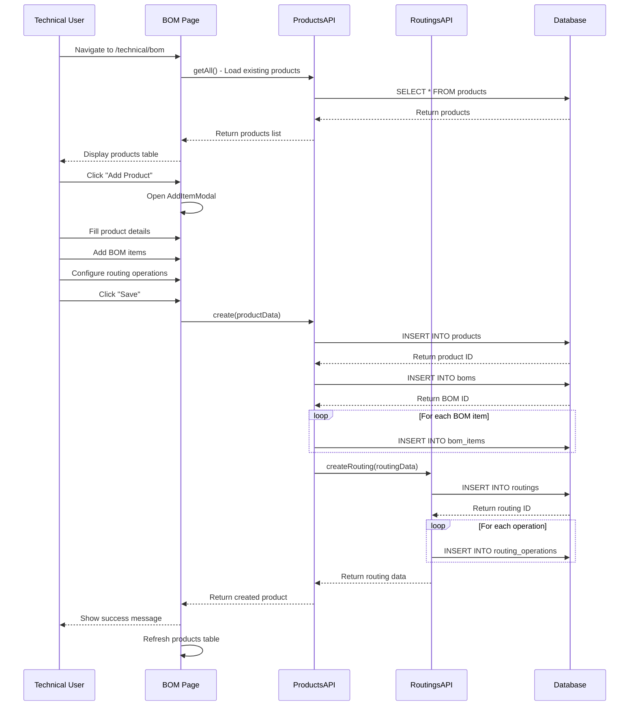
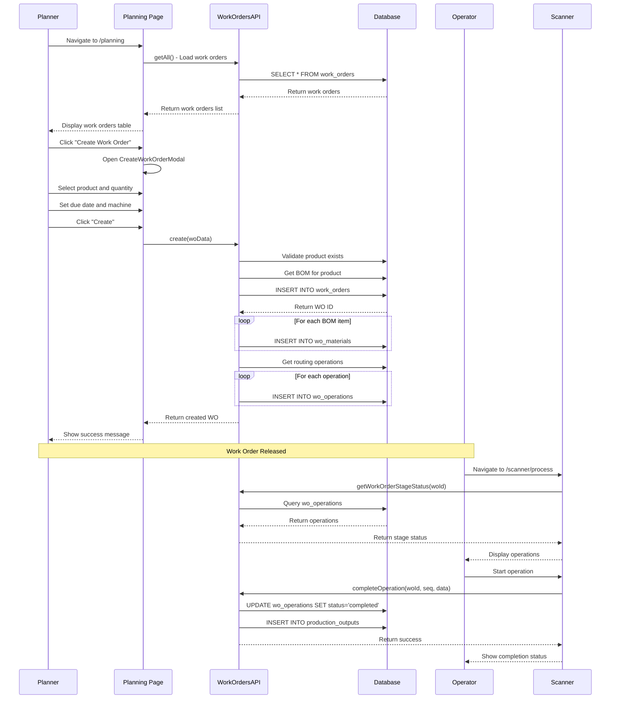
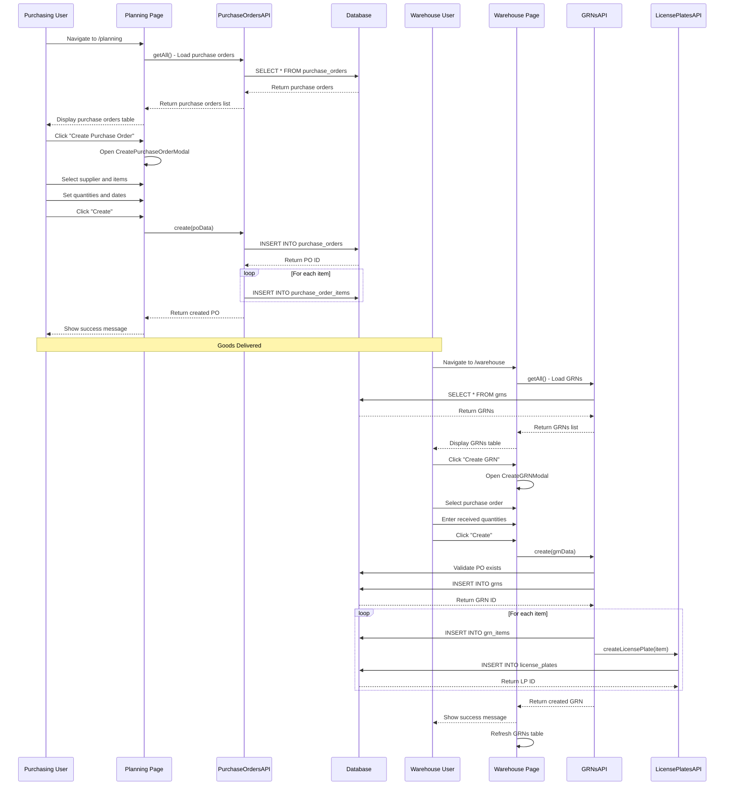
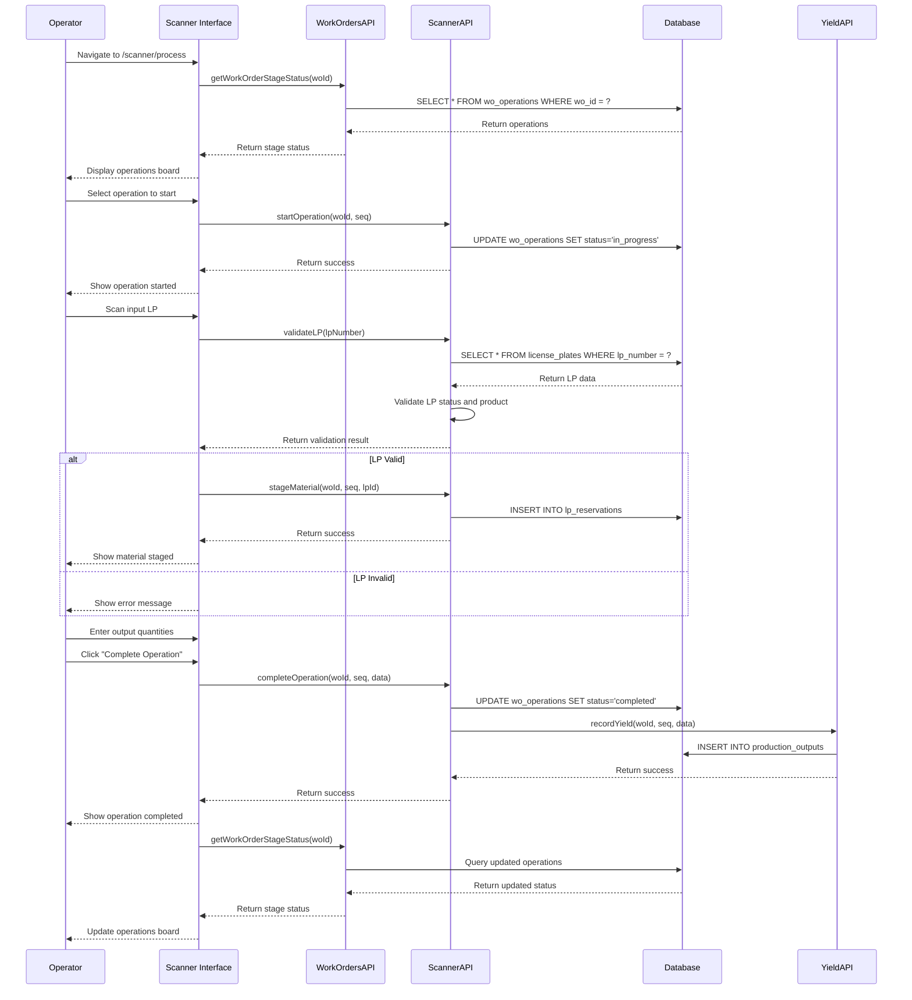
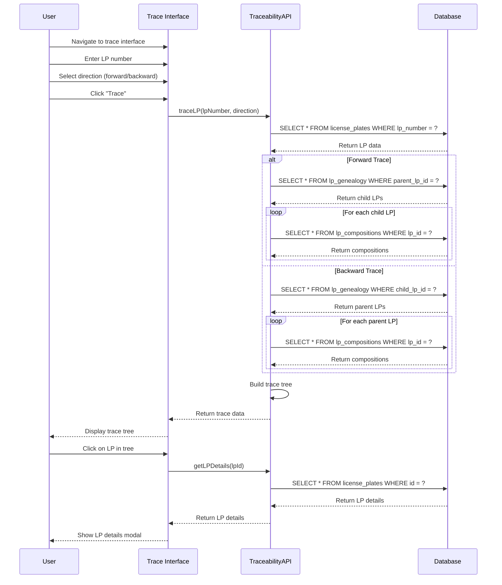
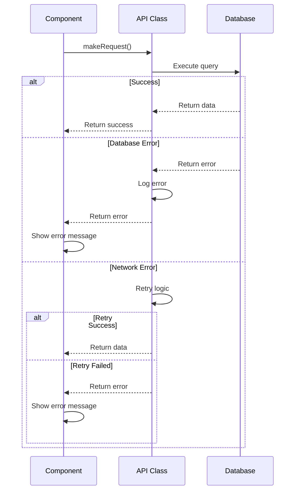
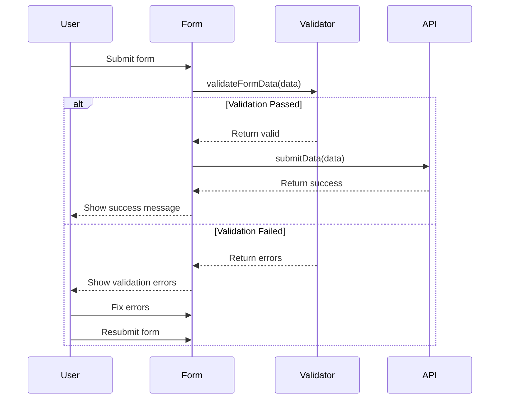
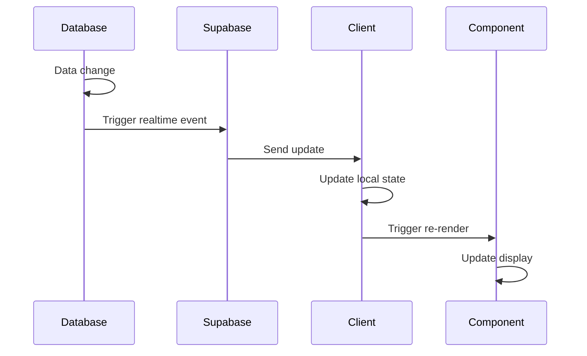
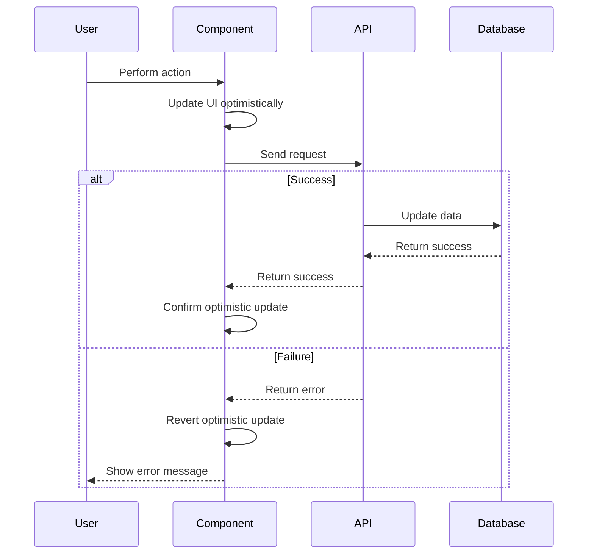

# Business Process Flows

## Overview
This document describes the key business processes in the MonoPilot MES system, including user interactions, API calls, database operations, and state changes.

## Core Business Flows

### 1. Product Creation and BOM Setup

**Process**: Create new product with bill of materials and routing

**Participants**: Technical User, System

**Flow**:

**Database Operations**:
- `INSERT INTO products` - Create product
- `INSERT INTO boms` - Create BOM
- `INSERT INTO bom_items` - Create BOM items
- `INSERT INTO routings` - Create routing
- `INSERT INTO routing_operations` - Create operations

**Business Rules**:
- Product part number must be unique
- BOM items must reference valid materials
- Routing operations must be sequential
- Allergen inheritance from components

### 2. Work Order Creation and Execution

**Process**: Create work order and execute production

**Participants**: Planner, Operator, System

**Flow**:

**Database Operations**:
- `INSERT INTO work_orders` - Create work order
- `INSERT INTO wo_materials` - Create material requirements
- `INSERT INTO wo_operations` - Create operations
- `UPDATE wo_operations` - Complete operations
- `INSERT INTO production_outputs` - Record yield

**Business Rules**:
- Work order requires valid BOM
- Operations must be sequential
- One-to-one components consume entire LP
- QA status blocks operations

### 3. Purchase Order to GRN Process

**Process**: Create purchase order and receive goods

**Participants**: Purchasing User, Warehouse User, System

**Flow**:

**Database Operations**:
- `INSERT INTO purchase_orders` - Create purchase order
- `INSERT INTO purchase_order_items` - Create PO items
- `INSERT INTO grns` - Create GRN
- `INSERT INTO grn_items` - Create GRN items
- `INSERT INTO license_plates` - Create license plates

**Business Rules**:
- GRN must reference valid PO
- Received quantities cannot exceed ordered
- License plates track material batches
- QA status assigned to new LPs

### 4. Production Execution with Scanner

**Process**: Execute production operations using scanner interface

**Participants**: Operator, System

**Flow**:

**Database Operations**:
- `SELECT FROM wo_operations` - Get operations
- `UPDATE wo_operations` - Update operation status
- `INSERT INTO lp_reservations` - Reserve materials
- `INSERT INTO production_outputs` - Record yield

**Business Rules**:
- Sequential operation execution
- One-to-one component validation
- QA status enforcement
- Reservation safety checks

### 5. Traceability Query Process

**Process**: Trace materials forward or backward through production

**Participants**: User, System

**Flow**:

**Database Operations**:
- `SELECT FROM license_plates` - Get LP data
- `SELECT FROM lp_genealogy` - Get parent/child relationships
- `SELECT FROM lp_compositions` - Get LP compositions

**Business Rules**:
- Trace chain integrity
- Direction-based traversal
- Data visualization

## Error Handling Flows

### API Error Handling

### Validation Error Handling

## State Management Flows

### Real-time Updates

### Optimistic Updates

## Performance Considerations

### Data Loading Patterns
- Server-side data fetching for initial load
- Client-side caching with SWR
- Background revalidation
- Pagination for large datasets

### Error Recovery
- Retry logic for transient errors
- Fallback data for critical failures
- User-friendly error messages
- Graceful degradation

## See Also

- [System Overview](SYSTEM_OVERVIEW.md) - High-level system architecture
- [API Reference](API_REFERENCE.md) - API documentation
- [Page Reference](PAGE_REFERENCE.md) - Page mappings
- [Component Reference](COMPONENT_REFERENCE.md) - Component documentation
