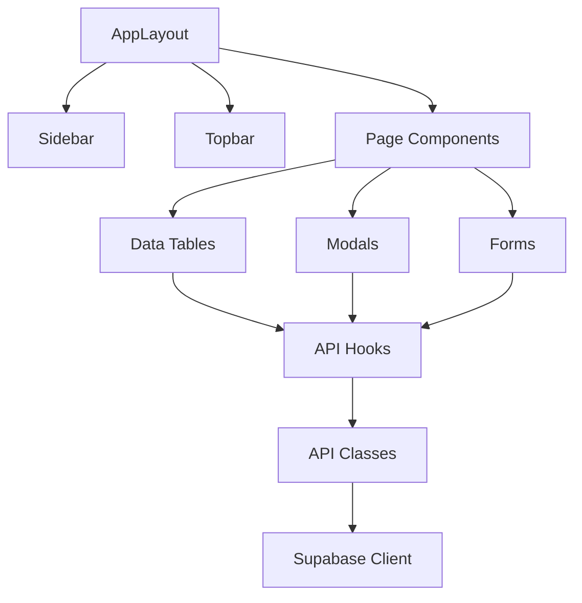

# Component Reference Guide

**Last Updated**: 2025-01-XX  
**Version**: 2.0 - Documentation Audit Update

## Overview
This document provides comprehensive documentation of all major React components in the MonoPilot MES system, including their props, state management, API dependencies, and usage patterns.

## Component Architecture

### Component Hierarchy


## Core Layout Components

### AppLayout
**File**: `components/layout/AppLayout.tsx`

**Purpose**: Main application layout wrapper

**Props**:
```typescript
interface AppLayoutProps {
  children: React.ReactNode;
  title?: string;
  description?: string;
}
```

**State Management**: Uses `AuthContext` for user authentication

**API Dependencies**: None (layout only)

**Related Components**: `Sidebar`, `Topbar`

**Usage**:
```tsx
<AppLayout title="Production Dashboard">
  <ProductionContent />
</AppLayout>
```

### Sidebar
**File**: `components/layout/Sidebar.tsx`

**Purpose**: Navigation sidebar with module links

**Props**:
```typescript
interface SidebarProps {
  isOpen: boolean;
  onToggle: () => void;
}
```

**State Management**: Uses `AuthContext` for user role-based navigation

**API Dependencies**: None

**Related Components**: `AppLayout`

**Business Logic**: Role-based menu visibility

### Topbar
**File**: `components/layout/Topbar.tsx`

**Purpose**: Top navigation bar with user info and actions

**Props**:
```typescript
interface TopbarProps {
  title: string;
  user?: User;
  onLogout: () => void;
}
```

**State Management**: Uses `AuthContext` for user data

**API Dependencies**: `UsersAPI` for user profile

**Related Components**: `AppLayout`

## Data Table Components

### WorkOrdersTable
**File**: `components/WorkOrdersTable.tsx`

**Purpose**: Display and manage work orders

**Props**:
```typescript
interface WorkOrdersTableProps {
  filters?: {
    status?: string;
    line?: string;
    dateRange?: { start: Date; end: Date };
  };
  onWorkOrderSelect?: (workOrder: WorkOrder) => void;
  showActions?: boolean;
}
```

**State Management**: Uses `useWorkOrders` hook

**API Dependencies**: `WorkOrdersAPI`, `YieldAPI`

**Tables Accessed**: `work_orders`, `wo_operations`, `products`

**Related Components**: `WorkOrderDetailsModal`, `CreateWorkOrderModal`

**Business Rules**:
- Status-based row coloring
- Role-based action visibility
- Real-time status updates

### ProductsTable
**File**: `components/ProductsTable.tsx`

**Purpose**: Display and manage products

**Props**:
```typescript
interface ProductsTableProps {
  products: Product[];
  loading: boolean;
  onProductSelect?: (product: Product) => void;
  onEdit?: (product: Product) => void;
  onDelete?: (product: Product) => void;
  showActions?: boolean;
}
```

**State Management**: Receives products as props

**API Dependencies**: `ProductsAPI` (via parent)

**Tables Accessed**: `products`, `product_allergens`, `allergens`

**Related Components**: `AddItemModal`, `BomCatalogClient`

**Business Rules**:
- Product categorization display
- Allergen indicator icons
- Active/inactive status filtering

### PurchaseOrdersTable
**File**: `components/PurchaseOrdersTable.tsx`

**Purpose**: Display and manage purchase orders

**Props**:
```typescript
interface PurchaseOrdersTableProps {
  purchaseOrders: PurchaseOrder[];
  loading: boolean;
  onOrderSelect?: (order: PurchaseOrder) => void;
  onEdit?: (order: PurchaseOrder) => void;
  onDelete?: (order: PurchaseOrder) => void;
}
```

**State Management**: Receives data as props

**API Dependencies**: `PurchaseOrdersAPI` (via parent)

**Tables Accessed**: `purchase_orders`, `purchase_order_items`, `suppliers`

**Related Components**: `CreatePurchaseOrderModal`, `EditPurchaseOrderModal`

**Business Rules**:
- Status-based row styling
- Supplier information display
- GRN creation validation

## Modal Components

### AddItemModal
**File**: `components/AddItemModal.tsx`

**Purpose**: Create new products with BOM and routing

**Props**:
```typescript
interface AddItemModalProps {
  isOpen: boolean;
  onClose: () => void;
  onSuccess?: (product: Product) => void;
  initialData?: Partial<Product>;
}
```

**State Management**: Local state for form data

**API Dependencies**: `ProductsAPI`, `RoutingsAPI`, `AllergensAPI`, `TaxCodesAPI`, `SuppliersAPI`

**Tables Accessed**: `products`, `boms`, `bom_items`, `routings`, `routing_operations`, `allergens`, `settings_tax_codes`, `suppliers`

**Related Components**: `BomCatalogClient`

**Business Rules**:
- Product number uniqueness validation
- BOM item quantity validation
- Allergen inheritance logic
- Routing operation sequence validation

### CreateWorkOrderModal
**File**: `components/CreateWorkOrderModal.tsx`

**Purpose**: Create new work orders

**Props**:
```typescript
interface CreateWorkOrderModalProps {
  isOpen: boolean;
  onClose: () => void;
  onSuccess?: (workOrder: WorkOrder) => void;
  productId?: number;
}
```

**State Management**: Local state for form data

**API Dependencies**: `WorkOrdersAPI`, `ProductsAPI`, `MachinesAPI`

**Tables Accessed**: `work_orders`, `wo_operations`, `products`, `machines`

**Related Components**: `WorkOrdersTable`

**Business Rules**:
- Product BOM validation
- Machine availability checking
- Quantity validation
- Due date validation

### CreateGRNModal
**File**: `components/CreateGRNModal.tsx`

**Purpose**: Create goods receipt notes

**Props**:
```typescript
interface CreateGRNModalProps {
  isOpen: boolean;
  onClose: () => void;
  onSuccess?: (grn: GRN) => void;
  purchaseOrderId?: number;
}
```

**State Management**: Local state for form data

**API Dependencies**: `GRNsAPI`, `PurchaseOrdersAPI`, `LicensePlatesAPI`

**Tables Accessed**: `grns`, `grn_items`, `license_plates`, `purchase_orders`

**Related Components**: `GRNTable`

**Business Rules**:
- Purchase order validation
- License plate creation
- Quantity validation
- QA status assignment

## Scanner Components

### StageBoard
**File**: `components/scanner/StageBoard.tsx`

**Purpose**: Display staged materials for operations

**Props**:
```typescript
interface StageBoardProps {
  workOrderId: number;
  operationSeq: number;
  onMaterialSelect?: (lp: LicensePlate) => void;
  onStageMaterial?: (lp: LicensePlate) => void;
}
```

**State Management**: Uses `useWorkOrderStageStatus` hook

**API Dependencies**: `WorkOrdersAPI`, `ScannerAPI`

**Tables Accessed**: `wo_operations`, `license_plates`, `lp_reservations`

**Related Components**: `StagedLPsList`

**Business Rules**:
- One-to-one component validation
- Reservation safety checks
- QA status enforcement

### StagedLPsList
**File**: `components/scanner/StagedLPsList.tsx`

**Purpose**: List staged license plates

**Props**:
```typescript
interface StagedLPsListProps {
  stagedLPs: LicensePlate[];
  onLPSelect?: (lp: LicensePlate) => void;
  onRemove?: (lp: LicensePlate) => void;
}
```

**State Management**: Receives staged LPs as props

**API Dependencies**: `ScannerAPI`

**Tables Accessed**: `license_plates`, `lp_reservations`

**Related Components**: `StageBoard`

**Business Rules**:
- LP status validation
- Quantity availability checking
- Reservation management

## Form Components

### SettingsForm
**File**: `components/SettingsForm.tsx`

**Purpose**: System configuration form

**Props**:
```typescript
interface SettingsFormProps {
  settings: Settings;
  onSave: (settings: Settings) => void;
  loading?: boolean;
}
```

**State Management**: Local state for form data

**API Dependencies**: `SettingsAPI`

**Tables Accessed**: `settings`

**Related Components**: None

**Business Rules**:
- Configuration validation
- Role-based field access
- Setting persistence

## Specialized Components

### TraceTab
**File**: `components/TraceTab.tsx`

**Purpose**: Traceability visualization

**Props**:
```typescript
interface TraceTabProps {
  lpNumber: string;
  direction: 'forward' | 'backward';
  onTraceComplete?: (traceData: TraceData) => void;
}
```

**State Management**: Uses `useTraceability` hook

**API Dependencies**: `TraceabilityAPI`

**Tables Accessed**: `license_plates`, `lp_genealogy`, `lp_compositions`

**Related Components**: `TraceLPModal`

**Business Rules**:
- Trace chain integrity
- Direction-based traversal
- Data visualization

### YieldReportTab
**File**: `components/YieldReportTab.tsx`

**Purpose**: Yield reporting and visualization

**Props**:
```typescript
interface YieldReportTabProps {
  workOrderId?: number;
  dateRange?: { start: Date; end: Date };
  line?: string;
}
```

**State Management**: Uses `useYieldData` hook

**API Dependencies**: `YieldAPI`

**Tables Accessed**: `wo_operations`, `production_outputs`, `work_orders`

**Related Components**: `YieldChart`

**Business Rules**:
- Yield calculation formulas
- Variance analysis
- Historical data aggregation

## Component Patterns

### Data Fetching Pattern
```typescript
// Standard data fetching pattern
const MyComponent = () => {
  const { data, loading, error } = useData();
  
  if (loading) return <LoadingSpinner />;
  if (error) return <ErrorMessage error={error} />;
  
  return <DataDisplay data={data} />;
};
```

### Modal Pattern
```typescript
// Standard modal pattern
const MyModal = ({ isOpen, onClose, onSuccess }) => {
  const [formData, setFormData] = useState(initialData);
  
  const handleSubmit = async () => {
    try {
      const result = await api.create(formData);
      onSuccess?.(result);
      onClose();
    } catch (error) {
      // Handle error
    }
  };
  
  return (
    <Modal isOpen={isOpen} onClose={onClose}>
      <Form onSubmit={handleSubmit} />
    </Modal>
  );
};
```

### Table Pattern
```typescript
// Standard table pattern
const MyTable = ({ data, loading, onRowClick }) => {
  const columns = useMemo(() => [
    { key: 'id', label: 'ID' },
    { key: 'name', label: 'Name' },
    // ... more columns
  ], []);
  
  return (
    <Table
      columns={columns}
      data={data}
      loading={loading}
      onRowClick={onRowClick}
    />
  );
};
```

## State Management Patterns

### Local State
- Form data
- UI state (modals, dropdowns)
- Temporary selections

### Global State (Context)
- User authentication
- Application settings
- Real-time data

### Server State (SWR)
- API data caching
- Background revalidation
- Optimistic updates

## Error Handling Patterns

### Component Level
- Error boundaries for component crashes
- Loading states for async operations
- Validation errors for forms

### API Level
- Retry logic for transient errors
- Fallback data for critical failures
- User-friendly error messages

## Performance Considerations

### Optimization Techniques
- `React.memo` for expensive components
- `useMemo` for expensive calculations
- `useCallback` for event handlers
- Lazy loading for heavy components

### Bundle Splitting
- Route-based code splitting
- Component-based lazy loading
- Dynamic imports for modals

## Testing Patterns

### Unit Testing
- Component rendering
- Props validation
- Event handling

### Integration Testing
- API interactions
- State management
- User workflows

### E2E Testing
- Complete user journeys
- Cross-browser compatibility
- Performance testing

## See Also

- [System Overview](SYSTEM_OVERVIEW.md) - High-level system architecture
- [Page Reference](PAGE_REFERENCE.md) - Page-to-component mappings
- [API Reference](API_REFERENCE.md) - API documentation
- [Database Schema](DATABASE_SCHEMA.md) - Table definitions
