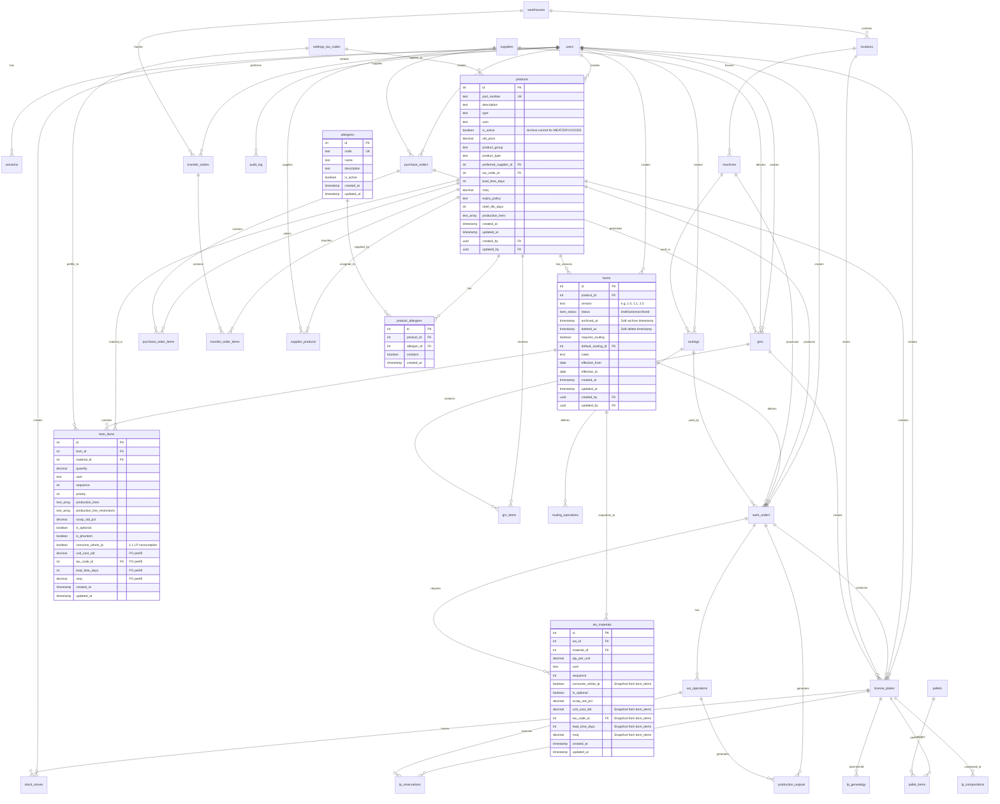

# Database Relationships Documentation

## Overview
This document provides comprehensive documentation of all database relationships in the MonoPilot MES system, including entity relationship diagrams, relationship types, cascade behaviors, and common join patterns.

**Last Updated**: 2025-01-21
**Version**: 2.0 - BOM Lifecycle & Archive Update

## Complete Entity Relationship Diagram



## Core Relationships

### 1. Products ↔ BOMs (One-to-Many with Versioning)

**Relationship Type**: One-to-Many
**Foreign Key**: `boms.product_id` → `products.id`

**Business Rules**:
- One product can have multiple BOM versions (1.0, 1.1, 2.0, etc.)
- Only ONE BOM can be active at a time per product (enforced by unique index)
- BOM lifecycle: draft → active → archived
- Draft BOMs can be edited directly
- Active BOMs use clone-on-edit (creates new draft)
- Archived BOMs are read-only

**Cascade Behavior**:
- Deleting a product: Cascades to BOMs if no work orders reference them
- Deleting an active/archived BOM: **BLOCKED** by trigger
- Deleting a draft BOM: Allowed if not referenced by work orders

**Common Queries**:
```sql
-- Get active BOM for a product
SELECT b.* FROM boms b
WHERE b.product_id = $1 AND b.status = 'active';

-- Get all BOM versions for a product (history)
SELECT b.* FROM boms b
WHERE b.product_id = $1
ORDER BY b.created_at DESC;

-- Get latest BOM regardless of status
SELECT b.* FROM boms b
WHERE b.product_id = $1
ORDER BY b.created_at DESC
LIMIT 1;
```

### 2. BOMs ↔ BOM Items (One-to-Many)

**Relationship Type**: One-to-Many
**Foreign Key**: `bom_items.bom_id` → `boms.id`

**Business Rules**:
- One BOM contains multiple materials
- Each BOM item references a material (product)
- Sequence determines order of consumption
- `consume_whole_lp` flag enforces 1:1 LP consumption in scanner
- PO prefill data stored for each material

**Cascade Behavior**:
- Deleting a BOM: Cascades to bom_items (orphan deletion)
- Deleting a BOM item: Allowed for draft BOMs only

**Common Queries**:
```sql
-- Get all materials for a BOM with product details
SELECT 
  bi.*,
  p.part_number,
  p.description,
  p.uom
FROM bom_items bi
JOIN products p ON bi.material_id = p.id
WHERE bi.bom_id = $1
ORDER BY bi.sequence;

-- Get active components for a product (with PO prefill data)
SELECT 
  bi.material_id,
  p.part_number,
  p.description,
  bi.quantity,
  bi.uom,
  bi.unit_cost_std,
  bi.tax_code_id,
  bi.lead_time_days,
  bi.moq
FROM boms b
JOIN bom_items bi ON b.id = bi.bom_id
JOIN products p ON bi.material_id = p.id
WHERE b.product_id = $1 AND b.status = 'active';
```

### 3. BOMs ↔ WO Materials (One-to-Many Snapshot)

**Relationship Type**: One-to-Many (Snapshot)
**Foreign Key**: `wo_materials.wo_id` → `work_orders.id`

**Business Rules**:
- BOM is snapshotted into `wo_materials` when work order is created
- Snapshot is immutable (cannot be changed once WO is in progress)
- For PLANNED WOs, snapshot can be updated if no issues/outputs exist
- `consume_whole_lp` flag is preserved in snapshot

**Cascade Behavior**:
- Deleting a work order: Cascades to wo_materials
- Deleting a BOM: Does NOT affect existing wo_materials (snapshot preserved)

**Common Queries**:
```sql
-- Get all materials for a work order
SELECT 
  wm.*,
  p.part_number,
  p.description
FROM wo_materials wm
JOIN products p ON wm.material_id = p.id
WHERE wm.wo_id = $1
ORDER BY wm.sequence;

-- Check if WO snapshot can be updated
SELECT 
  CASE 
    WHEN wo.status = 'planned' 
         AND NOT EXISTS (SELECT 1 FROM production_outputs WHERE wo_id = wo.id)
         AND NOT EXISTS (SELECT 1 FROM wo_issues WHERE wo_id = wo.id)
    THEN true
    ELSE false
  END as can_update_snapshot
FROM work_orders wo
WHERE wo.id = $1;
```

### 4. Products ↔ Product Allergens (Many-to-Many)

**Relationship Type**: Many-to-Many
**Foreign Keys**: 
- `product_allergens.product_id` → `products.id`
- `product_allergens.allergen_id` → `allergens.id`

**Business Rules**:
- Composite products inherit allergens from BOM components
- Manual override allowed (can add additional allergens)
- Combined set of inherited + manual allergens saved
- UI displays both inherited and manually selected allergens

**Cascade Behavior**:
- Deleting a product: Cascades to product_allergens
- Deleting an allergen: Cascades to product_allergens

**Common Queries**:
```sql
-- Get all allergens for a product
SELECT 
  a.*
FROM product_allergens pa
JOIN allergens a ON pa.allergen_id = a.id
WHERE pa.product_id = $1;

-- Get inherited allergens from BOM components
SELECT DISTINCT a.*
FROM boms b
JOIN bom_items bi ON b.id = bi.bom_id
JOIN product_allergens pa ON bi.material_id = pa.product_id
JOIN allergens a ON pa.allergen_id = a.id
WHERE b.product_id = $1 AND b.status = 'active';
```

### 5. BOM Items ↔ Tax Codes (Many-to-One - PO Prefill)

**Relationship Type**: Many-to-One
**Foreign Key**: `bom_items.tax_code_id` → `settings_tax_codes.id`

**Business Rules**:
- Tax code stored in BOM item for PO prefill
- Auto-populated when creating PO from BOM
- Can be overridden during PO creation

**Common Queries**:
```sql
-- Get BOM items with tax codes for PO creation
SELECT 
  bi.material_id,
  p.part_number,
  bi.quantity,
  bi.unit_cost_std,
  tc.code as tax_code,
  tc.rate as tax_rate,
  bi.lead_time_days,
  bi.moq
FROM bom_items bi
JOIN products p ON bi.material_id = p.id
LEFT JOIN settings_tax_codes tc ON bi.tax_code_id = tc.id
WHERE bi.bom_id = $1;
```

## Archive & Audit Relationships

### 1. Products Archive Logic

**Archive Control**:
- **MEAT/DRYGOODS**: Controlled by `products.is_active`
  - `is_active = true`: Visible in main tabs
  - `is_active = false`: Visible in ARCHIVE tab only
  
- **COMPOSITE (PR/FG)**: Controlled by `boms.status`
  - `status = 'active'` or `'draft'`: Visible in main tabs
  - `status = 'archived'`: Visible in ARCHIVE tab only

**Archive Tab Query**:
```sql
-- Get all archived products
SELECT p.* FROM products p
LEFT JOIN boms b ON p.id = b.product_id AND b.status IN ('active', 'draft')
WHERE 
  (p.product_group IN ('MEAT', 'DRYGOODS') AND p.is_active = false)
  OR 
  (p.product_group = 'COMPOSITE' AND b.id IS NULL AND EXISTS (
    SELECT 1 FROM boms WHERE product_id = p.id AND status = 'archived'
  ));
```

### 2. BOM Version History

**Version Tracking**:
- All BOM versions retained (draft, active, archived)
- `archived_at` timestamp when BOM is archived
- `deleted_at` timestamp for soft-deleted BOMs
- User tracking via `created_by`, `updated_by`

**Version History Query**:
```sql
-- Get BOM version history for a product
SELECT 
  b.version,
  b.status,
  b.created_at,
  b.updated_at,
  b.archived_at,
  u1.name as created_by_name,
  u2.name as updated_by_name
FROM boms b
LEFT JOIN users u1 ON b.created_by = u1.id
LEFT JOIN users u2 ON b.updated_by = u2.id
WHERE b.product_id = $1
ORDER BY b.created_at DESC;
```

## Join Patterns

### 1. Products with Active BOM and Items
```sql
SELECT 
  p.*,
  b.id as bom_id,
  b.version as bom_version,
  b.status as bom_status,
  json_agg(
    json_build_object(
      'material_id', bi.material_id,
      'part_number', m.part_number,
      'description', m.description,
      'quantity', bi.quantity,
      'uom', bi.uom,
      'consume_whole_lp', bi.consume_whole_lp
    )
  ) as bom_items
FROM products p
LEFT JOIN boms b ON p.id = b.product_id AND b.status = 'active'
LEFT JOIN bom_items bi ON b.id = bi.bom_id
LEFT JOIN products m ON bi.material_id = m.id
WHERE p.product_group = 'COMPOSITE'
GROUP BY p.id, b.id;
```

### 2. Work Orders with BOM Snapshot
```sql
SELECT 
  wo.*,
  p.part_number,
  p.description,
  json_agg(
    json_build_object(
      'material_id', wm.material_id,
      'part_number', m.part_number,
      'quantity', wm.qty_per_unit,
      'consume_whole_lp', wm.consume_whole_lp
    )
  ) as materials
FROM work_orders wo
JOIN products p ON wo.product_id = p.id
LEFT JOIN wo_materials wm ON wo.id = wm.wo_id
LEFT JOIN products m ON wm.material_id = m.id
GROUP BY wo.id, p.id;
```

### 3. Products with Allergens (Inherited + Manual)
```sql
SELECT 
  p.*,
  json_agg(DISTINCT a.*) as allergens
FROM products p
LEFT JOIN product_allergens pa ON p.product_id = pa.product_id
LEFT JOIN allergens a ON pa.allergen_id = a.id
WHERE p.id = $1
GROUP BY p.id;
```

## Cascade Rules Summary

| Parent Table | Child Table | Cascade Type | Notes |
|--------------|-------------|--------------|-------|
| products | boms | CASCADE | Only if no WO references |
| products | product_allergens | CASCADE | Always |
| boms | bom_items | CASCADE | Always |
| boms | wo_materials | NO CASCADE | Snapshot preserved |
| work_orders | wo_materials | CASCADE | Always |
| allergens | product_allergens | CASCADE | Always |
| settings_tax_codes | bom_items | SET NULL | On delete |

## Constraints & Triggers

### 1. Single Active BOM per Product
```sql
CREATE UNIQUE INDEX boms_single_active_idx 
ON boms(product_id) WHERE status = 'active';
```

### 2. Guard BOM Hard Delete
```sql
CREATE TRIGGER trg_boms_guard_delete 
BEFORE DELETE ON boms 
FOR EACH ROW EXECUTE FUNCTION guard_boms_hard_delete();
```
- Blocks deletion of active/archived BOMs
- Blocks deletion if referenced by work orders

### 3. BOM Snapshot on WO Create
```sql
CREATE TRIGGER trg_snapshot_bom_on_wo_create
AFTER INSERT ON work_orders
FOR EACH ROW EXECUTE FUNCTION snapshot_bom_to_wo_materials();
```
- Automatically copies BOM items to wo_materials on WO creation

## TODO: Future Relationship Enhancements

### Audit Trail Table
```sql
CREATE TABLE audit_log (
  id SERIAL PRIMARY KEY,
  table_name TEXT NOT NULL,
  record_id INTEGER NOT NULL,
  action TEXT NOT NULL CHECK (action IN ('INSERT', 'UPDATE', 'DELETE', 'ARCHIVE')),
  old_values JSONB,
  new_values JSONB,
  changed_by UUID REFERENCES users(id),
  changed_at TIMESTAMP WITH TIME ZONE DEFAULT NOW(),
  change_reason TEXT
);
```

**Relationships**:
- `audit_log.changed_by` → `users.id`
- Tracks changes to: products, boms, bom_items, work_orders

**Use Cases**:
- BOM version change history
- Product activation/deactivation trail
- Price change tracking
- Allergen modification audit

### BOM Approval Workflow
```sql
CREATE TABLE bom_approvals (
  id SERIAL PRIMARY KEY,
  bom_id INTEGER REFERENCES boms(id),
  requested_by UUID REFERENCES users(id),
  approved_by UUID REFERENCES users(id),
  status TEXT CHECK (status IN ('pending', 'approved', 'rejected')),
  comments TEXT,
  requested_at TIMESTAMP WITH TIME ZONE DEFAULT NOW(),
  approved_at TIMESTAMP WITH TIME ZONE
);
```

**Relationships**:
- `bom_approvals.bom_id` → `boms.id`
- `bom_approvals.requested_by` → `users.id`
- `bom_approvals.approved_by` → `users.id`

**Use Cases**:
- Require manager approval before activating BOM
- Track approval history
- Compliance documentation
