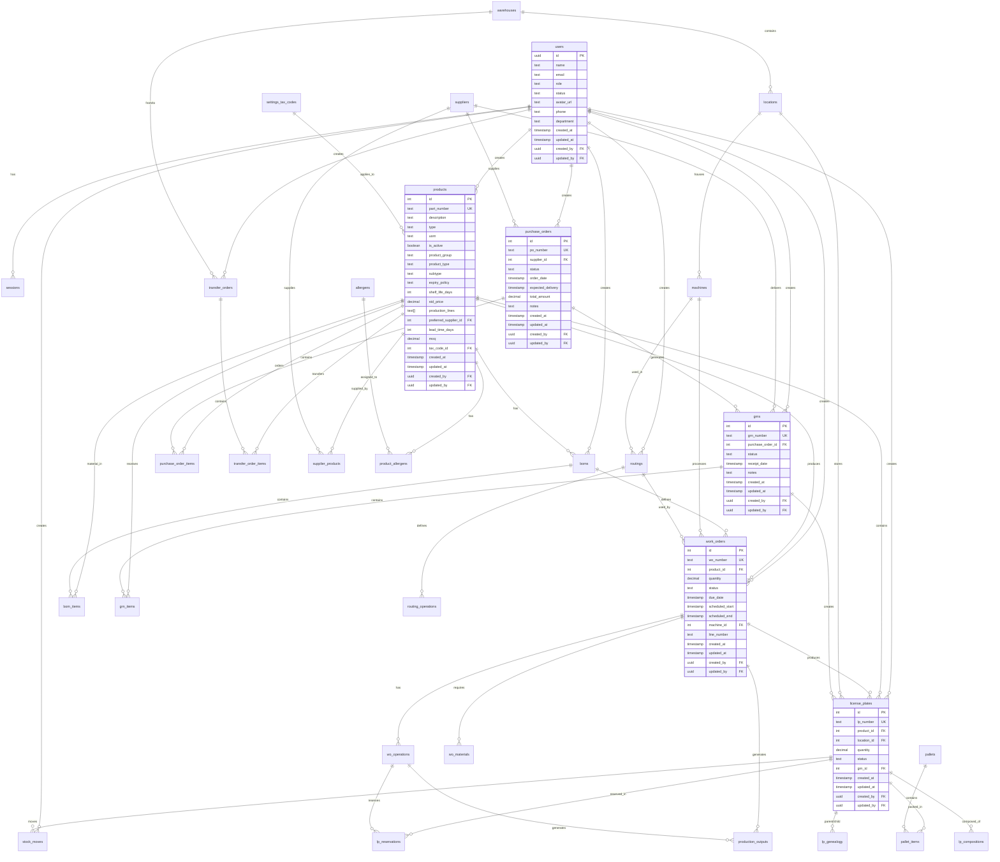

# Database Relationships Documentation

## Overview
This document provides comprehensive documentation of all database relationships in the MonoPilot MES system, including entity relationship diagrams, relationship types, cascade behaviors, and common join patterns.

## Complete Entity Relationship Diagram



## Relationship Types and Cardinalities

### One-to-Many (1:N) Relationships

| Parent Table | Child Table | Relationship | Cascade Behavior |
|--------------|-------------|--------------|------------------|
| `users` | `sessions` | User has many sessions | CASCADE DELETE |
| `users` | `work_orders` | User creates many work orders | SET NULL |
| `users` | `purchase_orders` | User creates many purchase orders | SET NULL |
| `users` | `products` | User creates many products | SET NULL |
| `products` | `boms` | Product has many BOMs | CASCADE DELETE |
| `products` | `bom_items` | Product is material in many BOM items | CASCADE DELETE |
| `products` | `work_orders` | Product produces many work orders | RESTRICT |
| `products` | `license_plates` | Product is in many license plates | RESTRICT |
| `boms` | `bom_items` | BOM contains many items | CASCADE DELETE |
| `work_orders` | `wo_operations` | Work order has many operations | CASCADE DELETE |
| `work_orders` | `wo_materials` | Work order requires many materials | CASCADE DELETE |
| `suppliers` | `purchase_orders` | Supplier has many purchase orders | RESTRICT |
| `warehouses` | `locations` | Warehouse contains many locations | CASCADE DELETE |
| `locations` | `license_plates` | Location stores many license plates | RESTRICT |
| `purchase_orders` | `purchase_order_items` | PO contains many items | CASCADE DELETE |
| `purchase_orders` | `grns` | PO generates many GRNs | RESTRICT |
| `grns` | `grn_items` | GRN contains many items | CASCADE DELETE |
| `routings` | `routing_operations` | Routing defines many operations | CASCADE DELETE |

### Many-to-Many (N:M) Relationships

| Table A | Table B | Junction Table | Purpose |
|---------|---------|----------------|---------|
| `products` | `allergens` | `product_allergens` | Product allergen assignments |
| `suppliers` | `products` | `supplier_products` | Supplier product relationships |
| `license_plates` | `license_plates` | `lp_genealogy` | Parent-child LP relationships |
| `license_plates` | `products` | `lp_compositions` | LP composition tracking |
| `license_plates` | `pallets` | `pallet_items` | LP pallet assignments |

### Self-Referencing Relationships

| Table | Column | References | Purpose |
|-------|--------|------------|---------|
| `users` | `created_by` | `users.id` | Audit trail |
| `users` | `updated_by` | `users.id` | Audit trail |
| `license_plates` | `parent_lp_id` | `license_plates.id` | LP genealogy |

## Common Join Patterns

### Product with BOM Information
```sql
SELECT 
    p.*,
    b.version as bom_version,
    b.is_active as bom_active,
    COUNT(bi.id) as bom_item_count
FROM products p
LEFT JOIN boms b ON p.id = b.product_id AND b.is_active = true
LEFT JOIN bom_items bi ON b.id = bi.bom_id
WHERE p.is_active = true
GROUP BY p.id, b.id;
```

### Work Order with Product and Operations
```sql
SELECT 
    wo.*,
    p.part_number,
    p.description,
    COUNT(wo_op.id) as operation_count,
    COUNT(CASE WHEN wo_op.status = 'completed' THEN 1 END) as completed_operations
FROM work_orders wo
JOIN products p ON wo.product_id = p.id
LEFT JOIN wo_operations wo_op ON wo.id = wo_op.wo_id
WHERE wo.status = 'in_progress'
GROUP BY wo.id, p.id;
```

### License Plate with Location and Product
```sql
SELECT 
    lp.*,
    p.part_number,
    p.description,
    l.code as location_code,
    l.name as location_name,
    w.name as warehouse_name
FROM license_plates lp
JOIN products p ON lp.product_id = p.id
JOIN locations l ON lp.location_id = l.id
JOIN warehouses w ON l.warehouse_id = w.id
WHERE lp.status = 'available';
```

### Purchase Order with Items and Supplier
```sql
SELECT 
    po.*,
    s.name as supplier_name,
    s.contact_email,
    COUNT(poi.id) as item_count,
    SUM(poi.quantity * poi.unit_price) as total_value
FROM purchase_orders po
JOIN suppliers s ON po.supplier_id = s.id
LEFT JOIN purchase_order_items poi ON po.id = poi.purchase_order_id
GROUP BY po.id, s.id;
```

### GRN with Items and License Plates
```sql
SELECT 
    g.*,
    po.po_number,
    COUNT(gi.id) as item_count,
    COUNT(lp.id) as lp_count
FROM grns g
JOIN purchase_orders po ON g.purchase_order_id = po.id
LEFT JOIN grn_items gi ON g.id = gi.grn_id
LEFT JOIN license_plates lp ON g.id = lp.grn_id
GROUP BY g.id, po.id;
```

### Traceability Chain (Forward)
```sql
WITH RECURSIVE trace_forward AS (
    -- Base case: starting LP
    SELECT 
        lp.id,
        lp.lp_number,
        lp.product_id,
        0 as level
    FROM license_plates lp
    WHERE lp.lp_number = 'LP-001'
    
    UNION ALL
    
    -- Recursive case: child LPs
    SELECT 
        child.id,
        child.lp_number,
        child.product_id,
        tf.level + 1
    FROM license_plates child
    JOIN lp_genealogy lg ON child.id = lg.child_lp_id
    JOIN trace_forward tf ON lg.parent_lp_id = tf.id
)
SELECT * FROM trace_forward ORDER BY level, lp_number;
```

### Traceability Chain (Backward)
```sql
WITH RECURSIVE trace_backward AS (
    -- Base case: starting LP
    SELECT 
        lp.id,
        lp.lp_number,
        lp.product_id,
        0 as level
    FROM license_plates lp
    WHERE lp.lp_number = 'LP-001'
    
    UNION ALL
    
    -- Recursive case: parent LPs
    SELECT 
        parent.id,
        parent.lp_number,
        parent.product_id,
        tb.level + 1
    FROM license_plates parent
    JOIN lp_genealogy lg ON parent.id = lg.parent_lp_id
    JOIN trace_backward tb ON lg.child_lp_id = tb.id
)
SELECT * FROM trace_backward ORDER BY level, lp_number;
```

## Cascade Behaviors

### CASCADE DELETE
- `users` → `sessions` (when user is deleted, sessions are deleted)
- `products` → `boms` (when product is deleted, BOMs are deleted)
- `boms` → `bom_items` (when BOM is deleted, items are deleted)
- `work_orders` → `wo_operations` (when WO is deleted, operations are deleted)
- `warehouses` → `locations` (when warehouse is deleted, locations are deleted)

### SET NULL
- `users` → `work_orders.created_by` (when user is deleted, created_by is set to NULL)
- `users` → `products.created_by` (when user is deleted, created_by is set to NULL)
- `suppliers` → `products.preferred_supplier_id` (when supplier is deleted, preferred_supplier_id is set to NULL)

### RESTRICT
- `products` → `work_orders` (cannot delete product if work orders exist)
- `products` → `license_plates` (cannot delete product if license plates exist)
- `suppliers` → `purchase_orders` (cannot delete supplier if purchase orders exist)
- `purchase_orders` → `grns` (cannot delete PO if GRNs exist)

## Index Strategy for Relationships

### Foreign Key Indexes
```sql
-- Primary foreign key indexes
CREATE INDEX idx_work_orders_product_id ON work_orders(product_id);
CREATE INDEX idx_work_orders_created_by ON work_orders(created_by);
CREATE INDEX idx_license_plates_product_id ON license_plates(product_id);
CREATE INDEX idx_license_plates_location_id ON license_plates(location_id);
CREATE INDEX idx_bom_items_bom_id ON bom_items(bom_id);
CREATE INDEX idx_bom_items_material_id ON bom_items(material_id);
CREATE INDEX idx_wo_operations_wo_id ON wo_operations(wo_id);
CREATE INDEX idx_purchase_orders_supplier_id ON purchase_orders(supplier_id);
CREATE INDEX idx_grns_purchase_order_id ON grns(purchase_order_id);
```

### Composite Indexes for Common Queries
```sql
-- Work orders by product and status
CREATE INDEX idx_work_orders_product_status ON work_orders(product_id, status);

-- License plates by product and location
CREATE INDEX idx_license_plates_product_location ON license_plates(product_id, location_id);

-- BOM items by BOM and sequence
CREATE INDEX idx_bom_items_bom_sequence ON bom_items(bom_id, sequence);

-- WO operations by work order and sequence
CREATE INDEX idx_wo_operations_wo_seq ON wo_operations(wo_id, sequence);
```

## Query Optimization Notes

### Join Optimization
- Use `INNER JOIN` when you need matching records
- Use `LEFT JOIN` when you need all records from the left table
- Use `EXISTS` instead of `IN` for subqueries
- Use `LIMIT` with `ORDER BY` for pagination

### Index Usage
- Ensure WHERE clauses use indexed columns
- Use composite indexes for multi-column queries
- Consider covering indexes for SELECT-only queries
- Monitor query performance with EXPLAIN ANALYZE

### Common Anti-patterns
- Avoid `SELECT *` in production queries
- Don't use functions in WHERE clauses
- Avoid unnecessary subqueries
- Don't forget to add indexes for foreign keys

## Data Integrity Constraints

### Check Constraints
```sql
-- Product type validation
ALTER TABLE products ADD CONSTRAINT chk_product_type 
CHECK (type IN ('RM', 'PR', 'FG', 'WIP'));

-- Work order status validation
ALTER TABLE work_orders ADD CONSTRAINT chk_wo_status 
CHECK (status IN ('planned', 'released', 'in_progress', 'completed', 'cancelled'));

-- License plate status validation
ALTER TABLE license_plates ADD CONSTRAINT chk_lp_status 
CHECK (status IN ('available', 'reserved', 'consumed', 'quarantine'));
```

### Unique Constraints
```sql
-- Ensure unique part numbers
ALTER TABLE products ADD CONSTRAINT uk_products_part_number UNIQUE (part_number);

-- Ensure unique work order numbers
ALTER TABLE work_orders ADD CONSTRAINT uk_work_orders_wo_number UNIQUE (wo_number);

-- Ensure unique license plate numbers
ALTER TABLE license_plates ADD CONSTRAINT uk_license_plates_lp_number UNIQUE (lp_number);
```

## See Also

- [Database Schema](DATABASE_SCHEMA.md) - Detailed table definitions
- [System Overview](SYSTEM_OVERVIEW.md) - High-level system architecture
- [API Reference](API_REFERENCE.md) - API documentation
- [Business Flows](BUSINESS_FLOWS.md) - Process workflows
