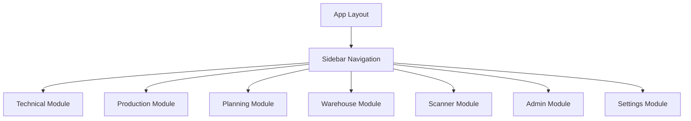

# Page Reference Guide

## Overview
This document provides comprehensive mapping of all pages in the MonoPilot MES system, showing their relationships to database tables, API endpoints, and React components.

## Page Structure

### Authentication Pages
| Page | URL | Purpose | Tables | APIs | Components |
|------|-----|---------|--------|------|------------|
| Login | `/login` | User authentication | `users`, `sessions` | `UsersAPI` | `LoginForm`, `AuthProvider` |
| Signup | `/signup` | User registration | `users` | `UsersAPI` | `SignupForm`, `AuthProvider` |

### Technical Module
| Page | URL | Purpose | Tables | APIs | Components |
|------|-----|---------|--------|------|------------|
| BOM Catalog | `/technical/bom` | Product & BOM management | `products`, `boms`, `bom_items`, `routings`, `routing_operations` | `ProductsAPI`, `RoutingsAPI`, `AllergensAPI`, `TaxCodesAPI` | `BomCatalogClient`, `ProductsTable`, `AddItemModal` |

### Production Module
| Page | URL | Purpose | Tables | APIs | Components |
|------|-----|---------|--------|------|------------|
| Production Dashboard | `/production` | Work order management | `work_orders`, `wo_operations`, `wo_materials`, `license_plates` | `WorkOrdersAPI`, `YieldAPI`, `TraceabilityAPI` | `WorkOrdersTable`, `WorkOrderDetailsModal`, `YieldChart` |

### Planning Module
| Page | URL | Purpose | Tables | APIs | Components |
|------|-----|---------|--------|------|------------|
| Planning Dashboard | `/planning` | Order management | `purchase_orders`, `transfer_orders`, `suppliers`, `warehouses` | `PurchaseOrdersAPI`, `TransferOrdersAPI`, `SuppliersAPI` | `PurchaseOrdersTable`, `TransferOrdersTable`, `CreateOrderModal` |

### Warehouse Module
| Page | URL | Purpose | Tables | APIs | Components |
|------|-----|---------|--------|------|------------|
| Warehouse Dashboard | `/warehouse` | Inventory management | `grns`, `stock_moves`, `license_plates`, `locations` | `GRNsAPI`, `StockMovesAPI`, `LicensePlatesAPI` | `GRNsTable`, `StockMovesTable`, `CreateGRNModal` |

### Scanner Module
| Page | URL | Purpose | Tables | APIs | Components |
|------|-----|---------|--------|------|------------|
| Scanner Dashboard | `/scanner` | Production terminal | `work_orders`, `wo_operations`, `license_plates` | `WorkOrdersAPI`, `ScannerAPI` | `ScannerInterface`, `OperationPanel` |
| Process Operations | `/scanner/process` | Operation execution | `wo_operations`, `lp_reservations`, `license_plates` | `WorkOrdersAPI`, `ScannerAPI` | `ProcessInterface`, `OperationControls` |
| Pack Operations | `/scanner/pack` | Pallet creation | `pallets`, `pallet_items`, `license_plates` | `PalletsAPI`, `ScannerAPI` | `PackInterface`, `PalletBuilder` |

### Admin Module
| Page | URL | Purpose | Tables | APIs | Components |
|------|-----|---------|--------|------|------------|
| Admin Dashboard | `/admin` | System administration | `users`, `settings` | `UsersAPI`, `SettingsAPI` | `AdminPanel`, `UserManagement` |

### Settings Module
| Page | URL | Purpose | Tables | APIs | Components |
|------|-----|---------|--------|------|------------|
| Settings | `/settings` | System configuration | `settings`, `users` | `SettingsAPI`, `UsersAPI` | `SettingsForm`, `ConfigurationPanel` |

## Detailed Page Analysis

### Technical Module - BOM Catalog (`/technical/bom`)

**Purpose**: Manage product catalog and bill of materials

**Database Tables**:
- **Read**: `products`, `boms`, `bom_items`, `routings`, `routing_operations`, `allergens`, `settings_tax_codes`
- **Write**: `products`, `boms`, `bom_items`, `product_allergens`

**API Endpoints**:
- `ProductsAPI.getAll()` - Fetch all products
- `ProductsAPI.create()` - Create new product
- `ProductsAPI.update()` - Update existing product
- `RoutingsAPI.getAll()` - Fetch routings
- `AllergensAPI.getAll()` - Fetch allergens
- `TaxCodesAPI.getAll()` - Fetch tax codes

**Key Components**:
- `BomCatalogClient` - Main client component
- `ProductsTable` - Product listing table
- `AddItemModal` - Product creation modal
- `ProductsTable` - Product management table

**Business Rules**:
- Products must have unique part numbers
- BOM items must reference valid materials
- Allergen inheritance follows component hierarchy
- Product categorization by `product_group` and `product_type`

**User Roles**: Technical, Admin

### Production Module - Production Dashboard (`/production`)

**Purpose**: Manage work orders and production execution

**Database Tables**:
- **Read**: `work_orders`, `wo_operations`, `wo_materials`, `license_plates`, `products`, `machines`
- **Write**: `work_orders`, `wo_operations`, `production_outputs`

**API Endpoints**:
- `WorkOrdersAPI.getAll()` - Fetch work orders
- `WorkOrdersAPI.create()` - Create work order
- `WorkOrdersAPI.update()` - Update work order
- `YieldAPI.getYieldData()` - Fetch yield data
- `TraceabilityAPI.getTraceData()` - Fetch traceability data

**Key Components**:
- `WorkOrdersTable` - Work order listing
- `WorkOrderDetailsModal` - Work order details
- `YieldChart` - Yield visualization
- `StageBoard` - Operation staging

**Business Rules**:
- Work orders require valid BOM
- Operations must follow routing sequence
- One-to-one components consume entire LP
- QA status blocks operations

**User Roles**: Planner, Operator, Admin

### Planning Module - Planning Dashboard (`/planning`)

**Purpose**: Manage purchase orders and transfer orders

**Database Tables**:
- **Read**: `purchase_orders`, `purchase_order_items`, `transfer_orders`, `transfer_order_items`, `suppliers`, `warehouses`
- **Write**: `purchase_orders`, `purchase_order_items`, `transfer_orders`, `transfer_order_items`

**API Endpoints**:
- `PurchaseOrdersAPI.getAll()` - Fetch purchase orders
- `PurchaseOrdersAPI.create()` - Create purchase order
- `TransferOrdersAPI.getAll()` - Fetch transfer orders
- `TransferOrdersAPI.create()` - Create transfer order
- `SuppliersAPI.getAll()` - Fetch suppliers

**Key Components**:
- `PurchaseOrdersTable` - Purchase order listing
- `TransferOrdersTable` - Transfer order listing
- `CreateOrderModal` - Order creation modal
- `SuppliersTable` - Supplier management

**Business Rules**:
- Purchase orders require valid suppliers
- Transfer orders require valid warehouses
- Order status transitions are controlled
- GRN validation against purchase orders

**User Roles**: Planner, Purchasing, Admin

### Warehouse Module - Warehouse Dashboard (`/warehouse`)

**Purpose**: Manage inventory and goods receipt

**Database Tables**:
- **Read**: `grns`, `grn_items`, `stock_moves`, `license_plates`, `locations`, `purchase_orders`
- **Write**: `grns`, `grn_items`, `license_plates`, `stock_moves`

**API Endpoints**:
- `GRNsAPI.getAll()` - Fetch GRNs
- `GRNsAPI.create()` - Create GRN
- `LicensePlatesAPI.getAll()` - Fetch license plates
- `StockMovesAPI.getAll()` - Fetch stock moves
- `StockMovesAPI.create()` - Create stock move

**Key Components**:
- `GRNsTable` - GRN listing
- `CreateGRNModal` - GRN creation modal
- `StockMovesTable` - Stock moves listing
- `LicensePlatesTable` - License plate management

**Business Rules**:
- GRNs require valid purchase orders
- License plates track material batches
- Stock moves maintain audit trail
- Reservations prevent double-allocation

**User Roles**: Warehouse, Admin

### Scanner Module - Process Operations (`/scanner/process`)

**Purpose**: Execute production operations

**Database Tables**:
- **Read**: `work_orders`, `wo_operations`, `license_plates`, `lp_reservations`
- **Write**: `wo_operations`, `lp_reservations`, `production_outputs`

**API Endpoints**:
- `WorkOrdersAPI.getWorkOrderStageStatus()` - Get stage status
- `ScannerAPI.completeOperation()` - Complete operation
- `ScannerAPI.stageMaterials()` - Stage materials
- `ScannerAPI.recordYield()` - Record yield

**Key Components**:
- `ProcessInterface` - Main scanner interface
- `OperationControls` - Operation controls
- `MaterialStaging` - Material staging panel
- `YieldInput` - Yield recording

**Business Rules**:
- Sequential operation execution
- One-to-one component validation
- QA status enforcement
- Reservation safety checks

**User Roles**: Operator

## Page Navigation Patterns

### Module Navigation

### Data Flow Patterns

## Common Page Patterns

### List Pages
- **Structure**: Table + Filters + Actions
- **Components**: `DataTable`, `FilterPanel`, `ActionButtons`
- **APIs**: `getAll()`, `getById()`, `create()`, `update()`, `delete()`

### Detail Pages
- **Structure**: Form + Validation + Submit
- **Components**: `Form`, `Validation`, `SubmitButton`
- **APIs**: `getById()`, `update()`, `create()`

### Modal Pages
- **Structure**: Modal + Form + Actions
- **Components**: `Modal`, `Form`, `ActionButtons`
- **APIs**: `create()`, `update()`

## Error Handling by Page Type

### List Pages
- Loading states for data fetching
- Error boundaries for API failures
- Empty states for no data
- Pagination for large datasets

### Detail Pages
- Form validation errors
- Save/update error handling
- Navigation error handling
- Data not found errors

### Modal Pages
- Modal-specific error states
- Form validation within modals
- Close/cancel error handling
- Success feedback

## Performance Considerations

### Page Load Optimization
- Server-side data fetching where possible
- Client-side caching with SWR
- Lazy loading for heavy components
- Code splitting by route

### Data Fetching Patterns
- Parallel API calls where possible
- Optimistic updates for better UX
- Background revalidation
- Error retry mechanisms

## See Also

- [System Overview](SYSTEM_OVERVIEW.md) - High-level system architecture
- [Database Schema](DATABASE_SCHEMA.md) - Table definitions and relationships
- [API Reference](API_REFERENCE.md) - Complete API documentation
- [Component Reference](COMPONENT_REFERENCE.md) - Component documentation
- [Business Flows](BUSINESS_FLOWS.md) - Process workflows
