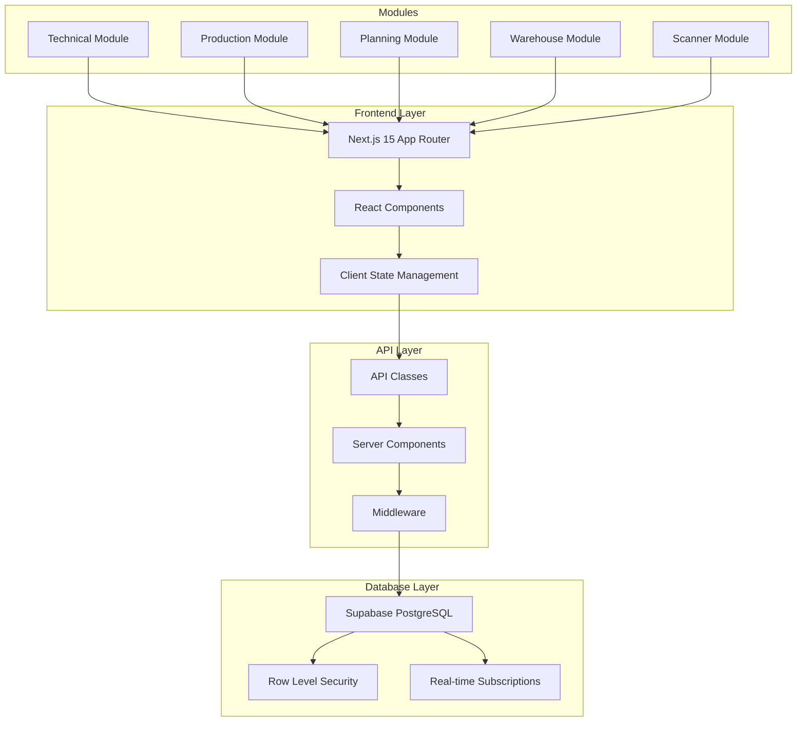
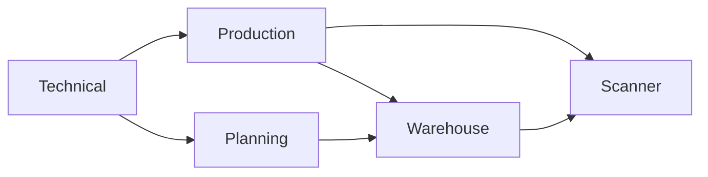
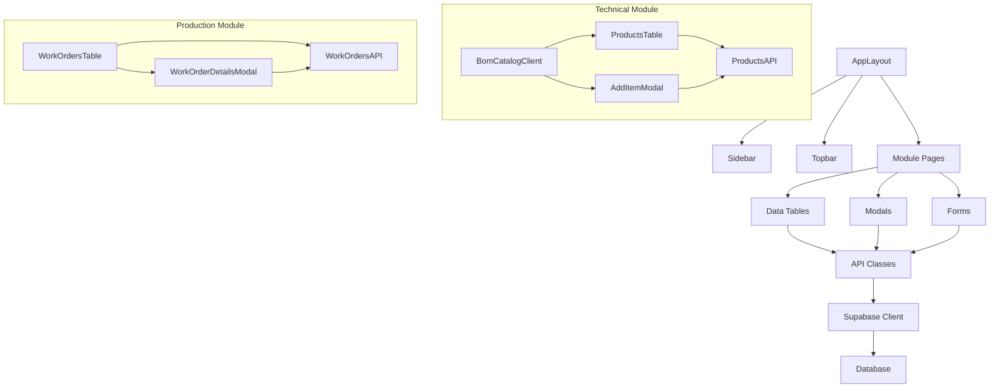

# MonoPilot MES System Overview

## System Architecture

MonoPilot is a Manufacturing Execution System (MES) built as a Next.js 15 monorepo with Supabase backend. The system manages the complete production lifecycle from planning to warehouse operations.



## Module Hierarchy

### Core Modules

| Module | Purpose | Main Pages | Key Tables |
|--------|---------|------------|------------|
| **Technical** | Product & BOM Management | `/technical/bom` | `products`, `boms`, `bom_items`, `routings` |
| **Production** | Work Order Execution | `/production` | `work_orders`, `wo_operations`, `license_plates` |
| **Planning** | Order Management | `/planning` | `purchase_orders`, `transfer_orders`, `asns` |
| **Warehouse** | Inventory Management | `/warehouse` | `grns`, `stock_moves`, `locations` |
| **Scanner** | Production Terminals | `/scanner` | `lp_reservations`, `lp_compositions` |

### Module Dependencies



## Page-to-Table Mapping Matrix

### Technical Module
| Page | Tables (Read) | Tables (Write) | APIs Used |
|------|---------------|----------------|-----------|
| `/technical/bom` | `products`, `boms`, `bom_items`, `routings`, `routing_operations` | `products`, `boms`, `bom_items` | `ProductsAPI`, `RoutingsAPI`, `AllergensAPI` |

### Production Module
| Page | Tables (Read) | Tables (Write) | APIs Used |
|------|---------------|----------------|-----------|
| `/production` | `work_orders`, `wo_operations`, `license_plates`, `lp_reservations` | `work_orders`, `wo_operations`, `license_plates` | `WorkOrdersAPI`, `YieldAPI`, `TraceabilityAPI` |

### Planning Module
| Page | Tables (Read) | Tables (Write) | APIs Used |
|------|---------------|----------------|-----------|
| `/planning` | `purchase_orders`, `transfer_orders`, `suppliers`, `warehouses` | `purchase_orders`, `transfer_orders` | `PurchaseOrdersAPI`, `TransferOrdersAPI`, `SuppliersAPI` |

### Warehouse Module
| Page | Tables (Read) | Tables (Write) | APIs Used |
|------|---------------|----------------|-----------|
| `/warehouse` | `grns`, `stock_moves`, `license_plates`, `locations` | `grns`, `stock_moves`, `license_plates` | `GRNsAPI`, `StockMovesAPI`, `LicensePlatesAPI` |

### Scanner Module
| Page | Tables (Read) | Tables (Write) | APIs Used |
|------|---------------|----------------|-----------|
| `/scanner/process` | `work_orders`, `wo_operations`, `license_plates` | `wo_operations`, `lp_reservations` | `WorkOrdersAPI`, `ScannerAPI` |
| `/scanner/pack` | `pallets`, `pallet_items`, `license_plates` | `pallets`, `pallet_items` | `PalletsAPI`, `ScannerAPI` |

## API Endpoint Catalog

### Core APIs
| API Class | Purpose | Tables Accessed | Used By Pages |
|-----------|---------|-----------------|---------------|
| `ProductsAPI` | Product CRUD | `products`, `product_allergens` | `/technical/bom` |
| `WorkOrdersAPI` | Work Order Management | `work_orders`, `wo_materials`, `wo_operations` | `/production`, `/scanner` |
| `PurchaseOrdersAPI` | Purchase Order Management | `purchase_orders`, `purchase_order_items` | `/planning` |
| `TransferOrdersAPI` | Transfer Order Management | `transfer_orders`, `transfer_order_items` | `/planning` |
| `GRNsAPI` | Goods Receipt Management | `grns`, `grn_items`, `license_plates` | `/warehouse` |

### Specialized APIs
| API Class | Purpose | Tables Accessed | Used By Pages |
|-----------|---------|-----------------|---------------|
| `YieldAPI` | Yield Reporting | `wo_operations`, `production_outputs` | `/production` |
| `TraceabilityAPI` | Traceability Queries | `license_plates`, `lp_genealogy`, `lp_compositions` | `/production`, `/warehouse` |
| `ScannerAPI` | Scanner Operations | `wo_operations`, `lp_reservations` | `/scanner` |
| `RoutingsAPI` | Routing Management | `routings`, `routing_operations` | `/technical/bom` |

## Component Dependency Graph



## Data Flow Patterns

### 1. Server-Side Data Fetching
```
Page Component → ProductsServerAPI → Supabase → Database
     ↓
Client Component → Real-time Updates → Optimistic Updates
```

### 2. Client-Side State Management
```
User Action → Component → API Class → Supabase → Database
     ↓
State Update → UI Re-render → User Feedback
```

### 3. Real-time Subscriptions
```
Database Change → Supabase Realtime → Client State → UI Update
```

## Business Rules Overview

### Product Management
- Products must have unique part numbers
- BOM items must reference valid materials
- Allergen inheritance follows component hierarchy

### Work Order Management
- Work orders require valid BOM
- Operations must follow routing sequence
- One-to-one components consume entire LP

### Inventory Management
- License plates track material batches
- Stock moves maintain audit trail
- Reservations prevent double-allocation

### Quality Control
- QA status blocks operations
- Supervisor override available
- Traceability chain must be maintained

## Security Model

### Row Level Security (RLS)
- All tables have RLS enabled
- Users can only access their organization's data
- Role-based permissions for sensitive operations

### API Security
- All API calls require authentication
- Input validation on all endpoints
- Audit logging for critical operations

## Performance Considerations

### Database Indexes
- Primary keys on all tables
- Foreign key indexes for joins
- Composite indexes for common queries

### Caching Strategy
- Server-side data fetching with Next.js caching
- Client-side state management with SWR
- Real-time updates for live data

### Query Optimization
- Use select() to limit returned fields
- Implement pagination for large datasets
- Batch operations where possible

## See Also

- [Database Schema](DATABASE_SCHEMA.md) - Detailed table definitions
- [API Reference](API_REFERENCE.md) - Complete API documentation
- [Page Reference](PAGE_REFERENCE.md) - Page-to-table mappings
- [Business Flows](BUSINESS_FLOWS.md) - Process workflows
- [Component Reference](COMPONENT_REFERENCE.md) - Component documentation
