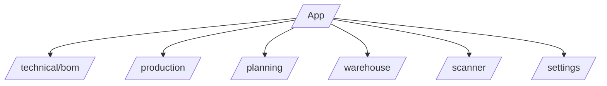
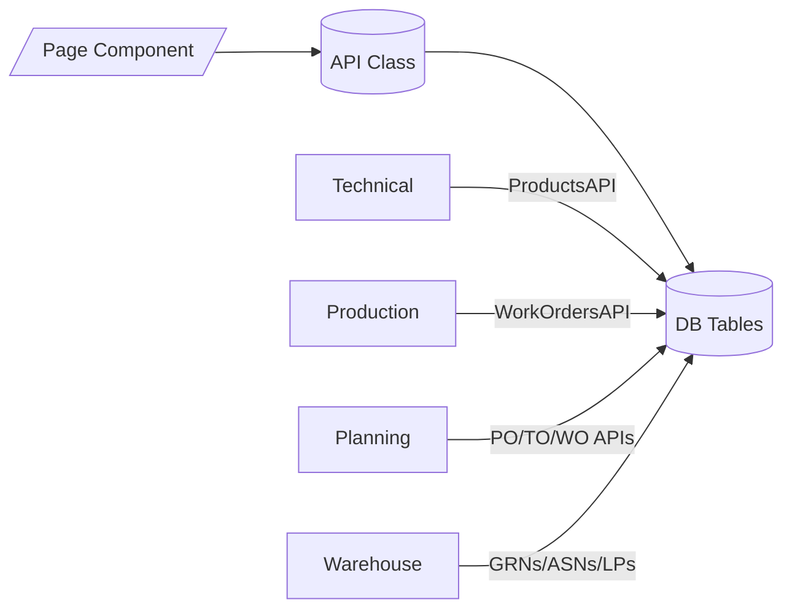
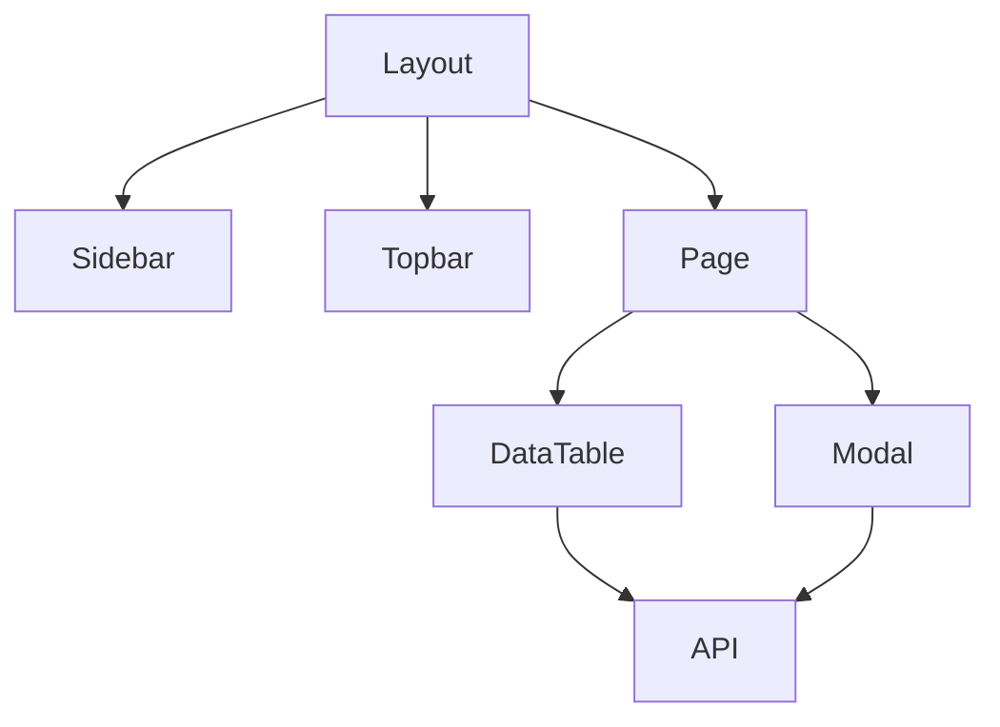
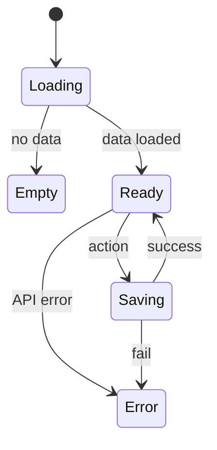
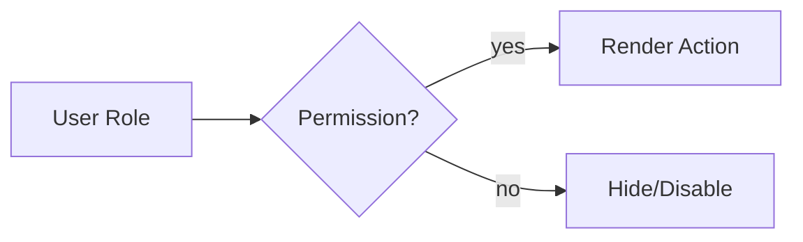

# App Guide (Przewodnik po aplikacji)

## 1. Cel

Ten przewodnik opisuje **strukturę nawigacji**, **strony i ich komponenty**, wzorce **pobierania danych**, **mapowanie stron ↔ API ↔ tabele**, oraz standardy **UX/UI** (stany ładowania/błędów/pustki, walidacje, notyfikacje, dostępność). Jest to dokument referencyjny dla deweloperów i QA.

---

## 2. Architektura UI (skrót)

- **Next.js 15 (App Router)**
- **Warstwa API klasowa** (np. `WorkOrdersAPI`, `ProductsAPI`)
- **Supabase** (PostgreSQL, RLS, subskrypcje realtime – gdzie potrzebne)
- **Komponenty wspólne**: tabele danych, formularze (modale), filtry, toasty, karty KPI

---

## 3. Mapa aplikacji (strony główne)

| Moduł          | Route            | Cel                                                 | Kluczowe komponenty                                                                                          |
| -------------- | ---------------- | --------------------------------------------------- | ------------------------------------------------------------------------------------------------------------ |
| **Technical**  | `/technical/bom` | Katalog produktów + edycja BOM, routing             | `BomCatalogClient`, `CompositeProductModal`, `AddItemModal`, `BomHistoryModal`, `AllergenChips`              |
| **Production** | `/production`    | Realizacja WO, KPI, trace                           | `WorkOrdersTable`, `WorkOrderDetailsModal`, `OperationsTab`, `YieldReportTab`, `TraceTab`                    |
| **Planning**   | `/planning`      | PO/TO/WO – planowanie i harmonogram                 | `PurchaseOrdersTable`, `TransferOrdersTable`, `WorkOrdersTable`, `CreateModal`, `UploadASNModal`             |
| **Warehouse**  | `/warehouse`     | GRN, ruchy, LP, palety, trace                       | `ReceiveScreen`, `StockMovesTable`, `LicensePlatesTable`, `PalletsTable` `TraceTab`                          |
| **Scanner**    | `/scanner`       | Terminal mobilny: receive, move, consume, finish    | `ScannerHome`, `ScannerReceive`, `ScannerMove`, `ScannerWO`,                                                 |
| **Settings**   | `/settings`      | RBAC, słowniki, linie/maszyny, lokalizacje, Routing | `OrganizationSettings`, `Users`, `Warehouses`, `Locations`, `Machines`, `RoutingBuilder`,`RoutingDictionary` |

> Uwaga: Scanner może działać jako PWA z uproszczonym UI.

---

## 4. Mapowanie stron ↔ API ↔ Tabele

| Strona                 | API                                                                           | Tabele (read)                                                                                           | Tabele (write)                            |
| ---------------------- | ----------------------------------------------------------------------------- | ------------------------------------------------------------------------------------------------------- | ----------------------------------------- |
| `/technical/bom`       | `ProductsAPI`, `bomAPI`                                                       | `products`, `bom`, `bom_items`,                                                                         | `products`, `bom`, `bom_items`            |
| `/production`          | `WorkOrdersAPI`, `YieldAPI`, `TraceabilityAPI`                                | `work_orders`, `wo_operations`, `production_outputs`, `license_plates`                                  | `work_orders`, `production_outputs`       |
| `/planning` (PO)       | `PurchaseOrdersAPI`                                                           | `purchase_orders`, `purchase_order_items`, `suppliers`                                                  | `purchase_orders`, `purchase_order_items` |
| `/planning` (TO)       | `TransferOrdersAPI`                                                           | `transfer_orders`, `transfer_order_items`, `locations`                                                  | `transfer_orders`, `transfer_order_items` |
| `/planning` (WO)       | `WorkOrdersAPI`                                                               | `work_orders`, `wo_materials`, `routings`                                                               | `work_orders`                             |
| `/warehouse` (Receive) | `GRNsAPI`, `ASNsAPI`, `LicensePlatesAPI`                                      | `asns`, `asn_items`, `purchase_orders`, `transfer_orders`                                               | `grns`, `grn_items`, `license_plates`     |
| `/warehouse` (Moves)   | `StockMovesAPI`, `LicensePlatesAPI`                                           | `license_plates`, `locations`, `stock_moves`                                                            | `stock_moves`, `license_plates`           |
| `/scanner`             | `ScannerAPI`, `WorkOrdersAPI`                                                 | `work_orders`, `lp_reservations`, `license_plates`                                                      | `lp_reservations`, `production_outputs`   |
| `/settings`            | `SuppliersAPI`, `WarehousesAPI`, `RoutingsAPI`, `MachinesAPI`, `LocationsAPI` | `suppliers`, `warehouses`, `machines`, `locations`, `routings`, `routing_operations` `production_lines` | w/w                                       |

---

## 5. Wzorce UI

### 5.1 Tabele danych

- **Paginacja**: stronicowanie serwerowe (default 25/50), pamiętanie filtrów w querystring
- **Filtry**: po statusie, dacie, linii (WO), dostawcy (PO), lokalizacji (TO/Moves)
- **Sortowanie**: kolumny daty/numerów rosnąco/malejąco; stabilne sorty
- **Puste stany**: CTA do utworzenia dokumentu (PO/TO/WO)

### 5.2 Formularze i modale

- **Walidacje**: sync + schema (TS/Zod) – komunikaty inline, focus na pierwszym błędzie
- **Zachowanie Draft vs Active**: blokady edycji dla Active (BOM/WO/PO/TO gdzie dotyczy)
- **Akcje**: `Cancel`, `Save`, `Save & Close`, `Clone as Draft`, `Activate`

### 5.3 Stany ładowania/błędów

- **Loading**: skeleton lub spinner w kontekście komponentu
- **Error**: komunikat z możliwością retry, logowanie do Sentry
- **Empty**: opis + link do dokumentacji/albo CTA

### 5.4 Notyfikacje

- **Toast** na sukces/błąd; dla operacji długich – progres (optimistic UI ograniczony)

### 5.5 Uprawnienia (RBAC)

- **Feature gating**: ukrywanie akcji/sekcji na podstawie roli
- **Disabled vs Hidden**: operacje niedozwolone – domyślnie **ukryte**

### 5.6 Dostępność (a11y)

- Fokus trap w modalach; aria‑label/aria‑describedby; kontrast; klawisz `Esc` zamyka modal

### 5.7 Obsługa skanera

- Pola ze wsparciem skanowania (autofocus, debounce)
- Skróty: `Enter` = confirm, `F2` = next field (jeśli desktop)

---

## 6. Przepływy danych (patterns)

### 6.1 SSR/Server Actions → API → DB

- Strony list używają **server actions** do pobierania, modale zapisują przez **API**

### 6.2 Subskrypcje realtime (opcjonalnie)

- Produkcja i Scanner mogą subskrybować statusy WO/operacji

### 6.3 Kontrakt UI ↔ DB (normatywny)

- **Moves**: `from_location_id`/`to_location_id` (nie warehouses)
- **PO**: waluta/podatek z `suppliers` (prefill, tylko do odczytu)
- **WO**: `line_id`, `bom_id`, `actual_start/end` widoczne w UI

---

## 7. Diagramy (Mermaid)

### 7.1 Site‑map

### 7.2 Page ↔ API ↔ DB

### 7.3 Component dependency (przykładowe)

### 7.4 UI states lifecycle

### 7.5 RBAC gating

---

## 8. Checklisty (QA & Akceptacja)

### 8.1 Strona (ogólna)

- [ ] Breadcrumbs, tytuł strony, akcje główne
- [ ] Filtry, sorty, stronicowanie (zachowywane w URL)
- [ ] Stany: loading/empty/error poprawnie zaimplementowane
- [ ] Uprawnienia: akcje ukryte dla ról bez dostępu

### 8.2 Formularz/Modal

- [ ] Walidacje schema (TS/Zod) + komunikaty inline
- [ ] Blokada edycji dla statusów tylko do odczytu (np. Active BOM)
- [ ] CTA: Cancel/Save/Save & Close; klawiatura `Esc` zamyka

### 8.3 Kontrakt danych

- [ ] Zgodność z `Database Schema` (nazwy pól/typy)
- [ ] PO: waluta/podatek z `suppliers` (prefill; brak edycji ręcznej waluty)
- [ ] TO/Moves: pola **Warehouse** zamiast location
- [ ] WO: `bom_id`, `line_id`, `actual_start/end` widoczne

### 8.4 Jakość i wydajność

- [ ] Sentry dla błędów
- [ ] Lighthouse/Axe – brak krytycznych ostrzeżeń a11y
- [ ] Brak powtarzających fetchy; memoizacja/kejsy SSR

### 8.5 Testy

- [ ] Testy jednostkowe komponentu
- [ ] Test integracyjny przepływu głównego
- [ ] E2E scenariusz (np. utworzenie PO→GRN)

---

## 9. Notatki implementacyjne

- Centralizuj kolumny tabel (definicje, renderery, formatery) – reużywalność
- Trzymaj mapping statusów w jednym module (TS + tłumaczenia)
- Wprowadzaj **feature flags** przy zmianach kontraktów API/DB
