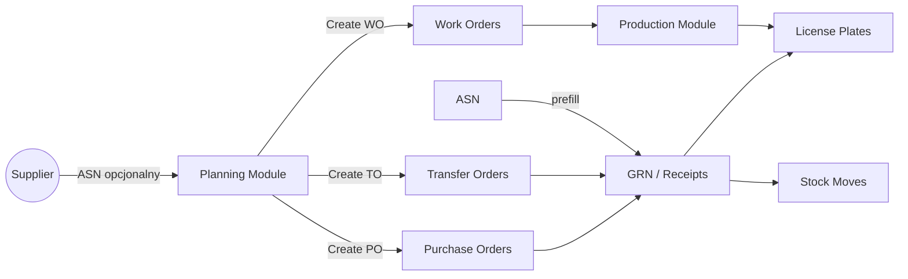
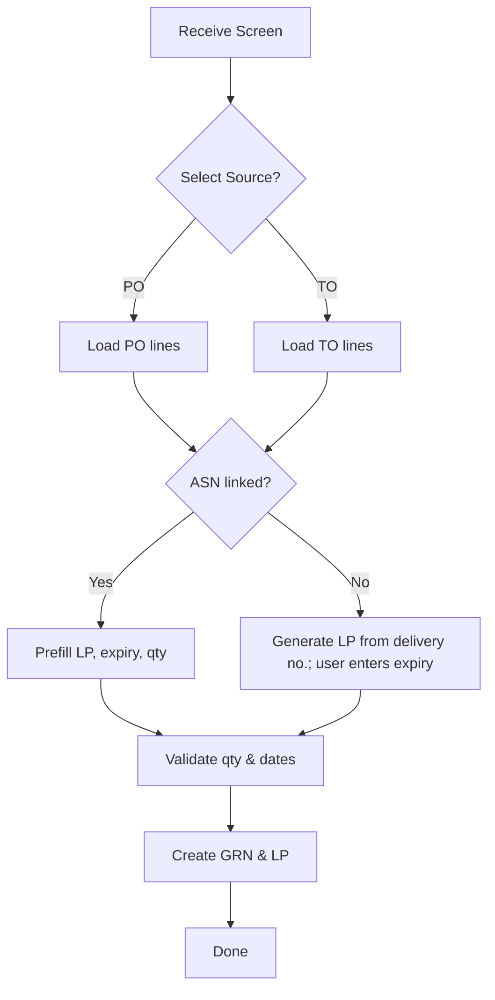
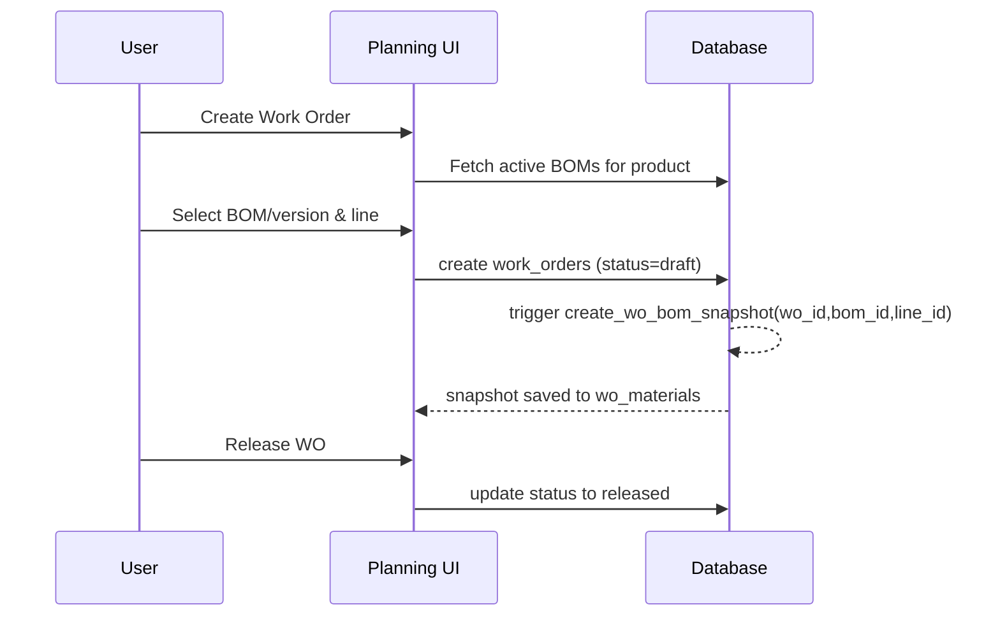

# Planning Module Documentation

## 1. Cel modułu

Moduł planowania odpowiada za zarządzanie zakupami (PO), przesunięciami (TO), zleceniami produkcyjnymi (WO) oraz automatyzację przygotowania materiałów do realizacji produkcji.

## 2. Typowe procesy

- Tworzenie zamówień zakupu (PO)
- Tworzenie zleceń przesunięcia (TO)
- Planowanie zleceń produkcyjnych (WO)
- Import ASN i jego rozpoznanie przy przyjęciu
- Śledzenie statusów i terminów

## 3. Struktura danych

### 3.1 Purchase Orders (`purchase_orders` + `purchase_order_items`)

- `po_number` – unikalny numer zamówienia
- `supplier_id`, `warehouse_id` – referencje
- `status` – draft / submitted / confirmed / received / closed / cancelled
- `expected_delivery_date`, `due_date` – daty
- `created_by`, `approved_by` – śledzenie użytkowników

### 3.2 Transfer Orders (`transfer_orders`, `transfer_order_items`)

- `to_number` – numer TO
- `from_Warehouse` / `to_Warehouse`
- `planned_ship_date`, `actual_ship_date`, `planned_receive_date`, `actual_receive_date`
- `status` – draft / planned / shipped / received / closed
- `created_by`, `approved_by` – śledzenie użytkowników

### 3.3 Work Orders (`work_orders` + `wo_materials`, `wo_operations`)

- `wo_number` – numer WO
- `product_id`, `bom_id`, `quantity`, `priority`
- `scheduled_start`, `actual_start`, `closed_at`
- `line_number`, `machine_id`, `umo` - referencje
- `created_by`, `approved_by`– śledzenie użytkowników
- `status` – draft / planned / released / in_progress / completed / cancelled

## 4. Interfejs użytkownika (UI)

### 4.1 WorkOrdersTable.tsx

- Pokazuje: WO number, produkt, ilość, status, daty planowane, linia, QA, wyprodukowana ilość, % postępu, braki
- ⚠️ Braki względem bazy: `bom_id`, `actual_start/end`, `created_by`

### 4.2 PurchaseOrdersTable.tsx

- Pokazuje: numer PO, dostawca, magazyn, daty, status, kupujący
- ⚠️ Braki względem bazy: `currency`, `exchange_rate`, `notes`, `due_date`, `created_by`

### 4.3 TransferOrdersTable.tsx

- Pokazuje: numer TO, from/to warehouse, status, data
- ⚠️ Błędne mapowanie pól: wukasuj wszedzie to_location_id i from_location_id
- ⚠️ Braki: daty planowane/rzeczywiste, `created_by`, `received_by`
- ⚠️ jezeli produkt znajduje sie w TO (LP zostal zeskanowany) domyslna lokacja jest Transit, jezeli to zostaje przyjete domyslna lokacje powinna byc ustawiona w settings

## 5. API i logika biznesowa

### 5.1 PurchaseOrdersAPI

- Tworzenie PO, edycja, filtrowanie po statusie

### 5.2 TransferOrdersAPI

- Operacje CRUD na TO
- Brakuje obsługi `from_Warehouse` / `to_Warehouse` w UI done?

### 5.3 WorkOrdersAPI

- Tworzenie WO, przypisanie BOM, zatwierdzenie
- Obsługa źródła zapotrzebowania (source_demand_id)
- Zatwierdzanie → snapshot BOM

## 6. ASN i przyjęcia

- Jeśli ASN (Advance Shipping Notice) jest zaimportowany:
  - System pobiera z niego daty, ilości, LP
  - Dostępne przez `asn_id`
- Jeśli ASN nie istnieje:
  - LP tworzony automatycznie przy przyjęciu
  - Użytkownik podaje datę ważności (jeśli wymagana)
  - Numer LP generowany na podstawie numeru dostawy

## 7. Uwagi dot. zgodności (⚠️)

- ⚠️ Braki w UI względem struktury bazy danych
- ⚠️ Nazwy pól niezgodne (`from_location_id``from_warehouse` zamiast `from_warehouse`)
- ⚠️ Brak obsługi `created_by`, `approved_by` w interfejsach

## 8. Zalecenia

- Zaktualizować komponenty UI, aby uwzględniały pola z bazy
- Ujednolicić mapowanie pól na `warehouse_id`
- Rozważyć obsługę pełnego cyklu WO (z BOM snapshot)
- Rozbudować integrację ASN → GRN + LP z przypisaniem

## 9. Powiązane tabele:

- `products`, `suppliers`, `warehouses`, `locations`
- `asn`, `grns`, `license_plates`
- `production_outputs`, `routing_operations`, `bom_items`

---

## 10. Diagramy (Mermaid)

### 10.1 Przepływ wysokiego poziomu (Planning → Warehouse/Scanner → Production)



### 10.2 Ekran przyjęcia (PO/TO) – z/bez ASN



### 10.3 Planowanie i snapshot BOM dla WO



### 10.4 Cykl życia Transfer Order

```mermaid
flowchart LR
  Draft[Create TO (draft)] --> Plan[Planned ship/receive dates]
  Plan --> Ship[Mark as Shipped (actual_ship_date)]
  Ship --> Transit[Status: in_transit]
  Transit --> Receive[Mark as Received (actual_receive_date)]
  Receive --> Close[Status: received/closed]
```

---

## 11. Checklisty (QA & Akceptacja)

### 11.1 Purchase Order (PO)

- [ ] Dostawca przypisany, waluta = suppliers.currency (auto)
- [ ] Domyślny kod podatku z dostawcy/produktu ustawiony (auto)
- [ ] Wszystkie pozycje mają cenę jednostkową i UoM
- [ ] Daty: expected_delivery_date, due_date uzupełnione
- [ ] Brak pozycji z innym dostawcą niż nagłówek (1:1)
- [ ] Pola `created_by` / `approved_by` wypełniane i dostępne w API/UI

### 11.2 Transfer Order (TO)

- [ ] `from_warehouse` i `to_warehouse` wskazują fizyczne lokalizacje (nie tylko magazyny)
- [ ] Daty planowane Ship/Receive uzupełnione
- [ ] Widoczność dat rzeczywistych Ship/Receive w UI
- [ ] Reguły anulowania: dozwolone tylko dla draft/submitted
- [ ] Pola `created_by` / `received_by` obsługiwane

### 11.3 Work Order (WO)

- [ ] Produkt ma aktywny BOM zgodny z linią
- [ ] `line_id` wybrany i kompatybilny (walidacja) z line from BoM
- [ ] Snapshot BOM zapisany w `wo_materials` przy utworzeniu WO
- [ ] UoM pobierane z BOM, brak konwersji po starcie WO
- [ ] Pola `actual_start` / `actual_end` rejestrowane i widoczne w UI
- [ ] `source_demand_type/id` ustawione (PO/TO/Manual)

### 11.4 Receive (PO/TO) + ASN/GRN/LP

- [ ] Wybór źródła: PO lub TO na ekranie przyjęcia
- [ ] Jeśli jest ASN → prefill ilości, LP, daty ważności
- [ ] Jeśli brak ASN → LP generowany automatycznie (z numeru dostawy); użytkownik wpisuje expiry (jeśli wymagane)
- [ ] Walidacja niedozwolonego over‑receipt (> zamówione)
- [ ] Tworzenie GRN + LP, przypisanie partii/expiry/QA/location

### 11.5 Zgodność UI ↔ DB (kontrakt pól)

- [ ] TO: UI używa `from_warehouse`/`to_warehouse`
- [ ] PO: UI pokazuje `due_date`, `currency`, `notes`, `created_by`
- [ ] WO: UI pokazuje `actual_start`, `actual_end`, `bom_id`, `created_by`
- [ ] Wszystkie listy mają filtry po `status`, dacie, linii (WO)

### 11.6 Integracja Scanner/Warehouse (MVP)

- [ ] Ekran przyjęcia na skanerze z wyborem PO/TO
- [ ] Prefill z ASN (jeśli istnieje); w przeciwnym razie ręczne expiry
- [ ] Druk/wyświetlenie LP po GRN
- [ ] Operacje: start/finish WO, move location→location, split/merge LP
