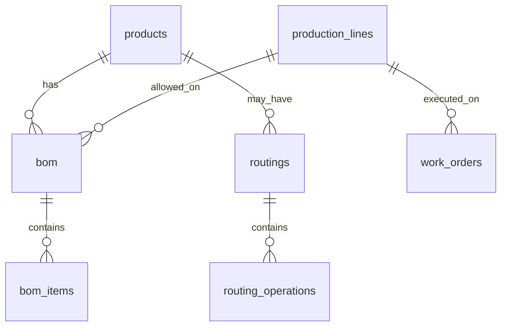
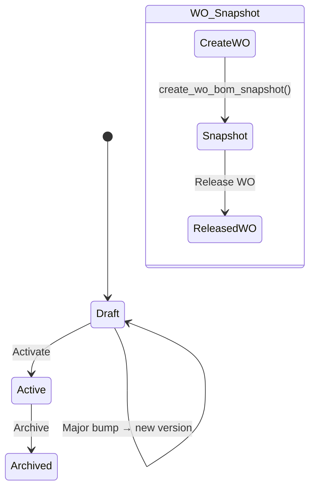
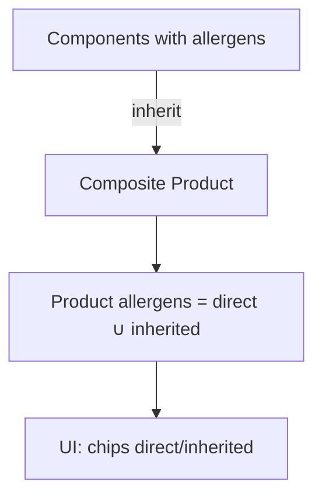
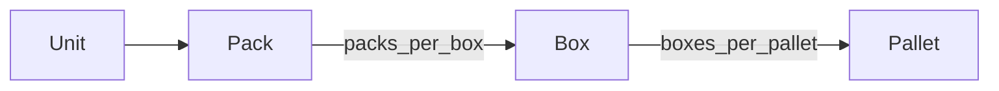
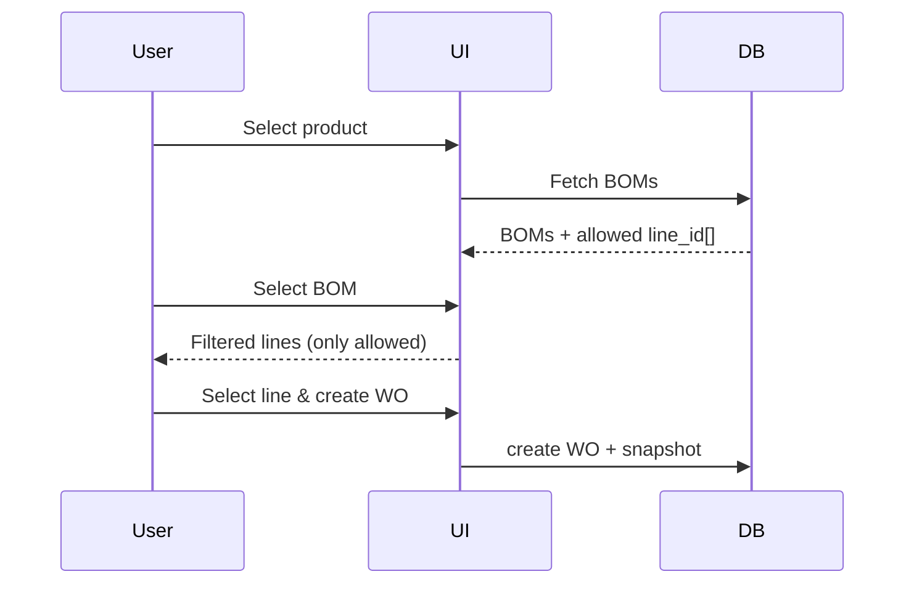
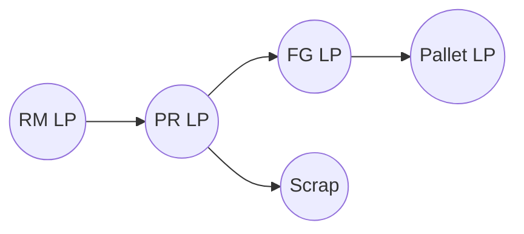

# Technical Module Documentation (BOM, Routing, Lines, QA, Packaging & Traceability)

## 1. Cel i zakres

Moduł Techniczny definiuje **produkty**, **struktury BOM**, **routing/operacje**, **linie produkcyjne**, **opakowania**, **alergeny/podatki** oraz reguły jakości (QA). Jest źródłem prawdy dla receptur i danych technologicznych używanych w Planowaniu, Produkcji i Magazynie/Scanner.

---

## 2. Model danych (schemat)

### 2.1 Produkty (`products`)

- Kluczowe pola: `id`, `part_number`, `description`, `product_group`, `product_type` (MEAT/DRYGOODS/COMPOSITE/PR/FG), `uom_info` (informacyjne), `preferred_supplier_id`,
- **Wersjonowanie produktu**: `product_version` (X.Y)
- **Opakowania** (tylko FG): `packs_per_box` (int ≥1), `boxes_per_pallet` (int ≥1)
- **Relacje**: alergeny (`product_allergens`), aktywny BOM, routingi

### 2.2 BOM (`bom`, `bom_items`)

- **`bom`**: `id`, `product_id`, `version` (X.Y), `status` (draft/active/archived), `line_id` (INT[] lub NULL = wszystkie), meta (`notes`, `created_at`)
- **`bom_items`**: `id`, `bom_id`, `material_id`, `qty`, `uom` (enum: `KG|EACH|METER|LITER`), `scrap_pct`, `one_to_one_flag`, `line_id` (INT[]/NULL)
- **Zasada UoM**: BOM jest źródłem prawdy dla jednostek; brak konwersji po starcie WO

### 2.3 Routing (`routings`, `routing_operations`)

- `routings`: `id`, `name`, `product_id`, `is_active`, `notes`
- `routing_operations`: `routing_id`, `sequence_number` (unikalne w ramach routingu), `operation_name`, `code`, `description`, `requirements` (TEXT[]), **`machine_id`** (FK)

### 2.4 Linie produkcyjne (`production_lines`)

- `id`, `code`, `name`, `status` (active/inactive), `warehouse_id`, `is_active`
- Wskazywane w `bom.line_id` (dozwolone linie) i na WO (`work_orders.line_id`)

### 2.5 QA / Jakość

- Statusy QA na poziomie `production_outputs`/LP blokują wydania/operacje
- Powiązania z traceability (genealogia partii)

### 2.6 Traceability & LP (przeglądowo)

- `license_plates` (nośnik partii + UoM), `lp_compositions`, `lp_genealogy`
- Integracja z BOM/WOs: pełna genealogia forward/backward

### 2.7 Alergeny & Podatki

- `allergens`, `product_allergens` (N:N); dziedziczenie alergenów w dół struktury
- `settings_tax_codes` – podatki ustawiane na **produkcie/dostawcy/PO**, **nie** w BOM

---

## 3. Reguły biznesowe

### 3.1 Cykl życia BOM

- **Draft → Active → Archived**
- Edytowalny tylko **w Draft**; Active wyłącznie do odczytu
- **Single Active BOM per product** (unikalność)

### 3.2 Wersjonowanie (X.Y)

- **Minor (mała zmiana)**: zmiana `qty`, `scrap%`, metadane → bump `X.(Y+1)`
- **Major (duża zmiana)**: zmiana `material_id` → nowa wersja (X+1).0 + nowy draft
- **Wersja produktu**: `product_version` (X.Y) – przechowywana w snapshot WO

### 3.3 Snapshot BOM (WO)

- Tworzony przy **Create WO**; zawiera: `material_id`, `qty`, `scrap%`, `one_to_one`, `uom`, alergeny, `product_version`, `bom_version`, `line_id`
- Snapshot jest **niezmienny** dla danego WO

### 3.4 Linie & kompatybilność

- `bom.line_id` = {dozwolone linie}; `bom_items.line_id` ⊆ `bom.line_id`
- WO **musi** mieć `line_id` zgodny z BOM; UI filtruje linie wg BOM

### 3.5 UoM – źródło prawdy w BOM

- `bom_items.uom` obowiązuje wszędzie; **brak konwersji** po utworzeniu WO
- Mieszane UoM per BOM dozwolone

### 3.6 Opakowania (FG)

- **Unit → Pack → Box → Pallet** (w systemie Pack = Unit)
- Z pól produktu: obliczanie `boxes`, `pallets` (zaokrąglenia w górę; przy LP na palecie)

### 3.7 Alergeny – dziedziczenie

- Produkt **dziedziczy** alergeny komponentów (oznaczenie `inherited` vs `direct`)

### 3.8 QA – blokady

- Status QA (np. `blocked`) blokuje operacje i transakcje magazynowe

---

## 4. Interfejsy (UI/UX) – kluczowe ekrany

- **Katalog BOM**: lista produktów, aktywne wersje BOM, filtry (grupa, dostawca, alergeny)
- **CompositeProductModal**: edycja BOM (Draft), wersjonowanie, preferowana linia
- **AddItemModal**: dodawanie materiałów, UoM, 1:1, scrap%
- **RoutingBuilder**: sekwencja operacji, wybór maszyny, słownik nazw operacji
- **BomHistoryModal**: historia wersji, diff draft↔active, eksport XLSX
- **TraceTab** (wspólne): LP, genealogia, export XLSX

---

## 5. Luki/Niespójności (⚠️)

- ⚠️ **Nazwy tabel**: używać `bom` (nie `boms`) – ujednolicenie dokumentacji/implementacji
- ⚠️ **Kolumny linii**: frontend używa `production_lines`, DB: `line_id`/`production_line_restrictions` → ujednolicić
- ⚠️ **`price` vs `std_price`** w formularzach/testach – ujednolicić na `std_price`
- ⚠️ **Typ produktu**: `PR` vs `WIP` – jeden słownik typów w TS/validation
- ⚠️ **BOM versioning**: przyciski w UI były placeholderami – wymagają implementacji

---

## 6. Diagramy (Mermaid)

### 6.1 Relacje: Product ↔ BOM ↔ Routing ↔ Lines

### 6.2 Cykl życia BOM & Snapshot WO

### 6.3 Dziedziczenie alergenów

### 6.4 Hierarchia opakowań (FG)

### 6.5 Kompatybilność linii i filtracja

### 6.6 Trace forward/backward (przegląd)

---

## 7. Checklisty (QA & Akceptacja)

### 7.1 Produkt & Opakowania (FG)

- [ ] `product_version` widoczne i aktualizowane (X.Y)
- [ ] `packs_per_box` i `boxes_per_pallet` > 0 (tylko dla FG)
- [ ] Obliczenia Box/Pallet poprawne (zaokr. w górę)

### 7.2 BOM – edycja i aktywacja

- [ ] Edycja tylko w `status=draft`
- [ ] `active` → tylko odczyt (blokada UI/API)
- [ ] Constraint: pojedynczy Active BOM per produkt
- [ ] Minor vs Major bump zgodnie z regułami

### 7.3 BOM – UoM i 1:1

- [ ] `bom_items.uom ∈ {KG,EACH,METER,LITER}`
- [ ] Brak konwersji UoM w WO (snapshot)
- [ ] `one_to_one_flag` wymuszane w Scanner/Production

### 7.4 Linie i kompatybilność

- [ ] `bom.line_id` (NULL = wszystkie) i `bom_items.line_id ⊆ bom.line_id`
- [ ] UI filtruje linie wg BOM
- [ ] WO wymaga `line_id` zgodnego z BOM

### 7.5 Routing & Operacje

- [ ] `routing_operations.sequence_number` unikalne i rosnące
- [ ] `machine_id` ustawiane gdy wymagane
- [ ] Słownik nazw operacji w Settings present

### 7.6 Alergeny & Podatki

- [ ] Alergeny dziedziczone + oznaczanie `direct` vs `inherited`
- [ ] Brak podatków w BOM (podatki z dostawcy/PO)

### 7.7 Snapshot & Traceability

- [ ] Snapshot WO zawiera: material_id, qty, scrap%, 1:1, UoM, allergens, product_version, bom_version, line_id
- [ ] Trace forward/backward poprawnie łączy LP i operacje

### 7.8 Spójność typów/kolumn

- [ ] `std_price` zamiast `price` w formularzach/testach
- [ ] Ujednolicone nazwy (`bom`, `line_id`/`production_line_restrictions`)
- [ ] Typ produktu spójny (`PR` vs `WIP`) w TS i walidacjach

---

## 8. Zalecenia implementacyjne (P0)

- Migracje: `product_version`, `bom.line_id`, `bom_items.uom`, `routing_operations.machine_id`
- UI: bannery Draft/Active, ostrzeżenia „Big change → major bump”, eksport XLSX BOM/Historia
- API: pełne metody wersjonowania (clone as draft, activate, archive)
- TraceTab: kolumny LP/Product/Batch/Depth/op_seq/qa_status + eksport XLSX
