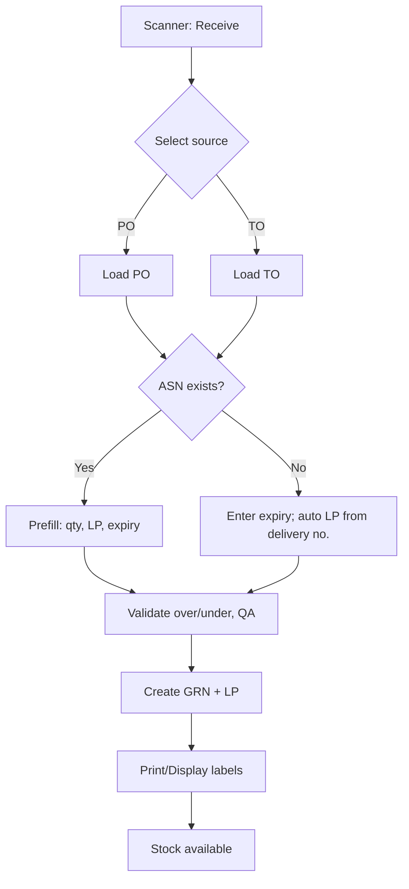
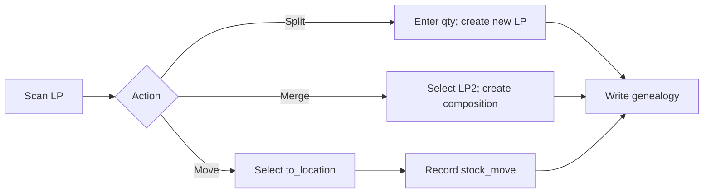
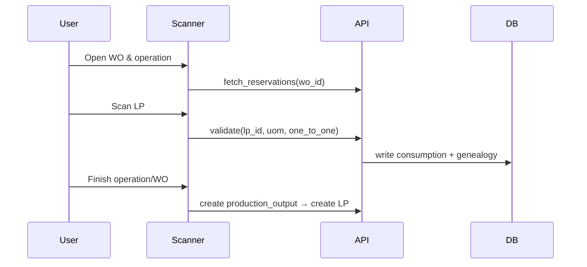

# Warehouse & Scanner Documentation

## 1. Cel i zakres

Opis funkcji magazynu i terminali skanerowych: **przyjęcia (PO/TO)**, **ruchy magazynowe (move)**, **obsługa WO (start/finish)**, **split/merge LP**, **pakowanie na palety** oraz integracja z **ASN/GRN/LP**. Moduł jest punktem styku między Planning (PO/TO/WO) a Production/Traceability.

---

## 2. Model danych (DB)

- **asns, asn_items** – awiza dostawy (prefill przy przyjęciu); zalecane `asns.po_id` (FK)
- **grns, grn_items** – dokumenty przyjęcia (GRN); tworzą LP
- **license_plates** – jednostki logistyczne (LP) z `uom`, batch, expiry, qa_status
- **lp_compositions, lp_genealogy** – skład i genealogia LP (split/merge/consume)
- **stock_moves** – ruchy magazynowe (from_location_id → to_location_id)
- **locations** – lokalizacje fizyczne; **warehouses** – nadrzędne magazyny
- **pallets, pallet_items** – paletyzacja (jeśli stosowana)

---

## 3. Procesy i interfejsy

### 3.1 Receive (PO/TO) z/bez ASN

- **Źródło**: użytkownik wybiera **PO** lub **TO**
- **Z ASN**: prefill ilości, LP (numery), expiry (jeśli podane), batch
- **Bez ASN**: LP generowany automatycznie (z numeru dostawy); użytkownik wpisuje expiry jeśli wymagane
- **Walidacje**: brak over‑receipt (> zamówione), QA status, wymagane pola LP
- **Wynik**: utworzony **GRN**, LP zapisane, stock zasilony w `to_location_id`

### 3.2 Movement (Move Location→Location)

- Składanie zadań przeniesienia (task) lub operacja ad‑hoc
- Rezerwacja LP (opcjonalnie), walidacja dostępności i QA
- Zapis do `stock_moves`, aktualizacja bieżącej lokalizacji LP

### 3.3 Split / Merge LP

- **Split**: podział LP na nowe LP (ilość + dziedziczenie batch/expiry/genealogii)
- **Merge**: łączenie LP (ten sam produkt/uom/qa) → nowa kompozycja w `lp_compositions`
- Każda operacja zostawia ślad w **genealogii**

### 3.4 Obsługa WO na skanerze

- **Start WO**: potwierdzenie linii/operacji, rezerwacje LP
- **Consume**: skan LP + walidacja UoM/1:1 + zapis genealogii
- **Finish WO**: utworzenie outputs (PR/FG) jako LP z właściwym `uom` i QA

### 3.5 Paletyzacja

- Tworzenie palety (pallet) z LP (pack), druk etykiety, powiązanie z lokalizacją paletową

---

## 4. Diagramy (Mermaid)

### 4.1 Receive flow: PO/TO ↔ ASN ↔ GRN ↔ LP

### 4.2 Movement & split/merge

### 4.3 WO via Scanner (consume/finish)

---

## 5. Checklisty (QA & Akceptacja)

### 5.1 Receive (PO/TO)

- [ ] Ekran wyboru źródła: PO/TO
- [ ] Prefill z ASN (qty, LP, expiry) gdy dostępny
- [ ] Brak over‑receipt; short shipment dozwolony zgodnie z polityką
- [ ] LP: numer, `uom`, `batch`, `expiry` (jeśli wymagane) zapisane
- [ ] GRN + LP utworzone; lokalizacja docelowa ustawiona

### 5.2 Movement & magazyn

- [ ] Walidacja QA i dostępności LP przed ruchem
- [ ] Zapis `stock_moves` z `from_location_id`/`to_location_id`
- [ ] Aktualizacja bieżącej lokalizacji w LP

### 5.3 Split / Merge

- [ ] Split dziedziczy `batch/expiry` i zapisuje genealogię
- [ ] Merge dopuszczalny tylko dla tego samego produktu/UoM/QA
- [ ] Każda operacja → `lp_compositions` + `lp_genealogy`

### 5.4 Scanner ↔ WO

- [ ] Start WO/operacji wymusza zgodność linii
- [ ] Consume wymusza `uom` z BOM i 1:1 jeśli flagowane
- [ ] Finish WO tworzy outputs jako LP z QA i lokalizacją

### 5.5 Etykiety i wydruki

- [ ] Druk etykiet LP/palet po GRN i pakowaniu
- [ ] Zawartość etykiety: product, qty+uom, batch, expiry, LP id, barcode

---

## 6. Niespójności / Do doprecyzowania (⚠️)

- ⚠️ Brak pełnego UI Receive – część pól (expiry/LP) tylko w trybie manual
- ⚠️ Różnice w nazewnictwie ruchów (warehouse vs location) – wymagana spójność
- ⚠️ Braki w testach Scanner (E2E) dla split/merge i pack

---

## 7. Zalecenia (P0)

- Dodać `asns.po_id` i integrację prefill do GRN
- Wymusić kontrakt pól LP (`uom`, `batch`, `expiry`) w UI/API
- Ujednolicić nazewnictwo: **location** (nie warehouse) w ruchach
- Dodać audyt operacji skanera (who/when/what)
