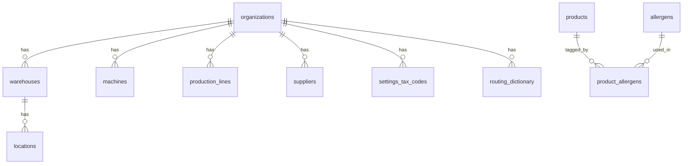
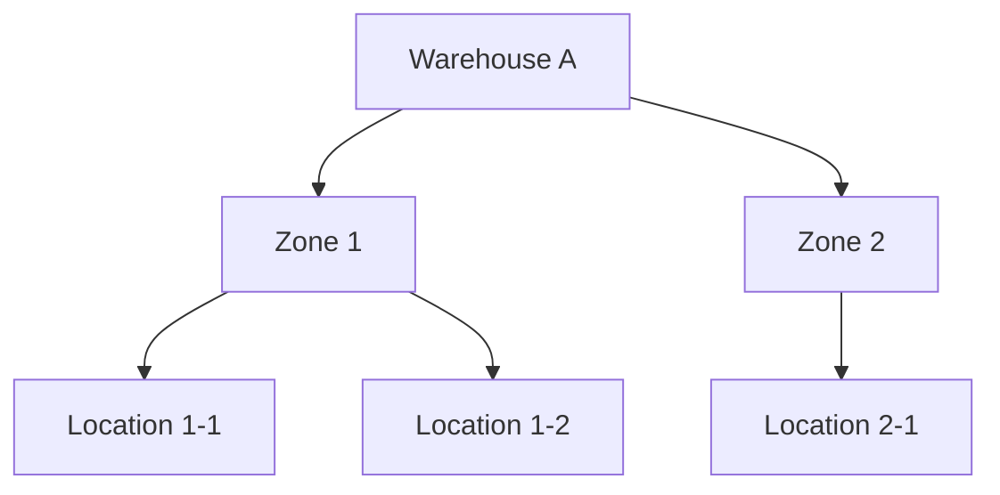
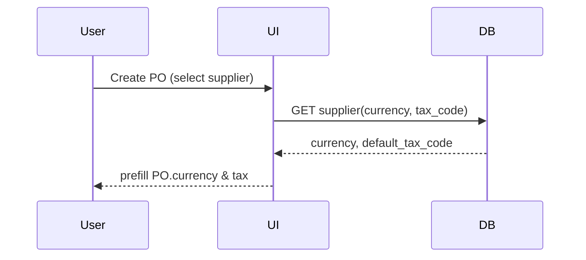
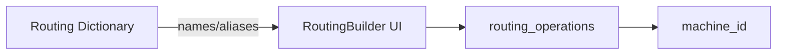

# Settings & Configuration Documentation

## 1. Cel i zakres

Dokument definiuje domenę **Ustawień i Konfiguracji** w MonoPilot: organizacje i multi‑tenant, role i uprawnienia (RBAC), słowniki (lokalizacje, magazyny, maszyny, linie, słownik operacji), alergeny, podatki, oraz parametry wpływające na moduły **Planning**, **Production**, **Technical** i **Warehouse & Scanner**. Ten plik jest **źródłem prawdy** dla nazw pól i kontraktów danych w obszarze Settings.

---

## 2. Domeny konfiguracji

- **Organizacja & Multi‑tenant**: `organizations`, powiązanie użytkowników, `org_id` na wszystkich tabelach biznesowych, polityki RLS.
- **Użytkownicy & Role (RBAC)**: role systemowe (Admin, Manager, Operator, Viewer) i macierz uprawnień per moduł.
- **Magazyny & Lokalizacje**: `warehouses` (magazyny), `locations` (hierarchia magazyn → strefa → miejsce). Kontrakt: w ruchach i TO używamy **`from_location_id` / `to_location_id`**.
- **Maszyny & Linie**: `machines` (park maszynowy), relacja do `routing_operations.machine_id`; linie produkcyjne konfigurowane w module Technical (`production_lines`).
- **Routing Dictionary**: słownik nazw operacji (Smoke, Roast, Dice, Mix…) wykorzystywany w `routing_operations` i UI.
- **Dostawcy, Waluty i Podatki**: `suppliers.currency` i `suppliers.default_tax_code_id`; PO dziedziczą walutę/podatek z dostawcy.
- **Alergeny**: `allergens`, `product_allergens` (N:N), dziedziczenie do produktu z BOM.
- **Polityki przydatności/expiry**: słownik wartości m.in. `DAYS_STATIC`, `FROM_MFG_DATE`, `FROM_DELIVERY_DATE`, `FROM_CREATION_DATE`.
- **Sekwencje numeracji** (opcjonalnie): formaty numerów (LP, PO, TO, WO) i prefiksy.

---

## 3. Model danych (tabele i kluczowe kolumny)

### 3.1 Organizacje & Użytkownicy

- **organizations**: `id`, `name`, `status`, `created_at`.
- **users** (Supabase): `id`, atrybuty profilu; powiązanie z organizations (tablica mapująca lub pole w sesji).
- **org_memberships** (jeśli używana): `org_id`, `user_id`, `role`.

### 3.2 RBAC

- **roles**: `code` (ADMIN|MANAGER|OPERATOR|VIEWER), `name`, `description`.
- **role_permissions**: `role_code`, `module` (PLANNING|PRODUCTION|TECHNICAL|WAREHOUSE|SCANNER|SETTINGS|REPORTS), `action` (READ|WRITE|APPROVE|ADMIN).

### 3.3 Magazyny & Lokalizacje

- **warehouses**: `id`, `code`, `name`, `is_active`, `org_id`.
- **locations**: `id`, `warehouse_id`, `code`, `name`, `parent_id` (dla hierarchii), `is_active`, `org_id`.

### 3.4 Maszyny & Linie

- **machines**: `id`, `code`, `name`, `is_active`, `org_id`.
- **production_lines** (Technical): `id`, `code`, `name`, `status`, `warehouse_id`, `is_active`, `org_id`.

### 3.5 Słowniki technologiczne

- **routing_dictionary**: `id`, `operation_name`, `aliases[]`, `is_active`, `org_id`.
- **settings_tax_codes**: `id`, `code`, `rate`, `description`, `is_active`, `org_id`.
- **allergens**: `id`, `code`, `name`, `is_active`.

### 3.6 Dostawcy

- **suppliers**: `id`, `name`, `currency`, `default_tax_code_id`, `is_active`, `org_id`.

### 3.7 Polityki przydatności

- **expiry_policies** (słownik): `code` (`DAYS_STATIC|FROM_MFG_DATE|FROM_DELIVERY_DATE|FROM_CREATION_DATE`), `label`, `notes`.

---

## 4. Przepływy konfiguracji (operacyjne)

### 4.1 Onboarding organizacji

1. Utwórz **organization**.
2. Dodaj użytkowników do org (role początkowe).
3. Włącz RLS i przypisz `org_id` do obiektów.

### 4.2 RBAC – role i uprawnienia

1. Zdefiniuj role systemowe: Admin, Manager, Operator, Viewer.
2. Przypisz uprawnienia per moduł (READ/WRITE/APPROVE/ADMIN).
3. W UI wymuś ukrywanie akcji niedozwolonych (feature gating).

### 4.3 Magazyny i lokalizacje

1. Utwórz **warehouses**.
2. Zdefiniuj hierarchię **locations** (strefy/pola) i ich kody.
3. Ustal lokalizacje domyślne (np. receiving, quarantine, pallets).

### 4.4 Maszyny i linie

1. Utwórz wpisy **machines**.
2. Skonfiguruj **production_lines** i powiąż z magazynem.
3. Udostępnij w UI wybór `machine_id` przy konfiguracji `routing_operations`.

### 4.5 Routing Dictionary → RoutingBuilder

1. W Settings dodaj nazwy operacji i aliasy.
2. W **Technical**: RoutingBuilder wykorzystuje słownik (autocomplete, walidacja).

### 4.6 Dostawcy → PO

1. W **suppliers** ustaw **currency** i **default_tax_code_id**.
2. W **Planning/PO**: przy tworzeniu zamówienia pola te **dziedziczą** się automatycznie.

### 4.7 Polityki przydatności

1. Ustal słownik `expiry_policies` (normatywny).
2. Zapewnij spójność wartości w UI/API/testach (bez legacy `use_by`/`best_before`).

---

## 5. RBAC – macierz uprawnień (skrót)

- **Admin**: ADMIN we wszystkich modułach + konfiguracja Settings.
- **Manager**: WRITE/APPROVE w Planning/Production/Technical, READ w Settings.
- **Operator**: WRITE w Production/Warehouse/Scanner, READ w Planning/Technical.
- **Viewer**: READ we wszystkich modułach.

> Uwaga: APPROVE dotyczy procesów wymagających zatwierdzeń (np. anulowanie PO/WO, aktywacja BOM).

---

## 6. Diagramy (Mermaid)

### 6.1 ER – Settings (skrót)



### 6.2 Hierarchia lokalizacji



### 6.3 Dziedziczenie waluty/podatku (Supplier → PO)



### 6.4 Routing Dictionary → RoutingBuilder



### 6.5 Multi‑tenant i RLS

```mermaid
flowchart LR
  UserSession[Session(org_id)] --> Policy[RLS policy]
  Policy -->|filter by org_id| Selects[(SELECT/UPDATE/DELETE)]
```

---

## 7. Checklisty (QA & Akceptacja)

### 7.1 Tenant & RLS

- [ ] `org_id` obecny w tabelach biznesowych, RLS USING/WITH CHECK aktywny
- [ ] Test izolacji: Org A ≠ Org B (SELECT/UPDATE/DELETE)

### 7.2 RBAC

- [ ] Role: Admin/Manager/Operator/Viewer zdefiniowane
- [ ] Macierz uprawnień przypisana do ról
- [ ] UI ukrywa/wyłącza niedozwolone akcje

### 7.3 Warehouses & Locations

- [ ] Unikalne kody `warehouses.code`, `locations.code` (per warehouse)
- [ ] Domyślne lokalizacje: receiving, quarantine, pallets
- [ ] Kontrakt TO/moves: `from_location_id`/`to_location_id`

### 7.4 Machines & Lines

- [ ] `routing_operations.machine_id` używane tam, gdzie wymagane
- [ ] `production_lines` powiązane z magazynem i aktywne

### 7.5 Suppliers & Finance

- [ ] `suppliers.currency` i `default_tax_code_id` uzupełnione
- [ ] PO dziedziczy currency/tax – brak ręcznej edycji waluty

### 7.6 Allergens & Expiry

- [ ] Spójny słownik alergenów; dziedziczenie w BOM → produkt
- [ ] `expiry_policies` zgodne z wartościami normatywnymi (bez legacy)

### 7.7 Numeracje i kody

- [ ] Zdefiniowane formaty LP/PO/TO/WO (prefiksy, długość)
- [ ] Walidacje unikalności i czytelności kodów

---

## 8. Niespójności / Do poprawy (⚠️)

- ⚠️ **Location vs Warehouse**: wszędzie w ruchach i TO wymusić pola **location**, nie magazyn.
- ⚠️ **Legacy expiry values**: zastąpić `use_by`/`best_before` na słownik `expiry_policies`.
- ⚠️ **Braki FK/indeksów**: upewnić się, że `suppliers.default_tax_code_id` → `settings_tax_codes.id`; indeksy `name/code`.
- ⚠️ **RBAC**: ujednolicić enforcement w API i UI (feature gating).

---

## 9. Backlog migracji (P0)

- S1: Dodać `org_id` + polityki RLS w tabelach brakujących.
- S2: Dodać `routing_operations.machine_id` (FK → machines).
- S3: Dodać słownik `routing_dictionary` + UI binding.
- S4: Ujednolicić TO/moves na `from_location_id`/`to_location_id` (migracja i refactor UI/API).
- S5: Słownik `expiry_policies` + walidacje UI/API/testy.
- S6: FK `suppliers.default_tax_code_id` → `settings_tax_codes.id` + indeksy perf.

---

## 10. Notatki implementacyjne

- Centralizuj słowniki (TS + SQL) i eksportuj do UI w jednym miejscu.
- Zmiana w Settings wpływa na walidacje w Planning/Production/Technical – wprowadzać feature flags dla stopniowego rollout.
