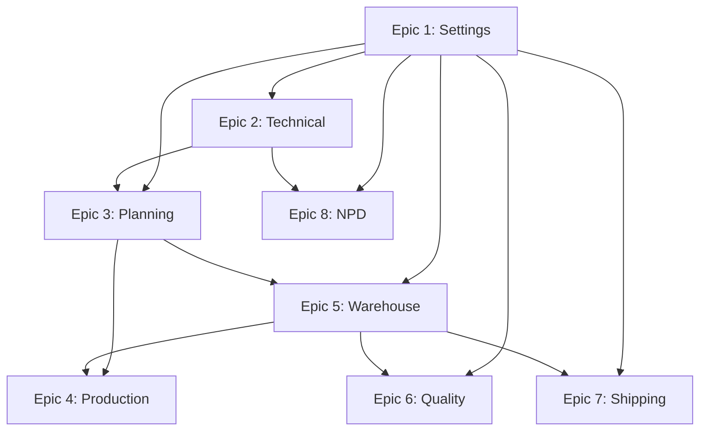

# MonoPilot - Epic Breakdown (Index)

**Author:** Mariusz
**Date:** 2025-11-20
**Project Level:** Enterprise MES for Food Manufacturing
**Target Scale:** Multi-tenant SaaS

---

## Overview

This directory contains the complete epic and story breakdown for MonoPilot, decomposing all 216 functional requirements from the modular PRD into 237 implementable user stories across 8 epics.

**Living Document Notice:** This breakdown is based on PRD and UX Design specifications. Stories include detailed BDD acceptance criteria.

**Structure:** Each epic is maintained in a separate file for better context management and modular AI consumption.

---

## Epic Summary

### Phase 1: P0 - MVP (Must Have)

| Epic | Module | File | FRs | Stories | Priority | Effort |
|------|--------|------|-----|---------|----------|--------|
| **Epic 1** | Foundation & Settings | [epic-1-settings.md](./epic-1-settings.md) | 11 | 12 | P0 🔴 | 2-3 weeks |
| **Epic 2** | Technical Core | [epic-2-technical.md](./epic-2-technical.md) | 18 | 24 | P0 🔴 | 3-4 weeks |
| **Epic 3** | Planning Operations | [epic-3-planning.md](./epic-3-planning.md) | 16 | 22 | P0 🔴 | 3-4 weeks |
| **Epic 4** | Production Execution | [epic-4-production.md](./epic-4-production.md) | 15 | 20 | P0 🔴 | 3-4 weeks |
| **Epic 5** | Warehouse & Scanner | [epic-5-warehouse.md](./epic-5-warehouse.md) | 30 | 35 | P0 🔴 | 4-5 weeks |
| **Subtotal P0** | | | **90** | **113** | | **15-20 weeks** |

### Phase 2: Growth (Should Have)

| Epic | Module | File | FRs | Stories | Priority | Effort |
|------|--------|------|-----|---------|----------|--------|
| **Epic 6** | Quality Control | [epic-6-quality.md](./epic-6-quality.md) | 26 | 28 | P1 🟠 | 3-4 weeks |
| **Epic 7** | Shipping & Fulfillment | [epic-7-shipping.md](./epic-7-shipping.md) | 26 | 28 | P1 🟠 | 3-4 weeks |
| **Epic 8** | New Product Development | [epic-8-npd.md](./epic-8-npd.md) | 74 | 68 | P1 🟠 | 6-8 weeks |
| **Subtotal P1** | | | **126** | **124** | | **12-16 weeks** |

### Grand Total

| Phase | Epics | FRs | Stories | Effort |
|-------|-------|-----|---------|--------|
| **P0 (MVP)** | 5 | 90 | 113 | 15-20 weeks |
| **P1 (Growth)** | 3 | 126 | 124 | 12-16 weeks |
| **TOTAL** | **8** | **216** | **237** | **27-36 weeks** |

---

## Functional Requirements Inventory

### Settings Module (11 FRs) - P0

- FR-SET-001: Organization Configuration
- FR-SET-002: User Management
- FR-SET-003: Session Management
- FR-SET-004: Warehouse Configuration
- FR-SET-005: Location Management
- FR-SET-006: Machine Configuration
- FR-SET-007: Production Line Configuration
- FR-SET-008: Allergen Management
- FR-SET-009: Tax Code Configuration
- FR-SET-010: Module Activation
- FR-SET-011: Subscription Management (Phase 2)

### Technical Module (18 FRs) - P0

- FR-TECH-001: Product CRUD with Versioning
- FR-TECH-002: Product Types Configuration
- FR-TECH-003: Product Field Configuration
- FR-TECH-004: Product Allergen Management
- FR-TECH-005: Product Version History
- FR-TECH-006: BOM CRUD with Items
- FR-TECH-007: BOM Versioning with Date Overlap Validation
- FR-TECH-008: BOM Clone and Compare
- FR-TECH-009: Conditional BOM Items
- FR-TECH-010: By-Products in BOM
- FR-TECH-011: Allergen Inheritance
- FR-TECH-012: Routing CRUD
- FR-TECH-013: Routing Operations
- FR-TECH-014: Routing-Product Assignment
- FR-TECH-015: Forward Traceability
- FR-TECH-016: Backward Traceability
- FR-TECH-017: Recall Simulation
- FR-TECH-018: Genealogy Tree View

### Planning Module (16 FRs) - P0

- FR-PLAN-001: PO CRUD
- FR-PLAN-002: Bulk PO Creation
- FR-PLAN-003: PO Approval Workflow
- FR-PLAN-004: Configurable PO Statuses
- FR-PLAN-005: TO CRUD
- FR-PLAN-006: Partial Shipments
- FR-PLAN-007: LP Selection for TO
- FR-PLAN-008: WO CRUD
- FR-PLAN-009: BOM Auto-Selection
- FR-PLAN-010: Material Availability Check
- FR-PLAN-011: Routing Copy to WO
- FR-PLAN-012: Configurable WO Statuses
- FR-PLAN-013: Supplier Management
- FR-PLAN-014: Demand Forecasting (Phase 2)
- FR-PLAN-015: Auto-Generate PO (Phase 2)
- FR-PLAN-016: Auto-Schedule WO (Phase 2)

### Production Module (15 FRs) - P0

- FR-PROD-001: Production Dashboard
- FR-PROD-002: WO Start
- FR-PROD-003: WO Pause/Resume
- FR-PROD-004: Operation Execution
- FR-PROD-005: WO Complete
- FR-PROD-006: Material Consumption (Desktop)
- FR-PROD-007: Material Consumption (Scanner)
- FR-PROD-008: 1:1 Consumption Enforcement
- FR-PROD-009: Consumption Correction
- FR-PROD-010: Over-Consumption Control
- FR-PROD-011: Output Registration (Desktop)
- FR-PROD-012: Output Registration (Scanner)
- FR-PROD-013: By-Product Registration
- FR-PROD-014: Yield Tracking
- FR-PROD-015: Multiple Outputs per WO

### Warehouse Module (30 FRs) - P0

- WH-FR-01 to 30: License Plates, ASN, GRN, Receiving, Stock Moves, Pallets, Scanner Workflows, Traceability
- (See [epic-5-warehouse.md](./epic-5-warehouse.md) for full list)

### Quality Module (26 FRs) - P1

- QC-FR-01 to 26: LP QA Status, Quality Holds, Specifications, Test Results, NCRs, CoAs, Quality Reports
- (See [epic-6-quality.md](./epic-6-quality.md) for full list)

### Shipping Module (26 FRs) - P1

- SH-FR-01 to 26: Sales Orders, Picking, Packing, Shipments, Scanner Workflows, Labels, Performance Reports
- (See [epic-7-shipping.md](./epic-7-shipping.md) for full list)

### NPD Module (74 FRs) - P1

- NPD-FR-01 to 74: Stage-Gate Workflow, Formulation Management, Compliance Tracking, Costing, Handoff Wizard, RBAC
- (See [epic-8-npd.md](./epic-8-npd.md) for full list)

---

## Epic Dependencies

**Dependency Rules:**
- **Epic 1 (Settings)** is prerequisite for all others
- **Epic 2 (Technical)** required before Planning and NPD
- **Epic 3 (Planning)** required before Production
- **Epic 5 (Warehouse)** required before Production, Quality, Shipping
- **Epic 6-8** are independent Growth features

---

## Implementation Roadmap

### Phase 1: MVP (P0) - 15-20 weeks

**Quarter 1 (Weeks 1-5):**
- Epic 1: Settings (2-3 weeks)
- Epic 2: Technical Core (3-4 weeks)

**Quarter 2 (Weeks 6-10):**
- Epic 3: Planning Operations (3-4 weeks)
- Epic 4: Production Execution (3-4 weeks)

**Quarter 3 (Weeks 11-15):**
- Epic 5: Warehouse & Scanner (4-5 weeks)

**Weeks 16-20: Buffer & Polish**
- Integration testing
- Bug fixes
- Performance optimization
- Documentation

### Phase 2: Growth (P1) - 12-16 weeks

**Quarter 4 (Weeks 21-24):**
- Epic 6: Quality Control (3-4 weeks)

**Quarter 5 (Weeks 25-28):**
- Epic 7: Shipping & Fulfillment (3-4 weeks)

**Quarter 6 (Weeks 29-36):**
- Epic 8: NPD (6-8 weeks)

---

## Key Patterns

All stories follow these patterns:

### Structure
- **BDD Acceptance Criteria:** Given/When/Then format
- **Vertically Sliced:** Full stack implementation per story
- **Prerequisites Tracked:** Dependencies clearly stated
- **Technical Notes:** API endpoints, database tables, implementation hints
- **UX Design References:** Links to relevant UX design docs

### Story Sizing
- Target: 1-2 day stories for single-session completion
- Larger features broken into multiple stories
- Each story delivers working, testable functionality

### Coverage
- Every FR mapped to at least one story
- Some stories cover multiple related FRs
- FR coverage matrix included in each epic file

---

## Context Management for AI

### Why Separate Files?

Each epic file is kept separate to prevent context overload when working with AI assistants:

- **Epic 1-2:** ~400-500 lines each (Settings, Technical)
- **Epic 3-5:** ~600-800 lines each (Planning, Production, Warehouse)
- **Epic 6-8:** ~700-1000 lines each (Quality, Shipping, NPD)

**Total:** ~5,500 lines across 8 files vs 1 monolithic file

### Usage Pattern

1. **Load index.md** - Get overview, pick epic
2. **Load specific epic** - Work on stories
3. **Never load all epics** - Prevents token exhaustion

---

## Next Steps

### For Development

1. **Sprint Planning:** Use `/bmad:bmm:workflows:sprint-planning` to create sprint tracking
2. **Story Implementation:** Use `/bmad:bmm:workflows:create-story` for individual stories
3. **Start with Epic 1:** Foundation & Settings (prerequisite for all others)

### For Product Management

1. **Review Epic Breakdown:** Validate story completeness
2. **Prioritize Growth Features:** Determine P1 epic order
3. **Plan UX Design:** Link UX specs to epics
4. **Architecture Review:** Validate technical approach

### For QA

1. **Test Planning:** Extract acceptance criteria for test cases
2. **E2E Test Scenarios:** Map critical paths across epics
3. **Validation Checklists:** Prepare gate checks per epic

---

## Quality Gates

Each epic has quality gates defined in `bmad.structure.yaml`:

- **QG-DB:** Database schema consistency
- **QG-UI:** UI/UX patterns adherence
- **QG-PROC:** Business process alignment
- **QG-TECH:** Technical integrity
- **QG-AUDIT:** Documentation sync

---

## Change Log

| Date | Version | Changes |
|------|---------|---------|
| 2025-11-20 | 2.0 | Added Epic 6-8 (Quality, Shipping, NPD), split into modular files |
| 2025-11-19 | 1.0 | Initial P0 epic breakdown (Epic 1-5) |

---

_For implementation: Load the specific epic file you're working on to keep context focused. Never load multiple epic files simultaneously._

_This modular structure optimizes for AI-assisted development while maintaining complete system documentation._
