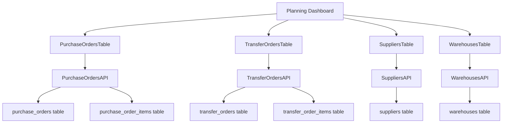
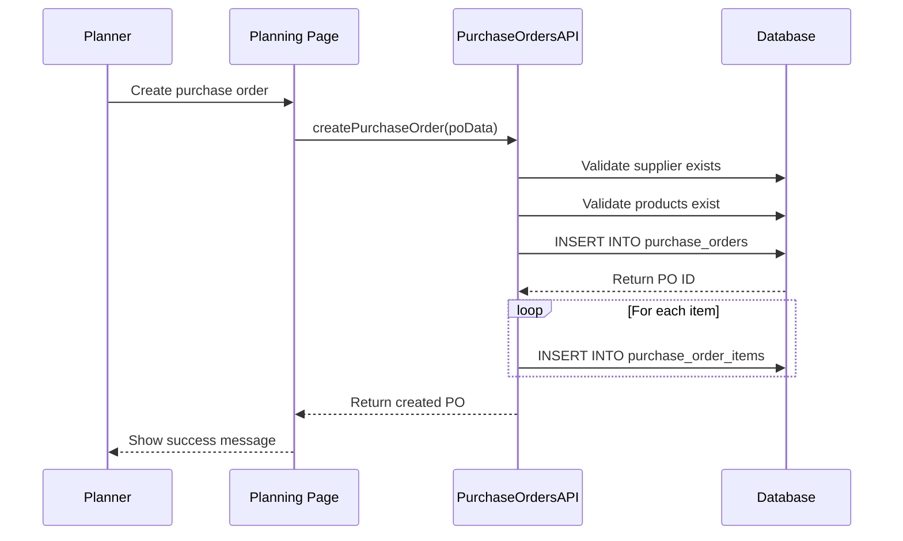
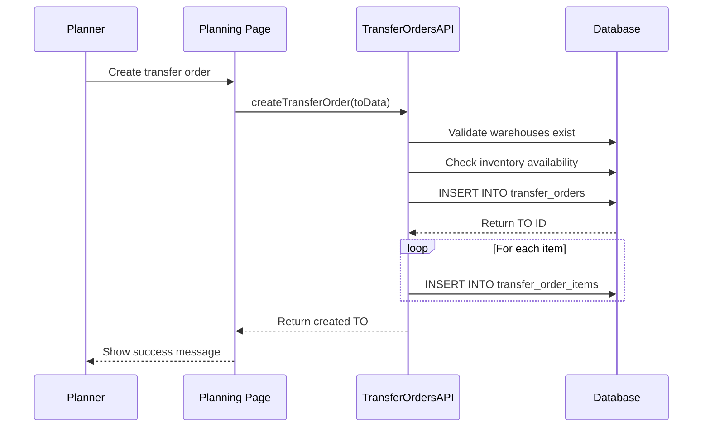
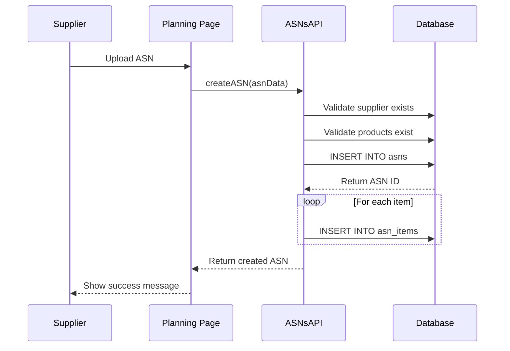

# Planning Module Guide

## Overview
The Planning Module manages procurement and material transfer operations through purchase orders, transfer orders, and supplier relationships. It serves as the bridge between demand planning and material acquisition.

## Module Architecture

### Page Structure
- **Main Page**: `/planning`
- **Server Component**: `apps/frontend/app/planning/page.tsx`
- **Client Component**: `apps/frontend/components/PurchaseOrdersTable.tsx`

### Database Tables

#### Primary Tables (Read/Write)
| Table | Purpose | Key Fields | Relationships |
|-------|---------|------------|---------------|
| `purchase_orders` | Purchase order management | `id`, `po_number`, `supplier_id`, `status`, `order_date` | `suppliers.id` |
| `purchase_order_items` | PO line items | `id`, `po_id`, `product_id`, `quantity`, `unit_price` | `purchase_orders.id`, `products.id` |
| `transfer_orders` | Transfer order management | `id`, `to_number`, `from_warehouse_id`, `to_warehouse_id`, `status` | `warehouses.id` |
| `transfer_order_items` | TO line items | `id`, `to_id`, `product_id`, `quantity` | `transfer_orders.id`, `products.id` |
| `asns` | Advanced shipping notices | `id`, `asn_number`, `supplier_id`, `status`, `expected_delivery` | `suppliers.id` |
| `asn_items` | ASN line items | `id`, `asn_id`, `product_id`, `quantity` | `asns.id`, `products.id` |

#### Secondary Tables (Read Only)
| Table | Purpose | Usage |
|-------|---------|-------|
| `suppliers` | Supplier information | Purchase order supplier details |
| `warehouses` | Warehouse information | Transfer order warehouse details |
| `products` | Product information | Order item product details |
| `grns` | Goods receipt notes | PO to GRN relationship |

## API Integration

### Primary APIs
- **`PurchaseOrdersAPI`**: CRUD operations for purchase orders
- **`TransferOrdersAPI`**: CRUD operations for transfer orders
- **`SuppliersAPI`**: Supplier management
- **`WarehousesAPI`**: Warehouse management
- **`ASNsAPI`**: Advanced shipping notice management

### API Usage Patterns
```typescript
// Purchase order creation
const purchaseOrder = await PurchaseOrdersAPI.create({
  supplier_id: 1,
  order_date: '2024-01-15',
  expected_delivery: '2024-01-22',
  items: [
    { product_id: 1, quantity: 100, unit_price: 5.50 },
    { product_id: 2, quantity: 50, unit_price: 3.25 }
  ]
});

// Transfer order creation
const transferOrder = await TransferOrdersAPI.create({
  from_warehouse_id: 1,
  to_warehouse_id: 2,
  items: [
    { product_id: 1, quantity: 25 },
    { product_id: 2, quantity: 10 }
  ]
});

// ASN creation
const asn = await ASNsAPI.create({
  supplier_id: 1,
  asn_number: 'ASN-2024-001',
  expected_delivery: '2024-01-20',
  items: [
    { product_id: 1, quantity: 100 },
    { product_id: 2, quantity: 50 }
  ]
});
```

## Component Architecture

### Main Components
- **`PurchaseOrdersTable`**: Purchase order listing and management
- **`TransferOrdersTable`**: Transfer order listing and management
- **`CreateOrderModal`**: Order creation modal
- **`SuppliersTable`**: Supplier management
- **`WarehousesTable`**: Warehouse management

### Component Data Flow


## Business Rules

### Purchase Order Management
1. **Status Transitions**: `draft` → `submitted` → `confirmed` → `received` → `closed`
2. **Supplier Validation**: Purchase orders must reference valid suppliers
3. **Item Validation**: All items must reference valid products
4. **Quantity Validation**: All quantities must be positive
5. **Price Validation**: Unit prices must be positive

### Transfer Order Management
1. **Status Transitions**: `draft` → `submitted` → `in_transit` → `received` → `closed`
2. **Warehouse Validation**: Transfer orders must reference valid warehouses
3. **Item Validation**: All items must reference valid products
4. **Quantity Validation**: All quantities must be positive
5. **Inventory Check**: Sufficient inventory must be available at source warehouse

### ASN Management
1. **Status Transitions**: `draft` → `submitted` → `confirmed` → `received` → `closed`
2. **Supplier Validation**: ASNs must reference valid suppliers
3. **PO Association**: ASNs can be associated with purchase orders
4. **Delivery Tracking**: Expected vs. actual delivery tracking

## Data Flow Patterns

### Purchase Order Creation Flow


### Transfer Order Creation Flow


### ASN Processing Flow


## Material Requirement Calculation

### MRP Logic
The planning module calculates material requirements based on work orders and current inventory:

```typescript
interface MaterialRequirement {
  product_id: number;
  product_name: string;
  required_qty: number;
  available_qty: number;
  shortage_qty: number;
  lead_time_days: number;
  suggested_order_qty: number;
}

function calculateMaterialRequirements(workOrders: WorkOrder[]): MaterialRequirement[] {
  const requirements: MaterialRequirement[] = [];
  
  for (const wo of workOrders) {
    const bom = getBOM(wo.product_id);
    
    for (const item of bom.items) {
      const requirement = requirements.find(r => r.product_id === item.material_id);
      
      if (requirement) {
        requirement.required_qty += item.quantity * wo.quantity;
      } else {
        requirements.push({
          product_id: item.material_id,
          product_name: item.material_name,
          required_qty: item.quantity * wo.quantity,
          available_qty: getAvailableQuantity(item.material_id),
          shortage_qty: 0,
          lead_time_days: getLeadTime(item.material_id),
          suggested_order_qty: 0
        });
      }
    }
  }
  
  // Calculate shortages and suggested order quantities
  for (const req of requirements) {
    req.shortage_qty = Math.max(0, req.required_qty - req.available_qty);
    req.suggested_order_qty = calculateOrderQuantity(req);
  }
  
  return requirements;
}
```

### Order Quantity Calculation
```typescript
function calculateOrderQuantity(requirement: MaterialRequirement): number {
  const { shortage_qty, lead_time_days } = requirement;
  const supplier = getPreferredSupplier(requirement.product_id);
  
  if (!supplier) return shortage_qty;
  
  // Consider minimum order quantity (MOQ)
  const moq = supplier.moq || 1;
  const orderQty = Math.max(shortage_qty, moq);
  
  // Consider lead time buffer
  const dailyUsage = shortage_qty / 30; // Assume 30-day planning horizon
  const leadTimeBuffer = dailyUsage * lead_time_days;
  
  return Math.ceil(orderQty + leadTimeBuffer);
}
```

## Supplier Management

### Supplier Information
```typescript
interface Supplier {
  id: number;
  name: string;
  contact_email: string;
  contact_phone: string;
  address: string;
  payment_terms: string;
  lead_time_days: number;
  minimum_order_value: number;
  is_active: boolean;
}

interface SupplierProduct {
  supplier_id: number;
  product_id: number;
  supplier_part_number: string;
  unit_price: number;
  lead_time_days: number;
  minimum_order_qty: number;
  is_preferred: boolean;
}
```

### Supplier Selection Logic
```typescript
function selectSupplier(productId: number, quantity: number): Supplier | null {
  const suppliers = getSuppliersForProduct(productId);
  
  if (suppliers.length === 0) return null;
  
  // Sort by preference and price
  return suppliers
    .filter(s => s.is_preferred)
    .sort((a, b) => {
      // Prefer suppliers with better lead times
      if (a.lead_time_days !== b.lead_time_days) {
        return a.lead_time_days - b.lead_time_days;
      }
      // Then by price
      return a.unit_price - b.unit_price;
    })[0];
}
```

## Warehouse Management

### Warehouse Hierarchy
```typescript
interface Warehouse {
  id: number;
  name: string;
  code: string;
  type: 'MAIN' | 'COLD_STORAGE' | 'PRODUCTION_FLOOR';
  address: string;
  is_active: boolean;
}

interface Location {
  id: number;
  warehouse_id: number;
  code: string;
  name: string;
  zone: string;
  is_active: boolean;
}
```

### Transfer Logic
```typescript
function validateTransfer(fromWarehouseId: number, toWarehouseId: number, items: TransferItem[]): ValidationResult {
  // Check if warehouses are different
  if (fromWarehouseId === toWarehouseId) {
    return { valid: false, error: 'Source and destination warehouses must be different' };
  }
  
  // Check inventory availability
  for (const item of items) {
    const availableQty = getAvailableQuantity(item.product_id, fromWarehouseId);
    if (availableQty < item.quantity) {
      return { 
        valid: false, 
        error: `Insufficient inventory for product ${item.product_id}. Available: ${availableQty}, Required: ${item.quantity}` 
      };
    }
  }
  
  return { valid: true };
}
```

## Error Handling

### Common Error Scenarios
1. **Invalid Supplier**: Purchase order references non-existent supplier
2. **Invalid Product**: Order item references non-existent product
3. **Insufficient Inventory**: Transfer order exceeds available inventory
4. **Invalid Warehouse**: Transfer order references non-existent warehouse
5. **Duplicate Order Number**: Order number already exists

### Error Recovery
1. **Form Validation**: Client-side validation prevents invalid submissions
2. **API Error Handling**: Server errors are caught and displayed to user
3. **Rollback Operations**: Failed operations are rolled back automatically
4. **User Guidance**: Clear error messages guide user to fix issues

## Performance Considerations

### Database Optimization
- **Indexes**: Orders table has indexes on `status`, `supplier_id`, `warehouse_id`
- **Query Optimization**: Use specific column selection and proper joins
- **Pagination**: Large order lists are paginated
- **Caching**: Frequently accessed data is cached

### Data Aggregation
- **Material Requirements**: Calculated in background and cached
- **Supplier Performance**: Tracked and updated regularly
- **Inventory Levels**: Monitored and updated in real-time
- **Order Status**: Updated automatically based on related operations

## Testing Strategy

### Unit Tests
- Order creation and validation
- Material requirement calculations
- Supplier selection logic
- Transfer validation logic

### Integration Tests
- API endpoint functionality
- Database operations
- Component interactions
- Error handling scenarios

### E2E Tests
- Complete order creation workflow
- Order approval workflow
- Transfer execution workflow
- Supplier management workflow

## See Also

- [System Overview](../SYSTEM_OVERVIEW.md) - High-level system architecture
- [Page Reference](../PAGE_REFERENCE.md) - Page mappings
- [Component Reference](../COMPONENT_REFERENCE.md) - Component documentation
- [Database Schema](../DATABASE_SCHEMA.md) - Table definitions
- [API Reference](../API_REFERENCE.md) - API documentation
- [Business Flows](../BUSINESS_FLOWS.md) - Process workflows
