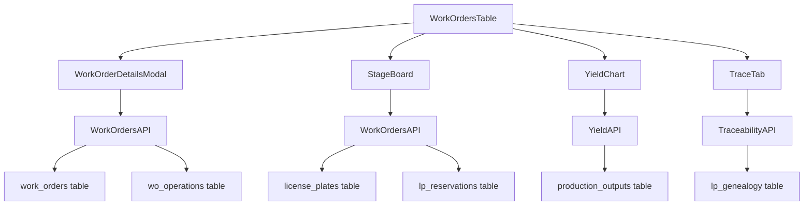
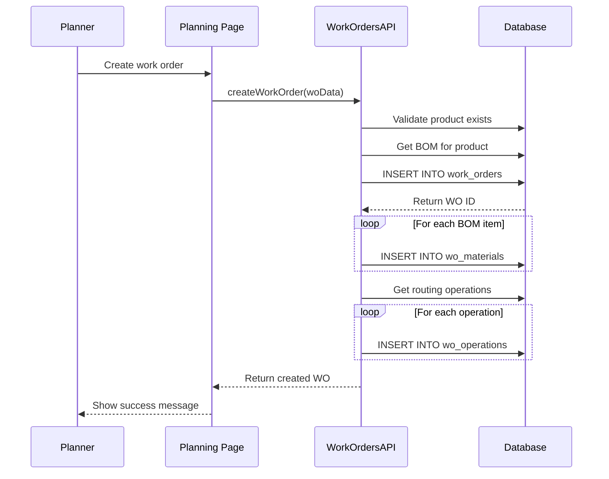
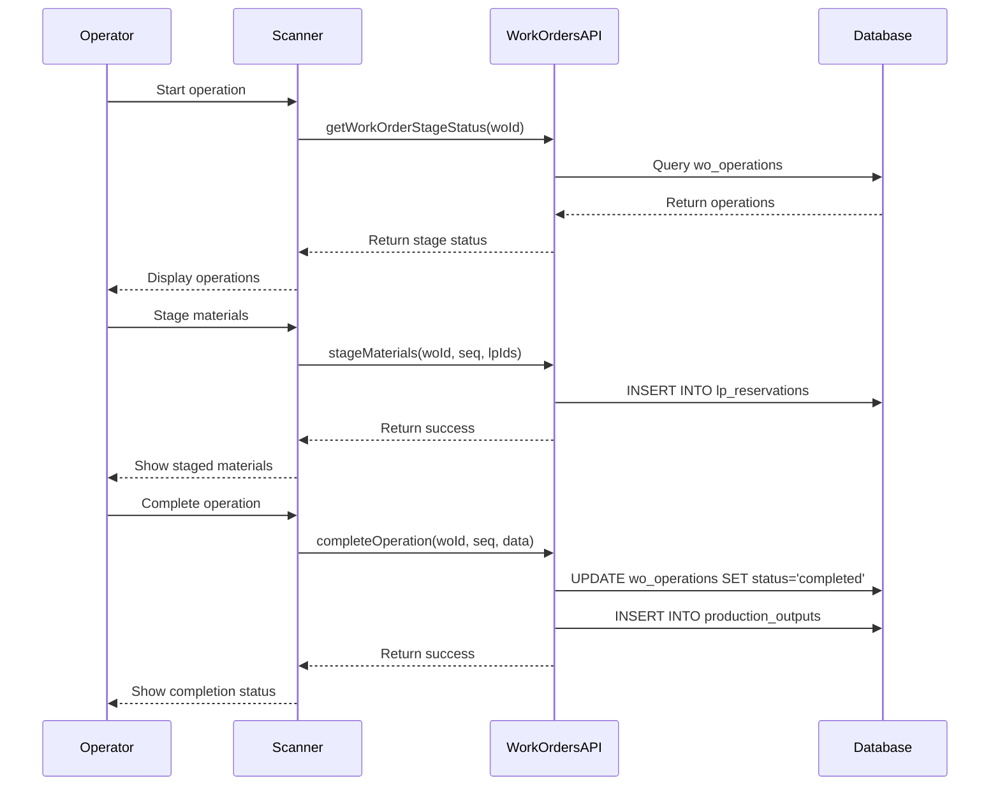
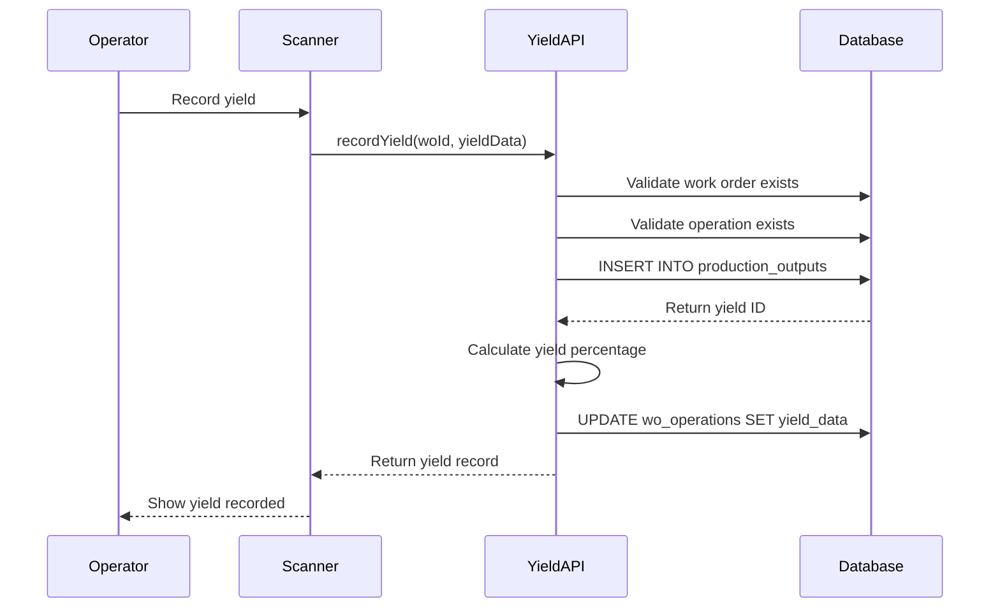

# Production Module Guide

**Last Updated**: 2025-01-XX  
**Version**: 2.0 - Documentation Audit Update

## Overview
The Production Module manages work order execution, production tracking, yield reporting, and material consumption analysis. It provides real-time visibility into production operations and performance metrics.

## Module Architecture

### Page Structure
- **Main Page**: `/production`
- **Server Component**: `apps/frontend/app/production/page.tsx`
- **Client Component**: `apps/frontend/components/WorkOrdersTable.tsx`

### Database Tables

#### Primary Tables (Read/Write)
| Table | Purpose | Key Fields | Relationships |
|-------|---------|------------|---------------|
| `work_orders` | Work order management | `id`, `wo_number`, `product_id`, `quantity`, `status` | `products.id`, `machines.id` |
| `wo_operations` | Operation tracking | `id`, `wo_id`, `routing_operation_id`, `sequence`, `status` | `work_orders.id`, `routing_operations.id` |
| `wo_materials` | Material requirements | `id`, `wo_id`, `material_id`, `required_qty`, `staged_qty` | `work_orders.id`, `products.id` |
| `production_outputs` | Yield tracking | `id`, `wo_id`, `operation_seq`, `output_qty`, `waste_qty` | `work_orders.id`, `wo_operations.id` |

#### Secondary Tables (Read Only)
| Table | Purpose | Usage |
|-------|---------|-------|
| `products` | Product information | Work order product details |
| `machines` | Machine information | Work order machine assignment |
| `license_plates` | Material tracking | Material staging and consumption |
| `lp_reservations` | Material reservations | Operation material allocation |

## API Integration

### Primary APIs
- **`WorkOrdersAPI`**: CRUD operations for work orders, includes scanner operations
- **`YieldAPI`**: Yield reporting and analysis
- **`ConsumeAPI`**: Consumption tracking and analysis
- **`TraceabilityAPI`**: Material traceability tracking
- **`LicensePlatesAPI`**: License plate management

**Note**: Scanner operations are handled through WorkOrdersAPI methods like `getWorkOrderStageStatus()`, `recordWeights()`, and `completeOperation()`.

### API Usage Patterns
```typescript
// Work order creation
const workOrder = await WorkOrdersAPI.create({
  product_id: 1,
  quantity: 100,
  due_date: '2024-12-31',
  machine_id: 1,
  line_number: 'Line-1'
});

// Get work order stage status
const stageStatus = await WorkOrdersAPI.getWorkOrderStageStatus(woId);

// Record yield
const yield = await YieldAPI.recordYield(woId, {
  operation_seq: 1,
  output_qty: 95,
  waste_qty: 5,
  notes: 'Good yield'
});

// Complete operation (via WorkOrdersAPI)
const result = await WorkOrdersAPI.completeOperation(woId, 1, {
  input_lps: ['LP-001', 'LP-002'],
  output_lps: ['LP-003'],
  yield_data: { output_qty: 95, waste_qty: 5 }
});
```

## Component Architecture

### Main Components
- **`WorkOrdersTable`**: Work order listing and management
- **`WorkOrderDetailsModal`**: Work order details and editing
- **`StageBoard`**: Material staging interface
- **`YieldChart`**: Yield visualization
- **`TraceTab`**: Traceability interface

### Component Data Flow


## Business Rules

### Work Order Management
1. **Status Transitions**: `planned` → `released` → `in_progress` → `completed` → `cancelled`
2. **BOM Requirements**: Work orders require valid BOM for the product
3. **Machine Assignment**: Work orders can be assigned to specific machines
4. **Quantity Validation**: Work order quantities must be positive

### Operation Execution
1. **Sequential Processing**: Operations must be completed in sequence
2. **One-to-One Components**: Certain components consume entire license plates
3. **QA Status Enforcement**: Operations blocked until QA status is passed
4. **Material Validation**: Input materials must match BOM requirements

### Yield Management
1. **Yield Calculation**: Yield = (Output Quantity / Required Quantity) × 100
2. **Waste Tracking**: Waste quantities are tracked and reported
3. **Variance Analysis**: Actual vs. expected yield comparison
4. **Historical Reporting**: Yield trends over time

### Material Consumption
1. **Reservation System**: Materials are reserved before operation starts
2. **Consumption Tracking**: Actual consumption is recorded during operations
3. **Inventory Updates**: License plate quantities are updated after consumption
4. **Traceability Chain**: Material genealogy is maintained

## Data Flow Patterns

### Work Order Creation Flow


### Production Execution Flow


### Yield Recording Flow


## Stage Board Logic

### Material Staging
The stage board displays materials that need to be staged for the next operation:

```typescript
interface StagedMaterial {
  lp_id: number;
  lp_number: string;
  product_id: number;
  product_name: string;
  quantity: number;
  qa_status: 'Pending' | 'Passed' | 'Failed';
  is_one_to_one: boolean;
  required_qty: number;
  staged_qty: number;
}

// Staging logic
function stageMaterial(woId: number, operationSeq: number, lpId: number) {
  // 1. Validate LP exists and is available
  // 2. Check QA status (must be 'Passed' or 'Pending')
  // 3. Validate product matches BOM requirement
  // 4. Check quantity availability
  // 5. Create reservation record
  // 6. Update staged quantities
}
```

### One-to-One Component Handling
Certain components must be consumed entirely (one-to-one relationship):

```typescript
interface OneToOneComponent {
  material_id: number;
  material_name: string;
  is_one_to_one: boolean;
  required_lp: string; // Specific LP that must be used
}

// One-to-one validation
function validateOneToOne(woId: number, operationSeq: number, inputLPs: string[]) {
  const oneToOneComponents = getOneToOneComponents(woId, operationSeq);
  
  for (const component of oneToOneComponents) {
    if (!inputLPs.includes(component.required_lp)) {
      throw new Error(`One-to-one component ${component.material_name} requires LP ${component.required_lp}`);
    }
  }
}
```

## Yield Calculation Formulas

### Basic Yield Calculation
```typescript
function calculateYield(requiredQty: number, outputQty: number, wasteQty: number) {
  const totalInput = requiredQty;
  const totalOutput = outputQty + wasteQty;
  const yieldPercentage = (outputQty / requiredQty) * 100;
  const wastePercentage = (wasteQty / requiredQty) * 100;
  
  return {
    yieldPercentage,
    wastePercentage,
    efficiency: (outputQty / totalInput) * 100
  };
}
```

### Cumulative Yield Calculation
```typescript
function calculateCumulativeYield(woId: number) {
  const operations = getWorkOrderOperations(woId);
  let cumulativeYield = 100;
  
  for (const operation of operations) {
    if (operation.status === 'completed') {
      const operationYield = operation.yield_data?.yield_percentage || 100;
      cumulativeYield = (cumulativeYield * operationYield) / 100;
    }
  }
  
  return cumulativeYield;
}
```

## Traceability Integration

### Material Traceability
The production module integrates with the traceability system to track materials through production:

```typescript
interface TraceabilityRecord {
  lp_id: number;
  lp_number: string;
  product_id: number;
  operation_seq: number;
  input_lps: string[];
  output_lps: string[];
  timestamp: Date;
  operator_id: string;
}

// Traceability recording
function recordTraceability(woId: number, operationSeq: number, inputLPs: string[], outputLPs: string[]) {
  // 1. Create traceability record
  // 2. Update LP genealogy
  // 3. Record operation details
  // 4. Update material compositions
}
```

## Error Handling

### Common Error Scenarios
1. **Invalid Work Order**: Operation attempted on non-existent work order
2. **Wrong Operation Sequence**: Operations completed out of sequence
3. **Insufficient Materials**: Not enough materials staged for operation
4. **QA Status Blocked**: Operation blocked due to failed QA status
5. **One-to-One Violation**: Wrong license plate used for one-to-one component

### Error Recovery
1. **Operation Rollback**: Failed operations can be rolled back
2. **Material Release**: Reserved materials are released on failure
3. **Status Reset**: Work order status can be reset to previous state
4. **User Guidance**: Clear error messages guide user to fix issues

## Performance Considerations

### Database Optimization
- **Indexes**: Work orders table has indexes on `status`, `product_id`, `machine_id`
- **Query Optimization**: Use specific column selection and proper joins
- **Pagination**: Large work order lists are paginated
- **Caching**: Frequently accessed data is cached

### Real-time Updates
- **WebSocket Integration**: Real-time updates for work order status
- **Optimistic Updates**: UI updates immediately, then syncs with server
- **Background Sync**: Data is synced in the background
- **Conflict Resolution**: Concurrent updates are handled gracefully

## Testing Strategy

### Unit Tests
- Work order creation and validation
- Operation sequencing logic
- Yield calculation formulas
- Material staging logic

### Integration Tests
- API endpoint functionality
- Database operations
- Component interactions
- Error handling scenarios

### E2E Tests
- Complete work order lifecycle
- Production execution workflow
- Yield recording workflow
- Traceability tracking

## See Also

- [System Overview](../SYSTEM_OVERVIEW.md) - High-level system architecture
- [Page Reference](../PAGE_REFERENCE.md) - Page mappings
- [Component Reference](../COMPONENT_REFERENCE.md) - Component documentation
- [Database Schema](../DATABASE_SCHEMA.md) - Table definitions
- [API Reference](../API_REFERENCE.md) - API documentation
- [Business Flows](../BUSINESS_FLOWS.md) - Process workflows
