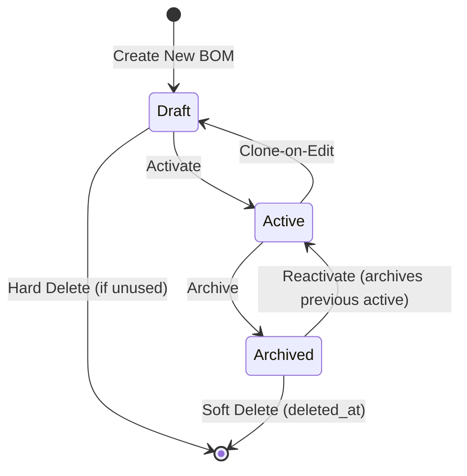

# BOM Architecture

**Last Updated**: 2025-01-21
**Version**: 2.0 - Lifecycle Management & Versioning

## Overview

This document describes the BOM (Bill of Materials) architecture, including product categorization, lifecycle management, versioning, and UI/UX patterns.

## Product Categorization

### Product Groups
- **MEAT**: Raw meat materials (RM_MEAT)
- **DRYGOODS**: Dry goods and ingredients (DG_ING, DG_LABEL, DG_WEB, DG_BOX, DG_SAUCE)
- **COMPOSITE**: Manufactured products requiring BOM
  - **PR** (Process): Intermediate work-in-progress products
  - **FG** (Finished Goods): Final products

### Archive Logic
- **MEAT/DRYGOODS**: Controlled by `products.is_active`
  - `is_active = true`: Visible in main tabs
  - `is_active = false`: Visible in ARCHIVE tab only
  
- **COMPOSITE (PR/FG)**: Controlled by `boms.status`
  - `status IN ('draft', 'active')`: Visible in main tabs
  - `status = 'archived'`: Visible in ARCHIVE tab only

## BOM Lifecycle Management

### BOM Status States



### Status Descriptions

1. **Draft**
   - Initial state for new BOMs
   - Can be edited directly (no clone)
   - Can be hard-deleted if not referenced by work orders
   - Not visible to production

2. **Active**
   - One active BOM per product (enforced by unique index)
   - Clone-on-edit: editing creates a new draft version
   - Cannot be hard-deleted
   - Used for work order creation
   - Visible in main tabs

3. **Archived**
   - Read-only state
   - Preserves historical BOM data
   - Visible in ARCHIVE tab only
   - Can be reactivated (archives current active BOM)
   - Cannot be hard-deleted

### Versioning Rules

#### Version Format
- **Major.Minor** format (e.g., 1.0, 1.1, 2.0)

#### Version Bumping Logic

**Minor Version Bump** (1.0 → 1.1):
- Description changes
- Standard price changes
- Default routing changes
- Expiry policy changes
- Shelf life changes
- Allergen changes

**Major Version Bump** (1.0 → 2.0):
- BOM items added
- BOM items removed
- BOM item quantities modified
- BOM item sequences changed

#### Automatic Versioning
- System automatically detects changes when saving
- Determines appropriate version bump (minor vs major)
- Updates `boms.version` field
- Manual override available via "Change Version" button

### Clone-on-Edit Pattern

When editing an **active** BOM:

1. **Create New Draft**
   - Clone BOM header with new version
   - Copy all BOM items
   - Set status to 'draft'
   - Preserve original active BOM

2. **Edit Draft**
   - User makes changes to draft BOM
   - Original active BOM remains unchanged

3. **Activate Draft**
   - User activates new BOM version
   - Previous active BOM → archived
   - New BOM → active
   - Only one active BOM per product

### Guard Delete Trigger

**Purpose**: Prevent accidental data loss

**Rules**:
- Draft BOMs can be hard-deleted if unused
- Active/Archived BOMs cannot be hard-deleted
- BOMs referenced by work orders cannot be deleted
- Archive instead of delete for production data

**Implementation**:
```sql
CREATE OR REPLACE FUNCTION guard_boms_hard_delete() RETURNS trigger AS $$
BEGIN
  IF OLD.status <> 'draft' THEN
    RAISE EXCEPTION 'Cannot hard-delete non-draft BOM';
  END IF;
  IF EXISTS (SELECT 1 FROM work_orders WHERE bom_id = OLD.id) THEN
    RAISE EXCEPTION 'Cannot hard-delete BOM referenced by Work Orders';
  END IF;
  RETURN OLD;
END;
$$ LANGUAGE plpgsql;
```

## Database Schema

### boms Table
```sql
CREATE TABLE boms (
  id SERIAL PRIMARY KEY,
  product_id INTEGER REFERENCES products(id) NOT NULL,
  version TEXT NOT NULL,
  
  -- Lifecycle
  status bom_status NOT NULL DEFAULT 'draft',  -- ENUM: 'draft', 'active', 'archived'
  archived_at TIMESTAMP WITH TIME ZONE NULL,
  deleted_at TIMESTAMP WITH TIME ZONE NULL,
  
  -- Configuration
  requires_routing BOOLEAN DEFAULT false,
  default_routing_id INTEGER REFERENCES routings(id),
  notes TEXT,
  effective_from DATE,
  effective_to DATE,
  
  -- Audit
  created_at TIMESTAMP WITH TIME ZONE DEFAULT NOW(),
  updated_at TIMESTAMP WITH TIME ZONE DEFAULT NOW(),
  created_by UUID REFERENCES users(id),
  updated_by UUID REFERENCES users(id),
  
  -- Single active BOM per product
  CONSTRAINT boms_single_active UNIQUE (product_id) WHERE status = 'active'
);
```

**Key Indexes**:
```sql
CREATE UNIQUE INDEX boms_single_active_idx ON boms(product_id) WHERE status = 'active';
CREATE INDEX idx_boms_status ON boms(status);
CREATE INDEX idx_boms_product_id ON boms(product_id);
```

### bom_items Table
```sql
CREATE TABLE bom_items (
  id SERIAL PRIMARY KEY,
  bom_id INTEGER REFERENCES boms(id) NOT NULL,
  material_id INTEGER REFERENCES products(id) NOT NULL,
  quantity DECIMAL(10,4) NOT NULL,
  uom TEXT NOT NULL,
  sequence INTEGER NOT NULL,
  priority INTEGER,
  
  -- Production Control
  production_lines TEXT[],
  production_line_restrictions TEXT[],
  scrap_std_pct DECIMAL(5,2) DEFAULT 0,
  is_optional BOOLEAN DEFAULT false,
  is_phantom BOOLEAN DEFAULT false,
  consume_whole_lp BOOLEAN DEFAULT false,  -- 1:1 LP consumption
  
  -- PO Prefill Data
  unit_cost_std DECIMAL(12,4),
  tax_code_id INTEGER REFERENCES settings_tax_codes(id),
  lead_time_days INTEGER,
  moq DECIMAL(12,4),
  
  -- Audit
  created_at TIMESTAMP WITH TIME ZONE DEFAULT NOW(),
  updated_at TIMESTAMP WITH TIME ZONE DEFAULT NOW()
);
```

**Field Descriptions**:
- `consume_whole_lp`: Enforce 1:1 LP consumption in scanner (renamed from `one_to_one`)
- `is_optional`: Component can be omitted from production
- `is_phantom`: Component used for costing but not physically consumed
- `scrap_std_pct`: Standard scrap percentage for material loss
- `unit_cost_std`, `tax_code_id`, `lead_time_days`, `moq`: PO prefill data

## BOM Editor UI/UX

### Catalog View (BomCatalogClient)

#### Tab Structure
1. **MEAT**: Single products (RM_MEAT) with `is_active = true`
2. **DRYGOODS**: Single products (DG_*) with `is_active = true`
3. **FINISHED_GOODS**: Composite products (FG) with BOM `status != 'archived'`
4. **PROCESS**: Composite products (PR) with BOM `status != 'archived'`
5. **ARCHIVE**: 
   - MEAT/DRYGOODS with `is_active = false`
   - COMPOSITE with BOM `status = 'archived'`

#### Columns (Category-Specific)

**MEAT/DRYGOODS Columns**:
- Part Number
- Description
- Type
- UoM
- **Is Active** (Product Status)
- Supplier
- Std Price
- Allergens
- Actions

**FINISHED_GOODS/PROCESS Columns**:
- Part Number
- Description
- Type
- UoM
- **Active BOM** (Version)
- **BOM Status** (draft/active/archived)
- **BOM Actions** (Activate/Archive)
- Std Price
- Allergens
- Actions

**BOM Actions**:
- **Activate**: Set BOM to active (archives previous active)
- **Archive**: Set BOM to archived (moves to ARCHIVE tab)

### Single Product Modal (SingleProductModal)

**Purpose**: Create/edit single products (MEAT, DRYGOODS)

**Fields**:
- Part Number
- Description
- Type (RM_MEAT, DG_ING, DG_LABEL, DG_WEB, DG_BOX, DG_SAUCE)
- UoM
- **Product Status** (is_active: Active/Inactive)
- Preferred Supplier
- Tax Code
- Lead Time (days)
- MOQ
- Expiry Policy
- Shelf Life (days)
- Std Price
- Allergens (multi-select)

**Business Rules**:
- No BOM for single products
- Status controlled by `is_active` field
- Allergens selected manually (no inheritance)

### Composite Product Modal (CompositeProductModal)

**Purpose**: Create/edit composite products (PR, FG) with BOM

**Sections**:

#### 1. Product Details
- Part Number
- Description
- Type (PR, FG)
- UoM
- Preferred Supplier
- Tax Code
- Lead Time (days)
- MOQ
- Expiry Policy
- Shelf Life (days)
- Std Price

#### 2. BOM Management (Edit Mode Only)
- **Current Version**: Display current BOM version (e.g., "1.0")
- **Current Status**: Display current BOM status with color coding
  - Draft: Yellow
  - Active: Green
  - Archived: Red
- **Status Actions**:
  - **Set Active**: Activate this BOM (archives previous active)
  - **Set Draft**: Change to draft status
  - **Archive**: Archive this BOM
  - **Change Version**: Manual version override (modal)

#### 3. BOM Items Table
**Columns**:
- Item Number (material `part_number`)
- Item Name (material `description` - auto-filled)
- Qty
- UoM
- Seq
- Optional (checkbox)
- Phantom (checkbox)
- 1:1 (`consume_whole_lp` checkbox)
- Actions (Remove)

**Component Selection**:
- Standard dropdown select (all MEAT, DRYGOODS, COMPOSITE loaded)
- Auto-fills Item Name when Item Number selected
- Validates allowed materials based on product type:
  - **PR**: Can only use MEAT, DRYGOODS
  - **FG**: Can use MEAT, DRYGOODS, PR

#### 4. Allergens
- **Inherited Allergens**: Auto-calculated from BOM components (read-only display)
- **Manual Selection**: Additional allergens (multi-select)
- **Combined Set**: Inherited + manual saved to `product_allergens`
- **Loading Indicator**: Spinner while allergens load

**Allergen Inheritance Logic**:
```typescript
// Calculate inherited allergens from BOM components
const inheritedAllergenIds = new Set<number>();
items.forEach(item => {
  const component = components.find(c => c.id === item.material_id);
  component?.allergens?.forEach(pa => {
    inheritedAllergenIds.add(pa.allergen_id);
  });
});
```

### BOM Versioning UI

#### Automatic Versioning Flow

**On Save** (Composite Product):
1. **Detect Changes**:
   - Compare initial vs current state
   - Categorize as minor or major

2. **Calculate Version**:
   - Minor changes: Increment minor (1.0 → 1.1)
   - Major changes: Increment major (1.0 → 2.0)

3. **Update BOM**:
   - Save new version number
   - Update `updated_at` timestamp
   - Preserve `created_at` for audit

**Manual Override**:
- "Change Version" button opens modal
- User enters new version (e.g., "3.0")
- Validates format (X.Y)
- Updates BOM version

#### Version Change Modal
```typescript
<Modal show={showVersionModal}>
  <input 
    type="text" 
    value={newVersionNumber}
    onChange={(e) => setNewVersionNumber(e.target.value)}
    placeholder="e.g. 2.0"
  />
  <Button onClick={handleVersionChange}>Confirm</Button>
</Modal>
```

## Work Order Snapshot

### BOM Snapshot on WO Creation

When a work order is created:

1. **Capture BOM State**
   - Copy active BOM to `wo_materials`
   - Include all BOM items with quantities
   - Preserve `consume_whole_lp` flag
   - Copy PO prefill data

2. **Immutable Snapshot**
   - WO uses snapshot (not live BOM)
   - Changes to BOM don't affect existing WOs
   - Ensures production consistency

3. **Update Snapshot (PLANNED WOs only)**
   - Allowed if: WO status = 'planned'
   - Blocked if: Issues exist OR outputs exist
   - Preview diff before applying
   - Confirm update with user

### Snapshot Update API

**Endpoint**: `POST /api/production/work-orders/:id/snapshot-update`

**Guards**:
- WO status must be 'planned'
- No production outputs exist
- No issues logged

**Response**:
```json
{
  "success": true,
  "diff": {
    "added": [...],
    "removed": [...],
    "modified": [...]
  }
}
```

## PO Prefill from BOM

### Prefill Data Flow

When creating a PO for a BOM component:

1. **Fetch BOM Item Data**
   - `unit_cost_std` → PO line `unit_price`
   - `tax_code_id` → PO line `tax_code_id`
   - `lead_time_days` → PO header expected delivery
   - `moq` → PO line minimum quantity

2. **Prefill PO Fields**
   - Auto-populate fields
   - User can override
   - Track prefilled vs manual values

3. **Prefill Hierarchy**
   - BOM `unit_cost_std` (highest priority)
   - Product `std_price` (fallback)
   - Manual entry (lowest priority)

## Scanner Integration

### Consume Whole LP (1:1)

**Purpose**: Enforce 1:1 LP consumption for specific materials

**Use Cases**:
- Whole carcass consumption
- Full pallet usage
- Quality-critical materials

**Scanner Validation**:
```typescript
// Check if material requires 1:1 consumption
const woMaterial = await getWoMaterial(woId, materialId);

if (woMaterial.consume_whole_lp) {
  // Enforce: consume entire LP qty, no partial
  if (scannedQty !== lp.quantity) {
    throw new Error('Must consume entire LP for this material');
  }
}
```

**Database Flag**:
- `bom_items.consume_whole_lp` (source)
- `wo_materials.consume_whole_lp` (snapshot)

## API Endpoints

### BOM Lifecycle Endpoints

```typescript
// Get all BOMs for a product (all versions)
GET /api/technical/products/:productId/boms

// Get active BOM for a product
GET /api/technical/products/:productId/boms/active

// Create new BOM (draft)
POST /api/technical/boms
Body: { product_id, version, items: [...] }

// Update BOM (clone-on-edit for active)
PATCH /api/technical/boms/:id
Body: { version?, items: [...] }

// Clone BOM (manual clone)
POST /api/technical/boms/:id/clone
Body: { new_version }

// Activate BOM (archives previous active)
POST /api/technical/boms/:id/activate

// Archive BOM
POST /api/technical/boms/:id/archive

// Delete BOM (hard delete, draft only)
DELETE /api/technical/boms/:id
Query: ?hard=true
```

### BOM Items Endpoints

```typescript
// Bulk upsert BOM items
PUT /api/technical/boms/:id/items
Body: { items: [...] }

// Delete BOM item
DELETE /api/technical/boms/:bomId/items/:itemId
```

## Validation Rules

### Frontend Validation (UI)
- Product type vs material validation
- Required fields
- Quantity > 0
- Unique sequences

### Backend Validation (Database/API)
- Single active BOM per product (unique index)
- Guard hard delete (trigger)
- Status transition validation
- Work order reference check

## TODO: Future Enhancements

### 1. Data Validation
- [ ] Circular BOM reference detection
- [ ] Version format validation (X.Y regex)
- [ ] Product type vs allowed materials validation
- [ ] Max BOM depth limit (prevent deep nesting)

### 2. Audit Trail
- [ ] Create `audit_log` table
- [ ] Add triggers for BOM status changes
- [ ] Implement change reason field
- [ ] Create audit trail viewer UI

### 3. BOM Versioning
- [ ] BOM comparison tool (diff between versions)
- [ ] BOM approval workflow (manager approval)
- [ ] Effective from/to date range enforcement
- [ ] BOM history viewer (all versions)

### 4. WO Snapshot Management
- [ ] Implement snapshot update for PLANNED WOs
- [ ] Add snapshot preview with diff view
- [ ] Block snapshot update if issues/outputs exist
- [ ] Create snapshot update approval workflow

### 5. Scanner Validation
- [ ] Enforce 1:1 validation for `consume_whole_lp`
- [ ] Add scanner validation rules table
- [ ] Real-time validation feedback
- [ ] Scanner error logging

### 6. PO Prefill
- [ ] Modify PO creation endpoint to use BOM prefill
- [ ] Add override capability
- [ ] Track prefilled vs manual values
- [ ] Prefill accuracy reporting

## Best Practices

### BOM Design
- Use semantic versioning (major.minor)
- Document version changes in notes
- Archive old versions (don't delete)
- Test BOMs before activating

### Status Management
- Draft → validate → activate workflow
- Archive when obsolete (not delete)
- One active BOM per product always
- Clone-on-edit for production BOMs

### Allergen Management
- Review inherited allergens
- Add manual allergens as needed
- Update when components change
- Verify allergen accuracy

### Component Selection
- Use correct product types (PR can't use PR)
- Set proper sequences
- Configure 1:1 for whole LP materials
- Document optional/phantom usage

## Migration History

- **Migration 031**: Rename `one_to_one` → `consume_whole_lp`
- **Migration 032**: Add BOM lifecycle status (draft/active/archived)
- **Migration 033**: Add PO prefill data to `bom_items`
