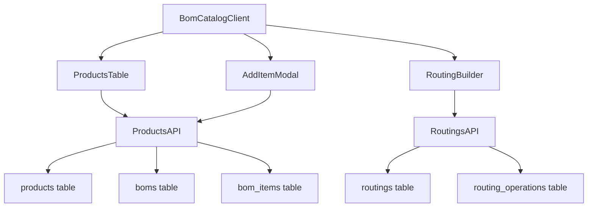
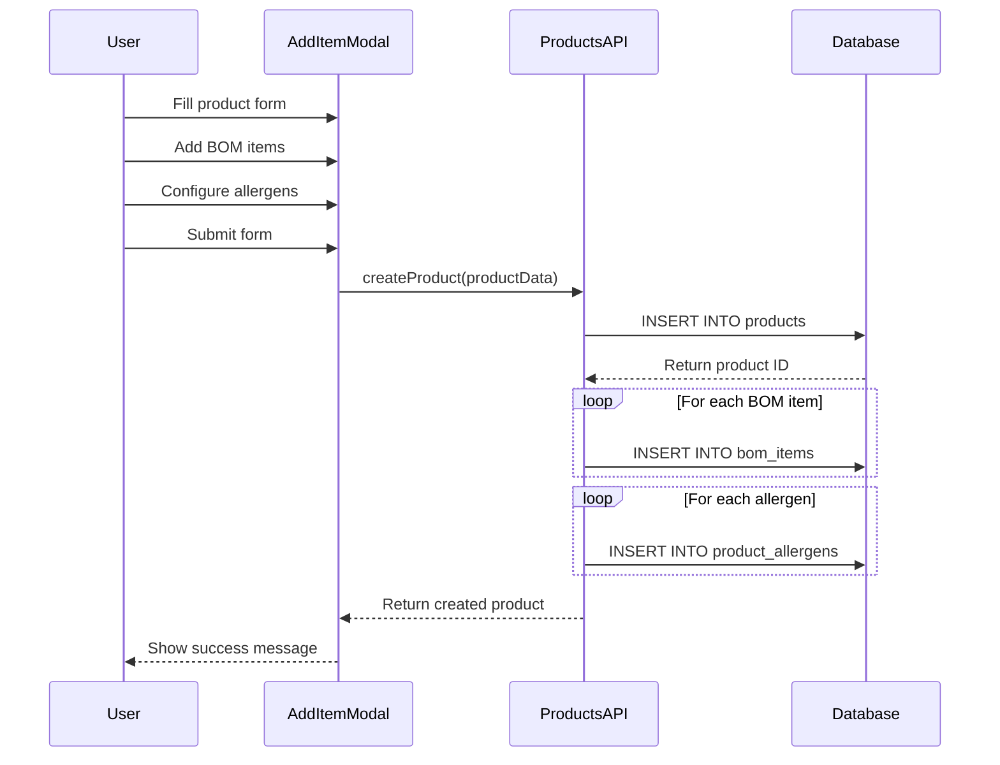
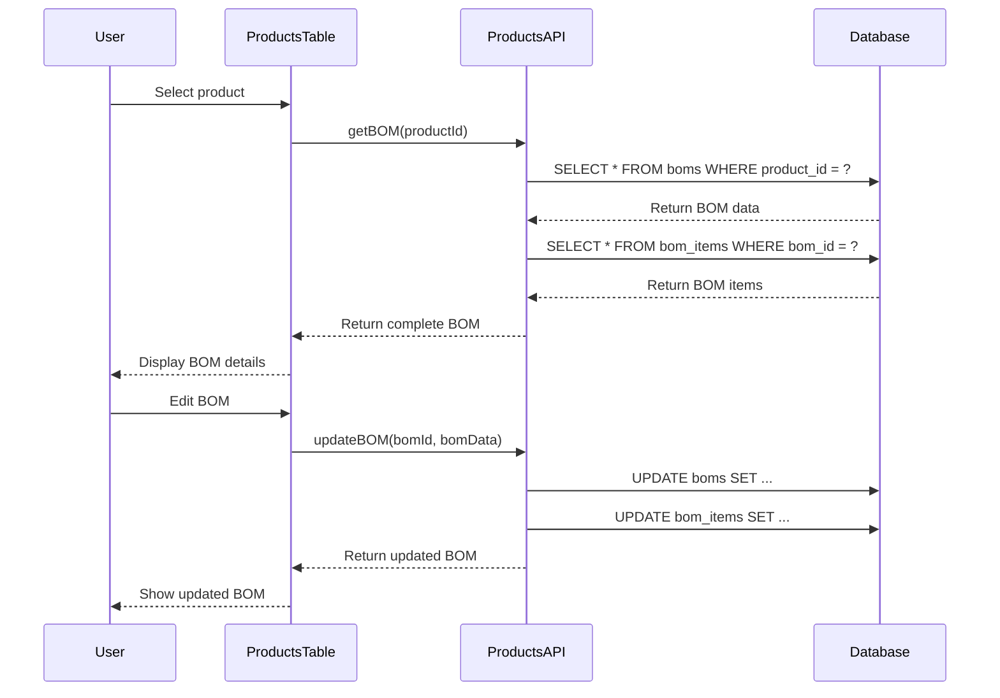

# Technical Module Guide

## Overview
The Technical Module is responsible for product catalog management, bill of materials (BOM) definition, and routing setup. It serves as the foundation for all other modules by defining products and their manufacturing requirements.

## Module Architecture

### Page Structure
- **Main Page**: `/technical/bom`
- **Server Component**: `apps/frontend/app/technical/bom/page.tsx`
- **Client Component**: `apps/frontend/components/BomCatalogClient.tsx`

### Database Tables

#### Primary Tables (Read/Write)
| Table | Purpose | Key Fields | Relationships |
|-------|---------|------------|---------------|
| `products` | Product catalog | `id`, `part_number`, `description`, `product_group`, `product_type` | `preferred_supplier_id`, `tax_code_id` |
| `boms` | Bill of materials | `id`, `product_id`, `version`, `status` | `products.id` |
| `bom_items` | BOM components | `id`, `bom_id`, `material_id`, `quantity`, `sequence` | `boms.id`, `products.id` |
| `routings` | Production routings | `id`, `product_id`, `name`, `version` | `products.id` |
| `routing_operations` | Operation sequences | `id`, `routing_id`, `operation_name`, `sequence_number` | `routings.id` |

#### Secondary Tables (Read Only)
| Table | Purpose | Usage |
|-------|---------|-------|
| `allergens` | Allergen definitions | Product allergen assignments |
| `settings_tax_codes` | Tax code definitions | Product tax code assignments |
| `suppliers` | Supplier information | Product preferred supplier |
| `product_allergens` | Product-allergen relationships | Allergen inheritance |

## API Integration

### Primary APIs
- **`ProductsAPI`**: CRUD operations for products
- **`RoutingsAPI`**: CRUD operations for routings and operations
- **`AllergensAPI`**: Allergen management
- **`TaxCodesAPI`**: Tax code management

### API Usage Patterns
```typescript
// Product creation with BOM
const product = await ProductsAPI.create({
  part_number: 'FG-BEEF-001',
  description: 'Beef Sausage',
  product_group: 'COMPOSITE',
  product_type: 'FG',
  // ... other fields
});

// BOM creation
const bom = await ProductsAPI.createBOM(product.id, {
  version: '1.0',
  items: [
    { material_id: 1, quantity: 0.8, uom: 'kg' },
    { material_id: 2, quantity: 0.2, uom: 'kg' }
  ]
});

// Routing creation
const routing = await RoutingsAPI.create(product.id, {
  name: 'Beef Sausage Production',
  operations: [
    { operation_name: 'Grind Meat', sequence: 1 },
    { operation_name: 'Mix Ingredients', sequence: 2 },
    { operation_name: 'Stuff Casings', sequence: 3 }
  ]
});
```

## Component Architecture

### Main Components
- **`BomCatalogClient`**: Main client component with product management
- **`ProductsTable`**: Product listing and management
- **`AddItemModal`**: Product creation modal
- **`RoutingBuilder`**: Routing creation interface

### Component Data Flow


## Business Rules

### Product Management
1. **Unique Part Numbers**: Each product must have a unique part number
2. **Product Categorization**: Products are categorized by `product_group` and `product_type`
3. **Active Status**: Only active products are shown in production
4. **Supplier Assignment**: Products can have preferred suppliers

### BOM Management
1. **One BOM per Product**: Each product can have multiple BOM versions, but only one active
2. **Material Validation**: BOM items must reference valid materials
3. **Quantity Requirements**: All quantities must be positive
4. **Sequence Ordering**: BOM items can be ordered by sequence

### Routing Management
1. **Sequential Operations**: Operations must be completed in sequence
2. **Product Association**: Each routing belongs to one product
3. **Version Control**: Routings can have multiple versions
4. **Operation Names**: Operation names must be descriptive and unique per routing

### Allergen Inheritance
1. **Component Inheritance**: Finished products inherit allergens from components
2. **Manual Override**: Allergens can be manually added to products
3. **Display Priority**: Allergens are displayed with priority indicators

## Data Flow Patterns

### Product Creation Flow


### BOM Management Flow


## Product Categorization System

### Product Groups
- **MEAT**: Raw meat products (beef, pork, chicken, lamb)
- **DRYGOODS**: Dry ingredients and packaging materials
- **COMPOSITE**: Finished products and intermediate products

### Product Types
| Group | Type | Description | Examples |
|-------|------|-------------|----------|
| MEAT | RM_MEAT | Raw meat materials | Beef, Pork, Chicken |
| DRYGOODS | DG_ING | Dry ingredients | Salt, Pepper, Spices |
| DRYGOODS | DG_LABEL | Labels and packaging | Product labels |
| DRYGOODS | DG_WEB | Webs and casings | Sausage casings |
| DRYGOODS | DG_BOX | Boxes and containers | Shipping boxes |
| DRYGOODS | DG_SAUCE | Sauces and liquids | BBQ sauce |
| COMPOSITE | PR | Intermediate products | Ground meat mix |
| COMPOSITE | FG | Finished goods | Beef sausage |

### Categorization Logic
```typescript
function categorizeProduct(partNumber: string): { group: string, type: string } {
  if (partNumber.startsWith('RM-')) {
    return { group: 'MEAT', type: 'RM_MEAT' };
  }
  if (partNumber.startsWith('DG-')) {
    if (partNumber.includes('SALT') || partNumber.includes('PEPPER')) {
      return { group: 'DRYGOODS', type: 'DG_ING' };
    }
    if (partNumber.includes('LABEL')) {
      return { group: 'DRYGOODS', type: 'DG_LABEL' };
    }
    // ... more logic
  }
  if (partNumber.startsWith('PR-')) {
    return { group: 'COMPOSITE', type: 'PR' };
  }
  if (partNumber.startsWith('FG-')) {
    return { group: 'COMPOSITE', type: 'FG' };
  }
}
```

## Error Handling

### Common Error Scenarios
1. **Duplicate Part Number**: Product creation fails if part number exists
2. **Invalid Material**: BOM item creation fails if material doesn't exist
3. **Missing Required Fields**: Form validation prevents submission
4. **Database Constraints**: Foreign key violations are caught and reported

### Error Recovery
1. **Form Validation**: Client-side validation prevents invalid submissions
2. **API Error Handling**: Server errors are caught and displayed to user
3. **Rollback Operations**: Failed operations are rolled back automatically
4. **User Feedback**: Clear error messages guide user to fix issues

## Performance Considerations

### Database Optimization
- **Indexes**: Products table has indexes on `part_number`, `product_group`, `product_type`
- **Query Optimization**: Use specific column selection instead of `SELECT *`
- **Pagination**: Large product lists are paginated
- **Caching**: Product data is cached on the client side

### UI Optimization
- **Lazy Loading**: Heavy components are loaded on demand
- **Virtual Scrolling**: Large tables use virtual scrolling
- **Debounced Search**: Search input is debounced to reduce API calls
- **Optimistic Updates**: UI updates immediately, then syncs with server

## Testing Strategy

### Unit Tests
- Product creation and validation
- BOM management operations
- Routing creation and updates
- Allergen inheritance logic

### Integration Tests
- API endpoint functionality
- Database operations
- Component interactions
- Error handling scenarios

### E2E Tests
- Complete product creation workflow
- BOM management workflow
- Routing setup workflow
- User permission validation

## See Also

- [System Overview](../SYSTEM_OVERVIEW.md) - High-level system architecture
- [Page Reference](../PAGE_REFERENCE.md) - Page mappings
- [Component Reference](../COMPONENT_REFERENCE.md) - Component documentation
- [Database Schema](../DATABASE_SCHEMA.md) - Table definitions
- [API Reference](../API_REFERENCE.md) - API documentation
