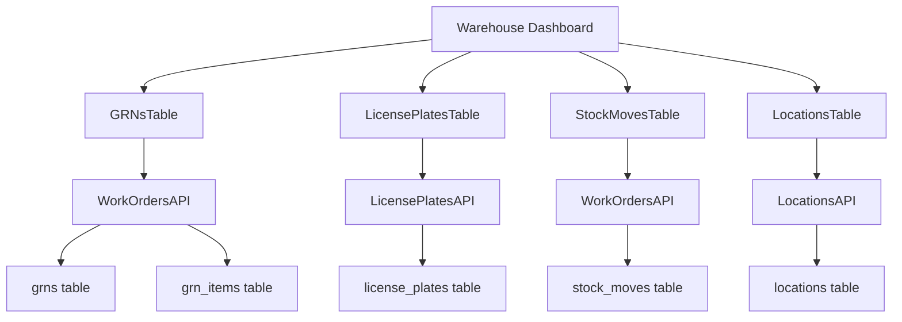
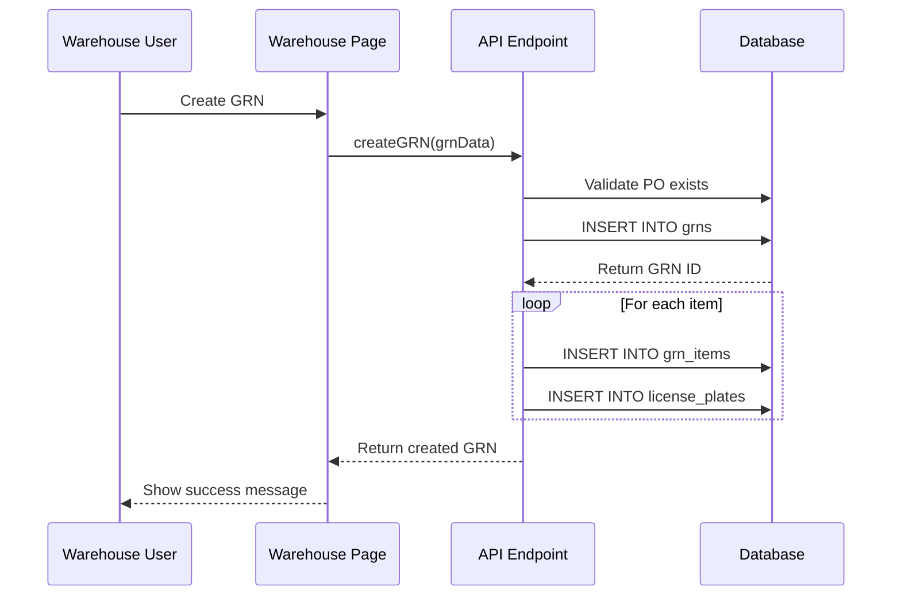
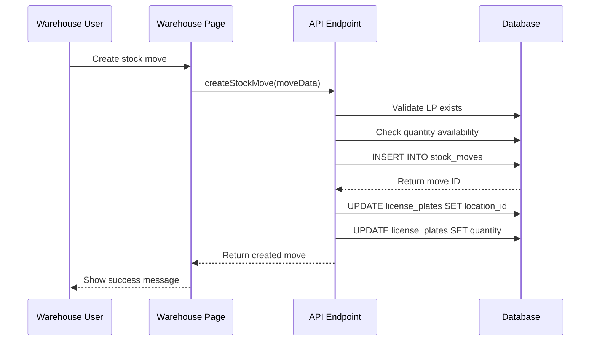
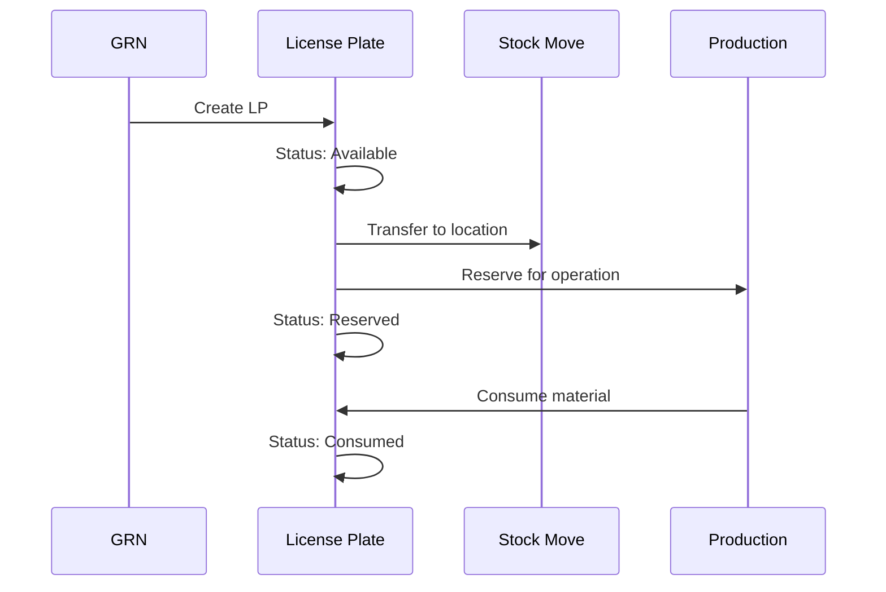

# Warehouse Module Guide

**Last Updated**: 2025-11-04  
**Version**: 2.1 - Type Safety Update  
**Type Safety Risk**: 🟡 MEDIUM - See DEPLOYMENT_ERRORS_ANALYSIS.md  
**Completion**: ~70% - Core done, ASN flow pending

## Overview
The Warehouse Module manages inventory operations including goods receipt processing, stock movements, license plate management, and location tracking. It provides real-time visibility into inventory levels and material locations.

### ⚠️ Type Safety Patterns

**Common Type Patterns**:
```typescript
// GRN Creation
type NewGRN = Omit<GRN, 'id' | 'created_at' | 'updated_at'>;

// License Plate Creation
type NewLP = Omit<LicensePlate, 'id' | 'created_at' | 'updated_at'>;

// Stock Move Creation
type NewStockMove = Omit<StockMove, 'id' | 'created_at' | 'updated_at'>;
```

**Status Enums**:
- **QAStatus**: `'pending' | 'passed' | 'failed' | 'quarantine'` (NOT 'approved')
- **LPStatus**: Use correct values from database schema

**Before Implementing**:
1. Check DEPLOYMENT_ERRORS_ANALYSIS.md
2. Run `pnpm type-check`
3. Parse quantity strings: `parseFloat(formData.quantity) || 0`

## Module Architecture

### Page Structure
- **Main Page**: `/warehouse`
- **Server Component**: `apps/frontend/app/warehouse/page.tsx`
- **Client Component**: `apps/frontend/components/GRNsTable.tsx`

### Database Tables

#### Primary Tables (Read/Write)
| Table | Purpose | Key Fields | Relationships |
|-------|---------|------------|---------------|
| `grns` | Goods receipt notes | `id`, `grn_number`, `purchase_order_id`, `status`, `receipt_date` | `purchase_orders.id` |
| `grn_items` | GRN line items | `id`, `grn_id`, `product_id`, `quantity`, `received_qty` | `grns.id`, `products.id` |
| `license_plates` | License plate tracking | `id`, `lp_number`, `product_id`, `location_id`, `quantity`, `status` | `products.id`, `locations.id` |
| `stock_moves` | Stock movements | `id`, `move_number`, `lp_id`, `from_location_id`, `to_location_id`, `quantity` | `license_plates.id`, `locations.id` |
| `locations` | Location management | `id`, `code`, `name`, `zone`, `warehouse_id` | `warehouses.id` |

#### Secondary Tables (Read Only)
| Table | Purpose | Usage |
|-------|---------|-------|
| `purchase_orders` | Purchase order information | GRN to PO relationship |
| `products` | Product information | License plate product details |
| `warehouses` | Warehouse information | Location warehouse hierarchy |
| `lp_genealogy` | LP genealogy | Material traceability |
| `lp_compositions` | LP compositions | Material composition tracking |

## API Integration

### Primary APIs
- **`LicensePlatesAPI`**: License plate management
- **`WorkOrdersAPI`**: Work order integration for GRN context
- **`LocationsAPI`**: Location management
- **`TraceabilityAPI`**: Material traceability

**Note**: GRN and Stock Move operations are handled through API endpoints, not dedicated API classes.

### API Usage Patterns
```typescript
// License plate creation
const licensePlate = await LicensePlatesAPI.create({
  product_id: 1,
  location_id: 1,
  quantity: 100,
  grn_id: 1
});

// License plate update
const updated = await LicensePlatesAPI.update(lpId, {
  location_id: 2,
  quantity: 95
});

// Get license plates
const licensePlates = await LicensePlatesAPI.getAll();

// Traceability tracking
const trace = await TraceabilityAPI.forwardTrace(lpId);
```

## Component Architecture

### Main Components
- **`GRNsTable`**: GRN listing and management
- **`CreateGRNModal`**: GRN creation modal
- **`LicensePlatesTable`**: License plate management
- **`StockMovesTable`**: Stock movement tracking
- **`LocationsTable`**: Location management

### Component Data Flow


## Business Rules

### GRN Management
1. **Status Transitions**: `draft` → `submitted` → `received` → `closed`
2. **PO Validation**: GRNs must reference valid purchase orders
3. **Quantity Validation**: Received quantities cannot exceed ordered quantities
4. **Item Validation**: All items must reference valid products
5. **LP Creation**: License plates are created automatically for received items

### License Plate Management
1. **Unique Numbers**: Each license plate must have a unique number
2. **Status Tracking**: LPs have status (available, reserved, consumed, quarantine)
3. **Location Assignment**: LPs must be assigned to valid locations
4. **Quantity Tracking**: LP quantities are tracked and updated with movements
5. **QA Status**: LPs have QA status (Pending, Passed, Failed, Quarantine)

### Stock Movement Management
1. **Movement Types**: TRANSFER, ISSUE, RECEIPT, ADJUSTMENT
2. **Location Validation**: Source and destination locations must be valid
3. **Quantity Validation**: Movement quantities cannot exceed available quantities
4. **Audit Trail**: All movements are logged with timestamps and user information
5. **Reservation Handling**: Reserved quantities are handled appropriately

### Location Management
1. **Hierarchy**: Locations belong to warehouses
2. **Zone Assignment**: Locations can be assigned to zones
3. **Active Status**: Only active locations can be used
4. **Capacity Management**: Locations can have capacity limits
5. **Access Control**: Location access can be restricted by user role

## Data Flow Patterns

### GRN Processing Flow


### Stock Movement Flow


### License Plate Lifecycle


## License Plate Management

### LP Status Lifecycle
```typescript
enum LPStatus {
  AVAILABLE = 'available',
  RESERVED = 'reserved',
  CONSUMED = 'consumed',
  QUARANTINE = 'quarantine'
}

enum QAStatus {
  PENDING = 'Pending',
  PASSED = 'Passed',
  FAILED = 'Failed',
  QUARANTINE = 'Quarantine'
}

interface LicensePlate {
  id: number;
  lp_number: string;
  product_id: number;
  location_id: number;
  quantity: number;
  status: LPStatus;
  qa_status: QAStatus;
  grn_id?: number;
  created_at: Date;
  updated_at: Date;
}
```

### LP Creation Logic
```typescript
function createLicensePlate(grnItem: GRNItem): LicensePlate {
  const lpNumber = generateLPNumber();
  const location = getDefaultLocation(grnItem.product_id);
  
  return {
    lp_number: lpNumber,
    product_id: grnItem.product_id,
    location_id: location.id,
    quantity: grnItem.received_qty,
    status: LPStatus.AVAILABLE,
    qa_status: QAStatus.PENDING,
    grn_id: grnItem.grn_id
  };
}
```

### LP Status Transitions
```typescript
function updateLPStatus(lpId: number, newStatus: LPStatus, reason?: string) {
  const lp = getLicensePlate(lpId);
  
  // Validate status transition
  if (!isValidStatusTransition(lp.status, newStatus)) {
    throw new Error(`Invalid status transition from ${lp.status} to ${newStatus}`);
  }
  
  // Update status
  updateLicensePlate(lpId, { status: newStatus });
  
  // Log status change
  logStatusChange(lpId, lp.status, newStatus, reason);
}
```

## Stock Movement Types

### Movement Type Definitions
```typescript
enum MovementType {
  TRANSFER = 'TRANSFER',           // Move between locations
  ISSUE = 'ISSUE',                 // Issue to production
  RECEIPT = 'RECEIPT',             // Receive from production
  ADJUSTMENT = 'ADJUSTMENT',       // Inventory adjustment
  RETURN = 'RETURN',               // Return from production
  QUARANTINE = 'QUARANTINE'        // Move to quarantine
}

interface StockMove {
  id: number;
  move_number: string;
  lp_id: number;
  from_location_id?: number;
  to_location_id?: number;
  quantity: number;
  move_type: MovementType;
  status: 'draft' | 'completed' | 'cancelled';
  move_date: Date;
  reason?: string;
  created_by: string;
}
```

### Movement Validation
```typescript
function validateStockMove(move: StockMove): ValidationResult {
  const lp = getLicensePlate(move.lp_id);
  
  // Check LP exists
  if (!lp) {
    return { valid: false, error: 'License plate not found' };
  }
  
  // Check quantity availability
  if (move.quantity > lp.quantity) {
    return { valid: false, error: 'Insufficient quantity available' };
  }
  
  // Check location validity
  if (move.from_location_id && !isValidLocation(move.from_location_id)) {
    return { valid: false, error: 'Invalid source location' };
  }
  
  if (move.to_location_id && !isValidLocation(move.to_location_id)) {
    return { valid: false, error: 'Invalid destination location' };
  }
  
  // Check movement type specific rules
  if (move.move_type === MovementType.ISSUE && !move.from_location_id) {
    return { valid: false, error: 'Source location required for issue' };
  }
  
  return { valid: true };
}
```

## Location Management

### Location Hierarchy
```typescript
interface Warehouse {
  id: number;
  name: string;
  code: string;
  type: 'MAIN' | 'COLD_STORAGE' | 'PRODUCTION_FLOOR';
  address: string;
  is_active: boolean;
}

interface Location {
  id: number;
  warehouse_id: number;
  code: string;
  name: string;
  zone: string;
  capacity?: number;
  is_active: boolean;
}

interface Zone {
  name: string;
  description: string;
  temperature_range?: string;
  humidity_range?: string;
  special_requirements?: string[];
}
```

### Location Assignment Logic
```typescript
function assignLocation(productId: number, quantity: number): Location | null {
  const product = getProduct(productId);
  const locations = getAvailableLocations(productId);
  
  if (locations.length === 0) return null;
  
  // Sort by preference
  return locations
    .filter(loc => hasCapacity(loc, quantity))
    .sort((a, b) => {
      // Prefer locations in the same zone
      if (a.zone === b.zone) return 0;
      if (a.zone === product.preferred_zone) return -1;
      if (b.zone === product.preferred_zone) return 1;
      return 0;
    })[0];
}
```

## Traceability Integration

### Material Traceability
The warehouse module integrates with the traceability system to track materials through the supply chain:

```typescript
interface TraceabilityRecord {
  lp_id: number;
  lp_number: string;
  product_id: number;
  location_id: number;
  movement_type: MovementType;
  quantity: number;
  timestamp: Date;
  user_id: string;
  parent_lps?: string[];
  child_lps?: string[];
}

function recordTraceability(move: StockMove) {
  const traceRecord: TraceabilityRecord = {
    lp_id: move.lp_id,
    lp_number: getLPNumber(move.lp_id),
    product_id: getProductId(move.lp_id),
    location_id: move.to_location_id || move.from_location_id,
    movement_type: move.move_type,
    quantity: move.quantity,
    timestamp: move.move_date,
    user_id: move.created_by
  };
  
  createTraceabilityRecord(traceRecord);
}
```

## Error Handling

### Common Error Scenarios
1. **Invalid GRN**: GRN references non-existent purchase order
2. **Insufficient Quantity**: Stock move exceeds available quantity
3. **Invalid Location**: Movement references non-existent location
4. **Duplicate LP Number**: License plate number already exists
5. **Invalid Status Transition**: LP status cannot be changed as requested

### Error Recovery
1. **Form Validation**: Client-side validation prevents invalid submissions
2. **API Error Handling**: Server errors are caught and displayed to user
3. **Rollback Operations**: Failed operations are rolled back automatically
4. **User Guidance**: Clear error messages guide user to fix issues

## Performance Considerations

### Database Optimization
- **Indexes**: License plates table has indexes on `lp_number`, `product_id`, `location_id`
- **Query Optimization**: Use specific column selection and proper joins
- **Pagination**: Large lists are paginated
- **Caching**: Frequently accessed data is cached

### Real-time Updates
- **WebSocket Integration**: Real-time updates for inventory levels
- **Optimistic Updates**: UI updates immediately, then syncs with server
- **Background Sync**: Data is synced in the background
- **Conflict Resolution**: Concurrent updates are handled gracefully

## Testing Strategy

### Unit Tests
- GRN creation and validation
- License plate management
- Stock movement logic
- Location assignment logic

### Integration Tests
- API endpoint functionality
- Database operations
- Component interactions
- Error handling scenarios

### E2E Tests
- Complete GRN processing workflow
- Stock movement workflow
- License plate lifecycle
- Location management workflow

## See Also

- [System Overview](../SYSTEM_OVERVIEW.md) - High-level system architecture
- [Page Reference](../PAGE_REFERENCE.md) - Page mappings
- [Component Reference](../COMPONENT_REFERENCE.md) - Component documentation
- [Database Schema](../DATABASE_SCHEMA.md) - Table definitions
- [API Reference](../API_REFERENCE.md) - API documentation
- [Business Flows](../BUSINESS_FLOWS.md) - Process workflows
