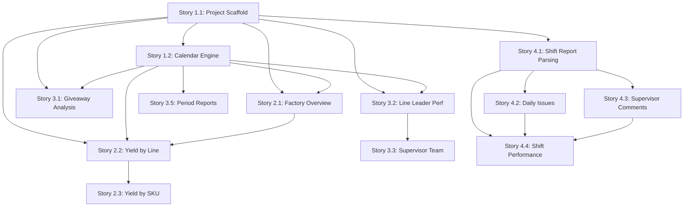

# Manufacturing KPI Dashboard — Orchestration Pipeline Plan

## Overview

This document defines the full orchestration pipeline for building the Manufacturing KPI Dashboard. The **Orchestrator** coordinates work across 13 stories, delegating each story through a **3-step pipeline** to specialized agents.

---

## Pipeline Architecture

### 3-Step Pipeline Per Story

Each story goes through exactly 3 steps before being marked complete:

```
┌─────────────────────────────────────────────────────────────────────┐
│                     ORCHESTRATOR - Per Story                        │
│                                                                     │
│  Step 1: IMPLEMENT          Step 2: REFACTOR         Step 3: QA    │
│  ┌─────────────────┐       ┌─────────────────┐    ┌──────────────┐ │
│  │   Code Agent     │  ──►  │   Code Agent     │ ──►│ Review Agent │ │
│  │                  │       │                  │    │              │ │
│  │ - Read story MD  │       │ - Clean up code  │    │ - Check ACs  │ │
│  │ - Implement all  │       │ - Optimize perf  │    │ - Code review│ │
│  │   acceptance     │       │ - DRY principles │    │ - Find bugs  │ │
│  │   criteria       │       │ - Add comments   │    │ - Verify UX  │ │
│  │ - Write tests    │       │ - Fix lint/types │    │ - Report     │ │
│  └─────────────────┘       └─────────────────┘    └──────────────┘ │
│                                                          │          │
│                                                          ▼          │
│                                                   ┌──────────────┐ │
│                                                   │ Issues Found?│ │
│                                                   │  YES → Fix   │ │
│                                                   │  task back   │ │
│                                                   │  to Code     │ │
│                                                   │  NO → Done ✅│ │
│                                                   └──────────────┘ │
└─────────────────────────────────────────────────────────────────────┘
```

### Step Details

| Step | Agent Mode | Purpose | Input | Output |
|------|-----------|---------|-------|--------|
| **1. Implement** | Code | Build the feature from the story spec | Story MD file + existing codebase | Working feature with all ACs met |
| **2. Refactor** | Code | Clean, optimize, and polish | Implemented code from Step 1 | Production-quality code |
| **3. Review/QA** | Review | Verify quality and correctness | Refactored code from Step 2 | Approval or list of issues |

### Feedback Loop

If the Review/QA step finds issues:
1. Orchestrator creates a **fix task** with the specific issues listed
2. Fix task goes to **Code mode** for resolution
3. After fixes, a **quick re-review** confirms resolution
4. Story is marked complete only when Review passes

---

## Story Execution Order

Stories are executed **sequentially** respecting dependency chains. No parallel execution to avoid merge conflicts and ensure each story builds on a stable foundation.

### Dependency Graph



### Execution Sequence

| Order | Story | Name | Dependencies | Phase |
|-------|-------|------|-------------|-------|
| 1 | **1.1** | Project Scaffold and Excel Parsing | None | Phase 1: Core Infrastructure |
| 2 | **1.2** | 4-4-5 Calendar and Aggregation Engine | 1.1 | Phase 1: Core Infrastructure |
| 3 | **2.1** | Factory Overview Dashboard | 1.1, 1.2 | Phase 2: Core Dashboards |
| 4 | **2.2** | Yield by Line Analysis | 1.1, 1.2, 2.1 | Phase 2: Core Dashboards |
| 5 | **2.3** | Yield by SKU Drill-Down | 2.2 | Phase 2: Core Dashboards |
| 6 | **3.1** | Giveaway Analysis Dashboard | 1.1, 1.2 | Phase 3: Advanced Analytics |
| 7 | **3.2** | Line Leader Performance | 1.1, 1.2 | Phase 3: Advanced Analytics |
| 8 | **3.3** | Supervisor Team View | 1.1, 1.2, 3.2 | Phase 3: Advanced Analytics |
| 9 | **3.5** | Period Reports | 1.2 | Phase 3: Advanced Analytics |
| 10 | **4.1** | Shift Report Data Parsing | 1.1 | Phase 4: Shift Reports |
| 11 | **4.2** | Daily Issues Analysis Dashboard | 4.1 | Phase 4: Shift Reports |
| 12 | **4.3** | Supervisor Comments and Actions View | 4.1 | Phase 4: Shift Reports |
| 13 | **4.4** | Shift Performance Overview | 4.1, 4.2, 4.3 | Phase 4: Shift Reports |

---

## Detailed Pipeline Per Story

### Story 1.1: Project Scaffold and Excel Parsing Infrastructure

**Step 1 — Implement (Code Agent)**
- Initialize Next.js project with static export config
- Create full folder structure as specified in story
- Install and bundle all dependencies locally: xlsx, d3, idb-keyval, tailwind
- Build HTML shell with sidebar navigation and loading overlay
- Implement dark/light theme CSS with Tailwind config
- Build file input UI for 3 file types: Line Yields, Prod Pallets, Shift Report
- Implement `data-loader.ts` with `parseExcelFile()` function
- Implement line yields column mapping parser
- Implement Prod Pallets parser for PROD, PlnSmy, Var£, PrdEff, SumEff, Mstr, Review, Yields sheets
- Implement targets sheet parser
- Build progress UI with row counts and percentage
- Implement IndexedDB storage via idb-keyval
- Implement incremental loading logic
- Extract valid line managers from distinct LINE YIELDS lineManager values

**Step 2 — Refactor (Code Agent)**
- Ensure all TypeScript interfaces are properly typed
- Optimize chunked processing for 80MB files
- Extract reusable parsing utilities
- Ensure consistent error handling across all parsers (Line Yields, Prod Pallets, Shift Report)
- Verify no CDN links exist anywhere
- Clean up CSS and ensure consistent spacing grid

**Step 3 — Review/QA (Review Agent)**
- Verify all acceptance criteria from story
- Check folder structure matches specification
- Verify all libraries are bundled locally
- Test file input UI renders correctly for Line Yields, Prod Pallets, and Shift Report
- Review parser code for correctness
- Check IndexedDB storage keys match spec
- Verify incremental loading logic

---

### Story 1.2: 4-4-5 Calendar and Aggregation Engine

**Step 1 — Implement (Code Agent)**
- Implement `getWeekEnding()` returning Saturday of input week
- Implement `getFiscalYear()` starting first Monday of January
- Implement `getPeriodInfo()` returning period 1-13 with 4-4-5 pattern
- Build aggregation engine with groupBy and metric calculations
- Implement `compareWeeks()`, `comparePeriods()`, `compareYears()`
- Implement `topNVariance()` for gains/losses identification
- Write unit tests for all calendar functions

**Step 2 — Refactor (Code Agent)**
- Optimize aggregation performance for large datasets
- Add edge case handling for boundary dates
- Ensure weighted average calculations are precise
- Add JSDoc comments to all exported functions

**Step 3 — Review/QA (Review Agent)**
- Verify all 6 acceptance criteria
- Test calendar edge cases: Jan 1, Dec 31, leap years
- Verify period boundaries match 4-4-5 pattern
- Check aggregation math against manual calculations

---

### Story 2.1: Factory Overview Dashboard

**Step 1 — Implement (Code Agent)**
- Build 5 KPI summary cards with correct calculations (replacing Tech Faults with Cases Produced from Prod Pallets)
- Implement week-over-week change badges with color coding
- Build Top 3 Gains panel
- Build Top 3 Losses panel
- Create D3.js weekly yield trend chart with 13 weeks, target line, gradient fill
- Create D3.js yield variance by line horizontal bar chart
- Implement week selector dropdown
- Auto-detect latest week on load
- Build responsive layout for desktop/tablet/mobile
- Implement loading skeleton states

**Step 2 — Refactor (Code Agent)**
- Extract reusable chart components
- Optimize D3.js rendering performance
- Ensure responsive breakpoints work correctly
- Polish animations and transitions

**Step 3 — Review/QA (Review Agent)**
- Verify all 10 acceptance criteria
- Check KPI calculations are accurate (including Cases Produced from Prod Pallets)
- Verify D3.js charts render correctly
- Test responsive layout at all breakpoints
- Verify design matches reference images

---

### Story 2.2: Yield by Line Analysis

**Step 1 — Implement (Code Agent)**
- Build sortable data table with all specified columns
- Implement week-over-week comparison columns
- Build inline D3.js trend charts expandable per line
- Create Top 3 gains/losses panels
- Implement global filter bar with all filter types
- Build factory average footer row
- Implement copy to clipboard functionality
- Add drill-down links to SKU view

**Step 2 — Refactor (Code Agent)**
- Optimize table rendering for many rows
- Extract reusable filter bar component
- Ensure sort performance is smooth
- Polish expand/collapse animations

**Step 3 — Review/QA (Review Agent)**
- Verify all 8 acceptance criteria
- Test sorting on all columns
- Verify filter combinations work correctly
- Test clipboard copy in Excel-compatible format

---

### Story 2.3: Yield by SKU Drill-Down

**Step 1 — Implement (Code Agent)**
- Build SKU drill-down accessible from line view and direct navigation
- Create SKU data table with all columns
- Implement contribution percentage calculation and mini bar visualization
- Build inline SKU trend charts with D3.js
- Implement breadcrumb navigation
- Build summary header with line totals

**Step 2 — Refactor (Code Agent)**
- Ensure contribution calculations handle edge cases
- Optimize data filtering for large SKU lists
- Polish breadcrumb navigation UX

**Step 3 — Review/QA (Review Agent)**
- Verify all 6 acceptance criteria
- Test drill-down navigation flow
- Verify contribution percentages sum correctly
- Test breadcrumb back-navigation

---

### Story 3.1: Giveaway Analysis Dashboard

**Step 1 — Implement (Code Agent)**
- Build GA by Line table with variance analysis
- Implement SKU-level GA drill-down with contribution analysis
- Create D3.js factory GA trend chart with target comparison
- Build D3.js GA by Line Manager grouped bar chart
- Create GA by Supervisor comparison view

**Step 2 — Refactor (Code Agent)**
- Ensure GA variance logic is inverted correctly (lower is better)
- Optimize chart rendering
- Extract shared drill-down patterns

**Step 3 — Review/QA (Review Agent)**
- Verify all 5 acceptance criteria
- Confirm color logic: green when below target, red when above
- Test drill-down to SKU level

---

### Story 3.2: Line Leader Performance

**Step 1 — Implement (Code Agent)**
- Build scorecard table with all columns and grade calculation
- Data sourced from LINE YIELDS aggregated by lineManager field
- Implement individual detail drawer panels with trend charts
- Create D3.js ranking heatmap with Yield/GA/Efficiency tabs
- Build grade criteria reference panel
- Implement period filtering with P1-P13 selector

**Step 2 — Refactor (Code Agent)**
- Ensure grade calculation thresholds are configurable
- Optimize heatmap rendering for many leaders
- Polish drawer slide-in animation
- Verify LINE YIELDS lineManager aggregation is correct and performant

**Step 3 — Review/QA (Review Agent)**
- Verify all 5 acceptance criteria
- Test grade calculations against criteria table
- Verify heatmap color scale accuracy
- Test period filtering recalculates grades
- Confirm data is correctly sourced from LINE YIELDS lineManager aggregation

---

### Story 3.3: Supervisor Team View

**Step 1 — Implement (Code Agent)**
- Build team summary table with rankings
- Create D3.js multi-line team trend charts with interactive legend
- Build team by line comparison matrix heatmap
- Implement potential savings calculation
- Add drill-down to individual leader performance

**Step 2 — Refactor (Code Agent)**
- Optimize multi-line chart for many teams
- Ensure savings calculation formula is accurate
- Polish legend toggle interactions

**Step 3 — Review/QA (Review Agent)**
- Verify all 5 acceptance criteria
- Test savings calculation math
- Verify drill-down navigation to Story 3.2

---

### Story 3.5: Period Reports

**Step 1 — Implement (Code Agent)**
- Build period summary table P1-P13 with all columns
- Implement period-over-period comparison
- Build year-over-year comparison table
- Create D3.js period trend combo chart with dual Y-axes
- Build year-end summary section
- Implement print-optimized view with SVG to canvas conversion

**Step 2 — Refactor (Code Agent)**
- Ensure 4-4-5 period boundaries are accurate
- Optimize combo chart rendering
- Polish print CSS layout

**Step 3 — Review/QA (Review Agent)**
- Verify all 6 acceptance criteria
- Test period calculations match Excel reports
- Verify print output is clean and correct
- Test year selector functionality

---

### Story 4.1: Shift Report Data Parsing and Infrastructure

**Step 1 — Implement (Code Agent)**
- Build file input UI for shift report with date detection
- Implement multi-sheet parser for all key sheets
- Implement SORT sheet column mapping
- Implement ACTIONS sheet 2-hour review block parsing
- Implement REPORT Daily KPI extraction
- Implement QC Hold sheet parsing
- Build IndexedDB storage with date-based keys
- Implement Team Trend .xlsb file parsing
- Build progress indicator per sheet
- Implement comprehensive error handling

**Step 2 — Refactor (Code Agent)**
- Ensure all TypeScript interfaces match spec
- Optimize parsing for UI responsiveness
- Extract shared parsing utilities
- Add detailed console logging for debugging

**Step 3 — Review/QA (Review Agent)**
- Verify all 10 acceptance criteria
- Test with actual Shift Report Excel file
- Verify column mappings match spec
- Test error handling for missing sheets

---

### Story 4.2: Daily Issues Analysis Dashboard

**Step 1 — Implement (Code Agent)**
- Build Top 3 issue cards with rank, line, downtime, category
- Implement issue card detail breakdown with mini bar
- Apply category color coding
- Build expandable issue details with parsed descriptions
- Create D3.js horizontal stacked bar chart for all lines
- Implement stacked category visualization with legend toggle
- Build total downtime summary card with donut chart
- Implement date selector from IndexedDB dates
- Build AM vs PM shift comparison view
- Implement click-through to detailed line breakdown

**Step 2 — Refactor (Code Agent)**
- Optimize D3.js chart transitions
- Ensure expand/collapse animations are smooth
- Extract reusable issue card component
- Polish responsive layout

**Step 3 — Review/QA (Review Agent)**
- Verify all 10 acceptance criteria
- Test Top 3 sorting logic
- Verify category color coding
- Test date selector with multiple dates
- Test shift toggle functionality

---

### Story 4.3: Supervisor Comments and Actions View

**Step 1 — Implement (Code Agent)**
- Build chronological timeline view with AM then PM blocks
- Implement review block content display
- Add running KPI indicators with trend arrows
- Create D3.js efficiency trend line chart
- Implement shift filter toggle
- Add below-target highlighting
- Build support required alert banners
- Implement expandable/collapsible blocks
- Create print-friendly view with CSS
- Implement search across comments with highlighting

**Step 2 — Refactor (Code Agent)**
- Optimize timeline rendering
- Ensure print CSS is clean
- Polish search highlighting performance
- Extract reusable timeline components

**Step 3 — Review/QA (Review Agent)**
- Verify all 10 acceptance criteria
- Test timeline chronological order
- Verify search filtering and highlighting
- Test print output
- Verify support required alerts are prominent

---

### Story 4.4: Shift Performance Overview

**Step 1 — Implement (Code Agent)**
- Build KPI summary cards row with all 7 cards
- Implement variance indicators on cards
- Build secondary KPI metrics grid
- Create QC Hold summary panel table
- Build yield issues panel table
- Implement safety summary section
- Build AM vs PM shift comparison table
- Create D3.js hourly efficiency trend chart
- Create D3.js line-by-line performance heatmap
- Implement export to clipboard and print

**Step 2 — Refactor (Code Agent)**
- Integrate with Story 4.2 and 4.3 components
- Optimize heatmap rendering for many lines and hours
- Ensure clipboard export format is clean
- Polish overall Shift Report tab layout

**Step 3 — Review/QA (Review Agent)**
- Verify all 10 acceptance criteria
- Test KPI values match source data
- Verify heatmap color scale
- Test clipboard export content
- Verify AM vs PM comparison accuracy
- Final integration test of entire Shift Report tab

---

## Agent Task Template

When delegating to an agent, the Orchestrator will provide:

### For Step 1 - Implement:
```
TASK: Implement Story X.X - [Story Name]

CONTEXT: Read the story file at stories/story-X.X-[name].md for full
acceptance criteria and technical implementation plan.

DEPENDENCIES: Stories [list] are already implemented.

INSTRUCTIONS:
1. Read the story file completely
2. Implement ALL acceptance criteria listed
3. Follow the technical implementation plan in the story
4. Follow the folder structure and naming conventions established
5. Use the existing codebase patterns from previous stories
6. Ensure TypeScript types are correct
7. Test that the feature works

OUTPUT: All files created/modified for this story.
```

### For Step 2 - Refactor:
```
TASK: Refactor Story X.X - [Story Name]

CONTEXT: Story X.X has been implemented. Review and refactor the code.

INSTRUCTIONS:
1. Review all files created/modified in Story X.X
2. Apply DRY principles - extract shared utilities
3. Optimize performance where possible
4. Add JSDoc comments to exported functions
5. Fix any TypeScript errors or lint issues
6. Ensure consistent code style
7. Remove any dead code or console.logs meant for debugging

OUTPUT: Cleaned, optimized code ready for review.
```

### For Step 3 - Review/QA:
```
TASK: Review Story X.X - [Story Name]

CONTEXT: Story X.X has been implemented and refactored.

INSTRUCTIONS:
1. Read the story file at stories/story-X.X-[name].md
2. Check EVERY acceptance criterion - does the code satisfy it?
3. Review code quality: types, error handling, edge cases
4. Check for security issues or performance problems
5. Verify the UI matches the design specification in the story
6. List any issues found with severity: CRITICAL / MAJOR / MINOR

OUTPUT: Review report with pass/fail per AC and list of issues.
```

---

## Progress Tracking

The Orchestrator will maintain a progress tracker:

| Story | Step 1: Implement | Step 2: Refactor | Step 3: Review | Status |
|-------|:-:|:-:|:-:|--------|
| 1.1 Project Scaffold | ⬜ | ⬜ | ⬜ | Not Started |
| 1.2 Calendar Engine | ⬜ | ⬜ | ⬜ | Not Started |
| 2.1 Factory Overview | ⬜ | ⬜ | ⬜ | Not Started |
| 2.2 Yield by Line | ⬜ | ⬜ | ⬜ | Not Started |
| 2.3 Yield by SKU | ⬜ | ⬜ | ⬜ | Not Started |
| 3.1 Giveaway Analysis | ⬜ | ⬜ | ⬜ | Not Started |
| 3.2 Line Leader Perf | ⬜ | ⬜ | ⬜ | Not Started |
| 3.3 Supervisor Team | ⬜ | ⬜ | ⬜ | Not Started |
| 3.5 Period Reports | ⬜ | ⬜ | ⬜ | Not Started |
| 4.1 Shift Report Parse | ⬜ | ⬜ | ⬜ | Not Started |
| 4.2 Daily Issues | ⬜ | ⬜ | ⬜ | Not Started |
| 4.3 Supervisor Comments | ⬜ | ⬜ | ⬜ | Not Started |
| 4.4 Shift Performance | ⬜ | ⬜ | ⬜ | Not Started |

Legend: ⬜ Not Started | 🔄 In Progress | ✅ Complete | ❌ Failed/Needs Fix

---

## Summary

- **Total Stories**: 13
- **Steps Per Story**: 3 (Implement → Refactor → Review)
- **Total Agent Tasks**: 39 minimum (+ fix tasks if review finds issues)
- **Execution**: Sequential, respecting dependency chain
- **Feedback Loop**: Review issues auto-delegated to Code for fixing
- **Orchestrator Role**: Coordinate, delegate, track progress, ensure quality
